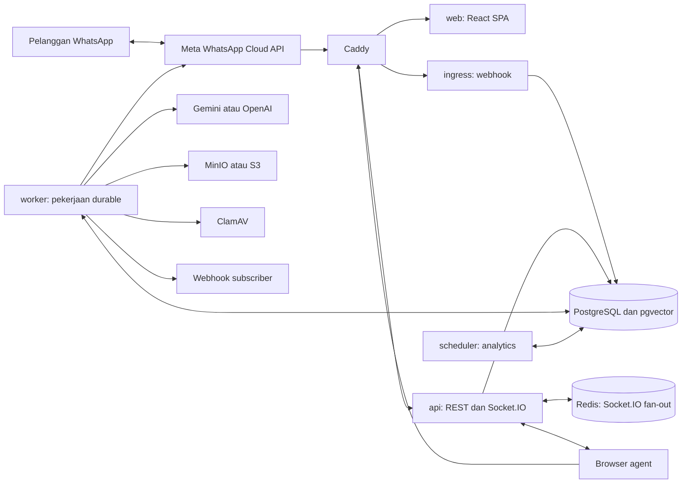
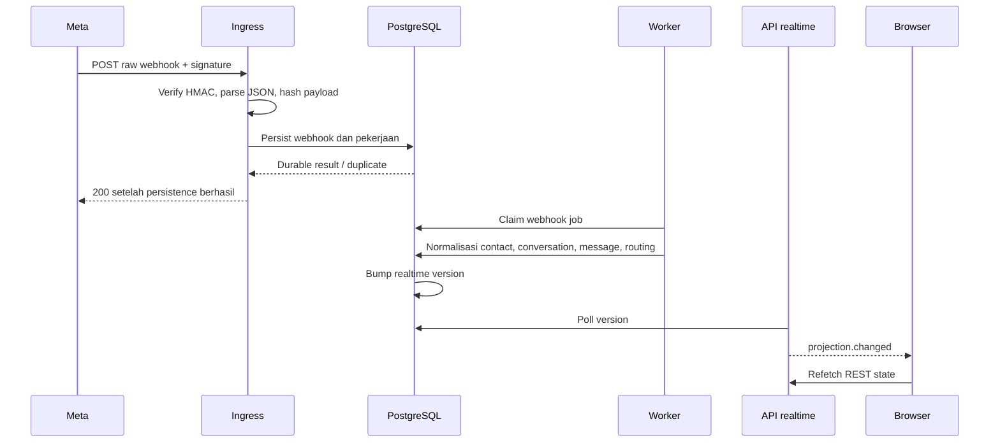

# FlowDesk: panduan repository, arsitektur, pipeline, dan operasi server

Snapshot kode: `d1c62be9a3ff8d8fb6be58adec802e025130e1d6`, diperiksa 9 September 2026.

Panduan ini menjelaskan implementasi di checkout tersebut. Pemeriksaan dilakukan terhadap source, migration, manifest, konfigurasi Docker, dan workflow. Tidak ada SSH, pengiriman pesan, perubahan database, deployment, atau pengujian provider sungguhan dalam audit ini. Command di bagian operasi adalah instruksi untuk operator; belum dieksekusi terhadap server.

## Cara membaca

Mulai dari bagian 1–4 untuk memahami sistem. Bagian 5–13 menelusuri alur bisnis dan implementasi. Bagian 14–17 membahas testing dan delivery. Bagian 18–25 merupakan handbook terminal. Lampiran berisi inventaris route, migration, tabel, test, dan file sumber agar bisa lanjut membaca setiap modul.

Fakta yang penting sejak awal:

- FlowDesk adalah SaaS customer support dan otomasi WhatsApp untuk banyak organisasi.
- Arsitektur utamanya modular monolith dengan lima process role, satu monorepo, dan database bersama.
- Database operasional menggunakan SQL langsung melalui `pg`. Kehadiran Prisma di dependencies/schema tidak menjadikan Prisma jalur ORM aktif.
- Antrean pekerjaan durable berada di PostgreSQL. Redis dipakai untuk fan-out Socket.IO.
- Frontend aktif adalah React SPA dengan Vite dan TanStack, bukan Next.js.
- Eksekusi AI berada di worker; API menerima konfigurasi dan permintaan pekerjaan.
- Staging single-host dan referensi production ECS merupakan dua jalur berbeda. File production tidak membuktikan seluruh produk sudah berjalan di ECS.

## 1. Produk ini sebenarnya menyelesaikan apa?

Bayangkan satu perusahaan punya nomor WhatsApp customer service. Ketika pelanggan mengirim pertanyaan, beberapa agent perlu membaca percakapan yang sama, mengetahui siapa yang menangani, membalas tanpa tabrakan, dan memastikan pesan benar-benar terkirim. Perusahaan juga ingin AI menjawab berdasarkan pengetahuan miliknya, bukan mengarang kebijakan refund.

FlowDesk menggabungkan kebutuhan tersebut menjadi satu workspace:

1. Organisasi mengelola anggota dan hak akses.
2. Organisasi menghubungkan akun/nomor WhatsApp Business.
3. Pesan pelanggan masuk ke inbox bersama.
4. Percakapan bisa diarahkan ke queue, team, atau agent.
5. Agent membalas teks, template, atau attachment.
6. Knowledge source diproses menjadi konteks untuk AI.
7. AI bisa membuat draft untuk direview, atau masuk jalur AUTO dengan pemeriksaan tambahan.
8. Riwayat, audit, analytics, API key, dan webhook membantu operasi dan integrasi.

Tenant adalah organisasi pelanggan FlowDesk. Customer adalah orang yang mengirim WhatsApp ke organisasi tersebut. User/agent adalah orang yang login ke dashboard. Tiga identitas ini berbeda: pelanggan WhatsApp tidak harus punya akun dashboard.

Jangan menganggap adanya field subscription/entitlement atau dokumen product sebagai bukti payment billing, seluruh kanal omnichannel, atau semua integrasi sudah tersedia. Jalur messaging konkret yang ditelusuri di sini adalah WhatsApp Cloud API.

## 2. Bentuk arsitektur



Diagram menggambarkan hubungan logis. Di staging, akses publik melewati Caddy; service internal berkomunikasi menggunakan DNS service Docker.

**Kenapa dipecah lima process?** Karena beban dan cara gagal berbeda. Request dashboard harus cepat. Webhook Meta perlu diterima dengan andal. Memanggil LLM atau mengunduh file bisa lama. Analytics bisa dijalankan periodik. Memisahkan process memungkinkan masing-masing direstart dan diberi resource sendiri.

Namun ini belum berarti lima microservice yang independen penuh. Semua role berbagi paket domain, kontrak, release repository, dan PostgreSQL. Perubahan schema masih harus kompatibel lintas role. Nama paling akurat: modular monolith dengan beberapa process role.

| Role      | Port internal/default | Pekerjaan utama                                     | Kalau mati                                           |
| --------- | --------------------: | --------------------------------------------------- | ---------------------------------------------------- |
| web       |                  3000 | Melayani bundle SPA                                 | Dashboard tidak bisa dimuat                          |
| api       |                  4000 | Auth, REST, permission, Socket.IO                   | Dashboard gagal baca/tulis; realtime terputus        |
| ingress   |                  4001 | Challenge dan callback WhatsApp                     | Webhook gagal diterima; provider perlu retry         |
| worker    |                  4002 | Normalisasi, outbound, AI, media, webhook developer | Pekerjaan menumpuk walau API mungkin masih sehat     |
| scheduler |                  4003 | Rollup analytics setiap 60 detik                    | Analytics tertinggal; inbox tidak otomatis ikut mati |

Source utama: `apps/*/src/index.ts`, `apps/web/server.mjs`, `infra/deploy/single-host/compose.yaml`.

## 3. Tech stack dan fungsi setiap lapisan

Versi di bawah adalah versi/range manifest atau tag image dalam snapshot repo, bukan klaim versi terbaru di internet.

| Lapisan                  | Teknologi                                         | Fungsi dalam FlowDesk                                                            |
| ------------------------ | ------------------------------------------------- | -------------------------------------------------------------------------------- |
| Runtime                  | Node.js 22; Docker base 22.21.1                   | Menjalankan backend, worker, scheduler, server static                            |
| Bahasa                   | TypeScript 5.9                                    | Menjaga kontrak dan tipe saat pengembangan                                       |
| Workspace                | pnpm 10, pinned 10.22.0                           | Dependencies workspace dan lockfile                                              |
| Build orchestration      | Turborepo 2.5                                     | Urutan build/test antar-package dan cache task                                   |
| API/ingress              | Express 5.1                                       | Routing HTTP dan middleware                                                      |
| UI                       | React 19.1, Vite 7.1                              | Rendering browser dan bundling                                                   |
| Routing browser          | TanStack Router                                   | Route berbasis file dan navigasi SPA                                             |
| Server state UI          | TanStack Query 5                                  | Fetch, cache, refetch, invalidasi                                                |
| UI tables/charts         | TanStack Table, Recharts 3.6                      | Data table dan grafik                                                            |
| Style/components         | Tailwind 4, Radix, CVA, Lucide, shared UI         | Tokens, interactive primitives, variants, ikon                                   |
| Panel inbox              | react-resizable-panels 4.12                       | Ukuran sidebar/list/thread/context yang bisa disesuaikan                         |
| Contract validation      | Zod melalui contracts                             | Memvalidasi input/output dan menghasilkan OpenAPI                                |
| Database                 | PostgreSQL 16                                     | Data bisnis, transaksi, constraints, job storage                                 |
| DB driver                | pg 8.16.3                                         | Connection pool dan SQL parameterized                                            |
| Vector search            | pgvector 0.8.0                                    | Pencarian chunk knowledge berdasarkan embedding                                  |
| Realtime                 | Socket.IO 4.8                                     | Koneksi realtime browser dan notifikasi perubahan                                |
| Fan-out                  | Redis 7.4 + Socket.IO Redis adapter               | Menyebarkan event antar-instance API                                             |
| WhatsApp                 | Adapter Meta HTTP                                 | Mengirim pesan dan mengelola integrasi Meta                                      |
| AI                       | Adapter Gemini/OpenAI + fake test provider        | Embedding dan generation                                                         |
| Object storage           | AWS S3 SDK; MinIO                                 | Menyimpan binary attachment                                                      |
| Malware                  | ClamAV 1.4.3                                      | Scan attachment sebelum digunakan                                                |
| Identity                 | OIDC/Auth0 integration                            | Login eksternal dan identitas user                                               |
| Logs                     | Pino                                              | Structured JSON log                                                              |
| Tracing                  | OpenTelemetry Node SDK + OTLP HTTP                | Ekspor trace ketika endpoint dikonfigurasi                                       |
| Metrics                  | Serializer metrics repo + Prometheus              | Counter, gauge, histogram/summary                                                |
| Dashboard metrics        | Grafana 12.1                                      | Visualisasi metrics yang berhasil dikumpulkan                                    |
| Local email tooling      | Mailpit                                           | Infrastruktur inspeksi email lokal; bukan bukti setiap invitation mengirim email |
| Test                     | Vitest 3, Testing Library, Supertest, Playwright  | Unit, API, database integration, browser regression                              |
| Quality                  | ESLint 9, Prettier 3, commitlint                  | Konsistensi dan pemeriksaan kualitas                                             |
| Delivery                 | GitHub Actions, GHCR, Docker BuildKit             | Build, validation, image publishing, deploy                                      |
| Edge                     | Caddy 2.10                                        | Reverse proxy, compression, TLS sesuai site config                               |
| IaC/reference production | Terraform, ECS Fargate, ALB, IAM OIDC, CloudWatch | Jalur production canary dalam source                                             |

Dependencies adalah kemampuan yang tersedia. Runtime wiring yang menentukan apakah kemampuan itu benar-benar digunakan.

## 4. Pembagian package: kode harus diletakkan di mana?

| Package       | Isi dan tanggung jawab                  | Contoh                                              |
| ------------- | --------------------------------------- | --------------------------------------------------- |
| contracts     | Schema request/response/event           | Bentuk draft action dan realtime hint               |
| domain        | Aturan bisnis yang sebisa mungkin murni | Routing, service window, permission, AUTO policy    |
| db            | SQL dan transaksi persistence           | Membuat message+outbox, tenant context, analytics   |
| providers     | Adapter sistem luar                     | Meta, AI, OIDC, S3, ClamAV                          |
| security      | Mekanisme keamanan reusable             | Signature, encryption, session, SSRF, prompt safety |
| config        | Parse/validate environment              | Memilih provider dan memvalidasi credential         |
| observability | Logging, metrics, telemetry, health     | `recordOutboxSnapshot`, `createLogger`              |
| ui            | Komponen UI bersama                     | Button, dialog, form primitives                     |
| testkit       | Helper pengujian                        | Fixture/factory dan dukungan test                   |

Contoh perubahan: menambah aturan kapan AUTO boleh berjalan masuk domain; mengambil state yang dibutuhkan masuk db; memanggil aturan dari worker; mengekspos konfigurasi masuk API/contracts; form pengaturan masuk web. Ini menjaga agar detail HTTP tidak bercampur dengan aturan bisnis dan SQL tidak tersebar ke komponen React.

Tetap ada SQL langsung dalam orchestration worker, terutama jalur dispatch dan AUTO yang membutuhkan locking terperinci. Struktur package adalah pola pemisahan, bukan klaim bahwa semua batas sudah sempurna.

## 5. Pipeline login, organisasi, dan permission

Problem dasarnya: mengetahui siapa user belum menjawab organisasi mana yang boleh ia akses, atau tindakan apa yang boleh ia lakukan.

Alur login nyata:

1. Browser membuka `/api/v1/auth/login` atau `/authorize`.
2. API membuat transaksi OIDC dengan state, nonce, dan PKCE.
3. User menjalani login pada identity provider.
4. Callback membawa authorization code dan state.
5. API mengonsumsi transaksi authorization dan memeriksa verifier sesuai jalurnya.
6. Identitas eksternal dipetakan ke user internal.
7. API membuat opaque session token, menyimpan hash token dalam DB, dan mengirim cookie session.
8. Request berikutnya membaca cookie, hash-nya dicocokkan dengan session aktif.
9. Route organisasi memeriksa membership dan permission sebelum melakukan pekerjaan tenant.

`AUTH_MOCK_ENABLED` menyediakan jalur mock. Default/example staging bukan bukti bahwa login OIDC asli telah diaktifkan pada server. Periksa konfigurasi runtime, jangan menyimpulkannya dari label environment.

Organisasi baru memerlukan bootstrap khusus: sebelum membership tersedia, user belum bisa melewati policy tenant biasa. Karena itu ada fungsi database khusus untuk bootstrap organisasi dan consume invitation. Fungsi lintas-tenant semacam ini sengaja dibatasi pada kemampuan tertentu.

Hak akses dipusatkan dalam domain permission dan middleware organisasi. UI juga memeriksa permission untuk menampilkan tindakan, tetapi keamanan tetap harus ditegakkan API dan database. Menyembunyikan tombol saja tidak mencegah orang memanggil endpoint langsung.

Source: `apps/api/src/auth.ts`, `organizations.ts`, `packages/security/src`, `packages/db/src/auth.ts`, `organizations.ts`, migration `0004`, `0005`.

## 6. Database dan tenant isolation

### 6.1 Kenapa satu database untuk banyak organisasi?

Lebih sederhana untuk deployment dan transaksi lintas-entitas dalam satu organisasi. Trade-off-nya: isolasi tenant harus ditegakkan dengan disiplin, dan beban satu tenant dapat memengaruhi resource database bersama.

Tabel bisnis mempunyai `organization_id`. Namun aplikasi tidak hanya mengandalkan developer selalu ingat menulis `WHERE organization_id = ...`.

`withTenantTransaction` melakukan urutan berikut:

```sql
BEGIN;
SET LOCAL ROLE flowdesk_runtime;
SET LOCAL search_path = flowdesk, public;
SELECT set_config('app.organization_id', '<tenant UUID>', true);
SELECT set_config('app.current_organization_id', '<tenant UUID>', true);
-- Query bisnis tenant.
COMMIT;
```

`SET LOCAL` hanya hidup sepanjang transaksi. Setelah commit/rollback, connection yang kembali ke pool tidak boleh mewariskan tenant sebelumnya. RLS menggunakan tenant context tersebut untuk membatasi baris yang bisa dibaca dan ditulis.

`flowdesk_runtime` adalah role operasional tanpa bypass RLS. Login role seperti `flowdesk_app` berbeda dari role permission runtime. Migrator memiliki hak schema yang berbeda. `flowdesk_system` dipakai untuk fungsi sistem terbatas, misalnya claim job lintas-tenant dan discovery yang memang harus berjalan sebelum tenant dipilih.

FORCE RLS dan role separation mengurangi risiko kesalahan query, tetapi superuser/bypass role tetap istimewa. Karena itu melihat tabel memakai bootstrap administrator tidak membuktikan perilaku akses aplikasi.

### 6.2 Peta kelompok data

| Domain             | Tabel utama                                                                                                      | Hubungan dan fungsi                                       |
| ------------------ | ---------------------------------------------------------------------------------------------------------------- | --------------------------------------------------------- |
| Identity/tenancy   | organizations, users, identities, roles, memberships                                                             | User global dapat menjadi anggota organisasi              |
| Sessions           | auth_sessions, oidc_authorization_transactions                                                                   | Session dan login transaction                             |
| Onboarding         | invitations, organization_settings                                                                               | Undangan dan pengaturan tenant                            |
| Channel            | channels, whatsapp_business_accounts, whatsapp_embedded_signup_attempts                                          | Nomor, WABA, credential terenkripsi, signup state         |
| Customer/inbox     | contacts, conversations, messages                                                                                | Contact pada channel mempunyai percakapan dan pesan       |
| History            | message_status_events, conversation_events                                                                       | Riwayat perubahan status/assignment                       |
| Reliability        | webhook_events, outbox_events, outbound_intents, idempotency_keys                                                | Penerimaan durable, pekerjaan, pengiriman, dedupe request |
| Operations         | teams, team_memberships, queues, queue_memberships                                                               | Pengelompokan agent dan tujuan routing                    |
| Inbox metadata     | tags, conversation_tags, conversation_notes, conversation_read_markers, saved_filters                            | Label, catatan internal, unread, filter                   |
| SLA                | business_hours_policies, sla_policies                                                                            | Definisi jam kerja dan target pelayanan                   |
| Realtime           | realtime_versions                                                                                                | Versi perubahan per organisasi                            |
| Templates          | whatsapp_templates, whatsapp_template_versions, whatsapp_template_status_history, whatsapp_template_sync_cursors | Template dan status approval/version                      |
| Media              | attachments, attachment_upload_sessions                                                                          | Metadata file, scan state, upload session                 |
| Knowledge          | knowledge_sources, documents, document_chunks, knowledge_versions, knowledge_ingestion_jobs                      | Intake sampai vector dan version boundary                 |
| AI                 | bot_configs, bot_runs                                                                                            | Konfigurasi dan riwayat eksekusi/draft                    |
| Automation         | routing_rules, routing_logs, automation_policies, automation_safety_controls, auto_release_gates                 | Policy, trace keputusan, safety, enablement               |
| Developer          | api_keys, webhook_subscriptions, webhook_deliveries                                                              | Integrasi eksternal                                       |
| Analytics          | analytics_aggregates_hourly, analytics_watermarks                                                                | Rollup dan checkpoint                                     |
| Audit              | audit_logs                                                                                                       | Actor, tindakan, target, hasil                            |
| Migration metadata | flowdesk_meta.schema_migrations, break_glass_access_log                                                          | Schema version dan pencatatan akses darurat               |

Tidak semua timestamp memiliki makna sama. `created_at` adalah waktu record dibuat, `sent_at`/`delivered_at` adalah state lifecycle, `occurred_at` milik event, `available_at` menentukan kapan job boleh diambil. Diagnosis queue harus memakai waktu yang sesuai.

### 6.3 Migration 0009 yang sedang lo buka

Migration `0009_m2_completion_hardening.sql` memperkuat fondasi pesan:

- Membuat contacts, melakukan backfill dari conversations, lalu mewajibkan contact pada conversation.
- Membuat message status history dan conversation event history.
- Membuat outbound intent terpisah dari message UI.
- Menambah unique index provider message ID per organisasi untuk dedupe.
- Menambah `available_at`, lease, claim token, dan dead-letter timestamp pada outbox.
- Menambahkan trigger contact/lifecycle agar perubahan data menangkap history secara konsisten.
- Menambah fungsi claim dan operational snapshot.

Kenapa message dan intent berbeda? Message merepresentasikan percakapan yang dilihat user; intent merepresentasikan apakah proses pengiriman sedang berjalan, sudah selesai, gagal, atau hasilnya belum diketahui. Satu kolom `sent: true/false` tidak cukup menjelaskan worker crash setelah Meta menerima pesan.

Migration selanjutnya dapat mengganti function/constraint. Contohnya claim outbox diperbarui lagi di `0035`. Jangan membaca `0009` sebagai schema final secara terpisah.

### 6.4 Cara migration bekerja

Migrator membaca SQL bernomor secara berurutan, mengambil PostgreSQL advisory lock, membandingkan SHA-256 isi migration dengan ledger, menjalankan tiap file dalam transaksi, lalu merekam keberhasilannya.

File yang sudah applied tidak boleh diedit: checksum mismatch akan menolak kelanjutan. Perubahan berikutnya harus menjadi migration baru. `DATABASE_MIGRATOR_URL` wajib; script tidak fallback ke `DATABASE_URL`.

Rollback image tidak membatalkan perubahan database. Desain migration perlu kompatibel dengan image sebelumnya jika rollback aplikasi masih diharapkan bekerja.

## 7. Pipeline WhatsApp: connect, inbound, outbound, status

### 7.1 Menghubungkan channel

FlowDesk memiliki route channel manual dan Meta Embedded Signup. Channel menghubungkan organisasi internal dengan `phone_number_id`/WABA Meta. Token disimpan sebagai credential terenkripsi, lalu worker mendekripsinya saat perlu mengirim.

Embedded Signup mempunyai state percobaan sendiri, pertukaran/validasi informasi Meta, dan langkah subscription. Berhasil menutup popup belum cukup: mapping nomor, credential, subscription, dan channel aktif harus benar.

`ENCRYPTION_KEY` API dan worker harus konsisten. Token yang tersimpan benar tetapi key worker berbeda akan menghasilkan credential error. Jangan mengganti key begitu saja: ciphertext lama tidak otomatis ikut berubah.

### 7.2 Pesan masuk



Rinciannya:

1. Challenge GET `/webhooks/whatsapp` memvalidasi verify token dan mengembalikan challenge Meta.
2. POST menerima raw bytes, batas body 5 MB.
3. Signature `x-hub-signature-256` diverifikasi sebelum JSON dipercaya.
4. Hash body membantu mengenali callback yang sama.
5. `phone_number_id` dipakai untuk menemukan mapping organisasi/channel.
6. Dengan DB terpasang, ingress menyimpan event sebelum 200. Kegagalan persistence menghasilkan 503 supaya pengirim bisa retry.
7. Worker mengambil event, memproses dalam tenant transaction, memecah payload menjadi inbound message/status update.
8. Conversation ditemukan/dibuat; contact terkait dipertahankan oleh persistence/trigger.
9. Provider message ID (`wamid`) menjaga pesan sama tidak masuk dua kali.
10. Inbound baru dapat memicu routing, webhook developer, dan job AI jika mode AUTO.

Ada dua dedupe berbeda: dedupe raw webhook dan dedupe pesan provider. Satu payload dapat memuat lebih dari satu item; perubahan wrapper payload tidak boleh menyebabkan pesan yang sama diduplikasi.

Detail batas implementasi: resolver awal ingress mengambil metadata dari entry/change pertama. Normalizer bisa membaca item lebih luas, tetapi jangan menganggap arbitrary multi-tenant mixed batch otomatis dipartisi secara sempurna. Jika channel tidak ditemukan, normalizer mencatat warning dan melewati item.

Tanpa database client, ingress punya fallback acknowledgement untuk runtime minimal/test. Itulah sebabnya HTTP 200 saja bukan bukti persistence.

### 7.3 Agent mengirim balasan

1. UI mengirim request tenant/conversation dengan data tervalidasi dan idempotency sesuai endpoint.
2. API memeriksa session, permission, conversation state, dan aturan pengiriman.
3. Dalam transaksi, message dibuat sebagai `queued` bersama outbox event `message.outbound.created`.
4. Lifecycle trigger membentuk outbound intent.
5. API dapat menjawab sebelum provider dipanggil; UI menampilkan queued.
6. Worker claim event, mengunci message/intent, lalu memvalidasi channel dan jenis payload.
7. Intent diset `dispatching` dan transaksi preparation di-commit.
8. Worker memanggil Meta di luar transaksi preparation.
9. Jika sukses, provider ID dicatat dan message menjadi `sent` dalam transaksi berikutnya.
10. Callback status Meta nanti mengubahnya menjadi delivered/read atau failed.

`queued` berarti tersimpan untuk dikirim. `sent` berarti provider menerima hasil pengiriman pada tahap itu. `delivered` dan `read` adalah tahap berbeda. Respons API sukses bukan bukti pelanggan sudah membaca pesan.

### 7.4 Kenapa transactional outbox diperlukan?

Jika API menulis message kemudian proses crash sebelum memasukkan queue, UI punya pesan tetapi tidak ada worker yang akan mengirimnya. Jika queue dibuat dulu lalu transaksi message gagal, worker mendapat pekerjaan untuk pesan yang tidak ada.

Menyimpan message dan outbox dalam transaksi yang sama membuat keduanya commit atau rollback bersama. Worker boleh datang belakangan; niat pekerjaan sudah durable.

Claim menggunakan locking `FOR UPDATE SKIP LOCKED`, sehingga worker lain bisa mengambil baris berikutnya. Lease membuat pekerjaan yang ditinggal process mati bisa ditemukan lagi. Lease bukan jaminan exactly-once untuk side effect HTTP.

### 7.5 Retry, DLQ, dan hasil tidak pasti

Jalur crash-safe membedakan:

| Kondisi                                                                     | Perlakuan                                         |
| --------------------------------------------------------------------------- | ------------------------------------------------- |
| Message sudah sent/delivered/read                                           | Lewati pengiriman ulang; tandai pekerjaan selesai |
| Channel tidak active/credential tidak valid                                 | Gagal terminal sesuai jalur                       |
| Transient yang diklasifikasikan aman dan attempts masih tersedia            | Jadwalkan retry                                   |
| Network error, malformed response, provider 5xx pada klasifikasi crash-safe | `reconcile_required`; jangan kirim ulang otomatis |
| Intent masih dispatching setelah interupsi                                  | `reconcile_required`                              |
| Terminal/exhausted                                                          | Failed/dead-letter                                |

Angka default outbound max retry pada jalur tersebut adalah 5. AI mempunyai batas attempts tersendiri, umumnya 3 dari schema durable job. Jangan menganggap semua pipeline punya angka yang sama.

Masalah yang paling sulit: Meta mungkin sudah menerima pesan, tetapi koneksi putus sebelum FlowDesk mendapat respons. Retry buta dapat mengirim dua kali. Karena itu repo memilih berhenti untuk rekonsiliasi pada keadaan ambigu. Trade-off-nya adalah beberapa pesan memerlukan penanganan operator.

Runbook lama menyebut semua 5xx otomatis retry; itu tidak menggambarkan klasifikasi crash-safe yang diperiksa di snapshot ini.

### 7.6 Template dan service window

Repo menghitung service window 24 jam dari inbound terakhir. Balasan free-form dibatasi sesuai aturan aplikasi; template punya jalur tersendiri dan harus berstatus approved. Ini adalah perilaku kode yang diperiksa, bukan verifikasi kebijakan Meta terbaru.

Template disimpan bersama version/status history. Worker memeriksa kembali template sebelum kirim, sebab status pada saat operator membuka dialog bisa berbeda saat job diproses. Variabel template dibentuk dalam urutan parameter.

`template-sync.ts` tersedia, tetapi entrypoint worker yang diperiksa tidak menjalankannya sebagai batch periodik. Keberadaan helper sync tidak boleh dijelaskan sebagai scheduler aktif tanpa caller.

## 8. Worker yang sedang lo buka: satu per satu

`apps/worker/src/index.ts` merupakan composition root: menyatukan config, DB pool, logger, provider, storage, scanner, timer, dan health server.

Saat startup:

1. Parse config HTTP, encryption, Meta, AI, media.
2. Pilih AI runtime: disabled/fake/gemini/openai.
3. Buat logger dan telemetry jika endpoint tersedia.
4. Buat Pool jika `DATABASE_URL` tersedia.
5. Buat S3 store jika konfigurasi storage lengkap.
6. Pilih ClamAV bila host tersedia; ada fallback fake scanner jika tidak tersedia.
7. Buat Meta provider sungguhan pada composition root.
8. Jika Pool tersedia, mulai timer 1.000 ms.

Dalam satu tick, `isPolling` mencegah tick biasa tumpang tindih. Kelompok pekerjaan dijalankan dengan `Promise.all`:

| Batch                      |          Limit entrypoint | Syarat                                     |
| -------------------------- | ------------------------: | ------------------------------------------ |
| Normalisasi webhook        |                        10 | DB                                         |
| Outbound WhatsApp          |                        10 | DB                                         |
| Developer webhook dispatch |                        10 | DB                                         |
| Knowledge ingestion        |                         5 | DB + AI runtime                            |
| Bot draft/AUTO generation  |                         5 | DB + AI runtime                            |
| Attachment scan            |                        10 | DB + storage                               |
| Attachment retention       | Sesuai implementasi batch | DB + storage; paling sering sekali per jam |

Batch berbeda dapat berjalan bersamaan, tetapi job di dalam beberapa batch diproses berurutan. Maka batch 5 tidak berarti lima request AI paralel, dan timer satu detik tidak berarti throughput pasti sekian pesan/detik.

Setelah selesai, worker membaca `messaging_operational_snapshot()` dan memperbarui metrics antrean. Error batch dicatat. Health server tetap merupakan HTTP process health terpisah.

Nuance penting: `Promise.all` menolak segera ketika satu promise gagal, tanpa membatalkan sibling. Flag yang dibersihkan di `finally` bukan bukti semua pekerjaan sibling sudah berhenti pada kondisi error. DB claims dan idempotency tetap penting. Label error batch juga menggunakan `outbound` secara umum di entrypoint; lihat detail log sebelum menyimpulkan pipeline yang rusak.

Tanpa `DATABASE_URL`, process tetap bisa menjawab health tetapi tidak claim job. Tanpa AI runtime, pekerjaan ingestion/draft tidak dijalankan oleh loop ini. Tanpa storage, scan/retention tidak dijalankan.

## 9. AI dan RAG: bagaimana jawaban terbentuk?

### 9.1 Masalah aslinya

Model bahasa tidak otomatis mengetahui aturan bisnis tenant. Memasukkan seluruh dokumen setiap request mahal dan bisa melebihi context budget. RAG memilih potongan pengetahuan yang relevan terlebih dahulu, lalu mengirim potongan itu bersama pertanyaan ke model.

Embedding adalah representasi angka untuk membandingkan kemiripan isi. Menyimpan embedding tidak melatih ulang model. Ketika knowledge berubah, data pencarian berubah; bobot model provider tidak ikut dilatih oleh pipeline ini.

### 9.2 Knowledge ingestion

1. Admin mengirim source text atau URL ke `/knowledge/sources`.
2. API memvalidasi dan menormalisasi input; URL diperiksa dengan SSRF policy.
3. Hash input menjadi dedupe key.
4. Source dan ingestion job dibuat dalam transaksi; API mengembalikan job ID.
5. Worker claim job dan mengubah status source ke indexing.
6. Untuk URL, fetch dibatasi timeout/size dan content type text yang didukung.
7. Extractor mengubah HTML/text menjadi isi yang bisa di-chunk.
8. Isi dibagi menjadi chunk; provider membuat embeddings dalam kelompok maksimal 64 input pada helper ingestion.
9. Document/chunks disimpan; source menjadi active dan knowledge version baru dicatat.
10. UI memetakan pending/indexing/active menjadi queued/processing/ready.

Schema mengenal tipe file, tetapi route intake yang diperiksa mendukung text dan URL. Jangan menganggap upload PDF/DOCX arbitrary sudah tersedia hanya karena tabel documents ada. Jenis URL yang diterima worker meliputi plain text, HTML/XHTML, dan JSON; bukan otomatis OCR atau PDF parser.

Vector disimpan sebagai `vector(1536)`. Adapter Gemini meminta output dimensionality yang kompatibel. Mengganti embedding provider/model memerlukan strategi re-embedding: dimensi sama belum berarti ruang semantiknya sama. Vector Gemini dan OpenAI tidak otomatis layak dicampur dalam satu pencarian.

### 9.3 Draft manual

Mode draft tidak otomatis berarti setiap inbound membuat draft. Pada normalizer yang diperiksa, enqueue otomatis eksplisit dilakukan untuk mode AUTO. Draft manual diminta melalui `/bot/draft/:conversationId`, lalu worker memproses durable run.

Urutan worker:

1. Claim run queued atau lease yang kedaluwarsa.
2. Ambil conversation, latest customer message, config sekarang, dan knowledge version.
3. Bandingkan trigger message dan knowledge version dengan snapshot run.
4. Jika pesan/knowledge berubah, tandai stale.
5. Jika bot off/emergency disabled, hentikan sesuai status.
6. Periksa pola prompt injection pada pesan.
7. Redact PII sebelum query embedding.
8. Cari chunk menggunakan cosine similarity dan top-K.
9. Buang chunk yang gagal safety check, redact isi chunk, dan bentuk citations.
10. Jika tidak ada evidence, simpan `no_evidence`; tidak lanjut mengarang jawaban.
11. Susun instructions, tone, language, knowledge context, dan conversation history.
12. Periksa perkiraan token budget.
13. Panggil chat provider melalui circuit breaker.
14. Periksa output dan kemungkinan kebocoran instructions.
15. Baca ulang latest message dan knowledge version untuk mendeteksi perubahan selama model berjalan.
16. Simpan suggested content, citations, token counts, latency, model, dan metadata.

Circuit breaker chat mempunyai threshold 3 kegagalan dan waktu pemulihan 30 detik. State ini berada di process worker; restart atau replica lain mempunyai state berbeda. Error provider yang retryable dijadwalkan ulang dengan backoff, bukan membuat request loop tanpa batas.

Status run mencakup queued, processing, completed, no_evidence, safety_blocked, budget_exceeded, provider_failed, stale, cancelled, off. `completed` adalah hasil generation, belum bukti pengiriman WhatsApp.

### 9.4 Approval agent

Agent dapat approve, edit, atau reject run melalui `/bot/draft-runs/:runId/action`. API memeriksa run masih actionable, trigger masih terbaru, conversation belum closed, konfigurasi safety, dan service window. Approval membuat outbound message+outbox melalui jalur pengiriman normal. Repeated action diperiksa terhadap outbound yang sudah terkait run.

AI tidak mempunyai koneksi bebas untuk langsung mengubah database atau mengirim arbitrary tool call. Orchestration aplikasi yang menentukan kapan output model menjadi sebuah outbound intent.

### 9.5 AUTO dan pengamannya

Setelah run AUTO selesai, `processCompletedAutoRun` memeriksa:

- Apakah outbound untuk run yang sama sudah ada.
- Global environment killswitch dan durable safety stop.
- Mode AUTO, completed, belum ada operator action.
- `auto_enabled`, config ID/version yang masih sesuai, emergency stop.
- Batas tenant per jam dan monthly cost ceiling.
- Conversation belum closed/paused, belum diambil human.
- Trigger masih customer message terbaru.
- Belum ada human message setelah run dimulai.
- Service window masih terbuka dan jawaban tidak kosong.
- Confidence threshold minimal 0.9 dan batas default tiga auto reply per conversation per jam.

Jika lolos, aplikasi menambahkan footer `_Balasan otomatis oleh AI FlowDesk_`, membuat outbound message+outbox, mencatat decision/audit, lalu dispatch worker mengambilnya. Dispatch mempunyai pemeriksaan safety lagi agar stop/takeover setelah enqueue dapat memblokir pekerjaan sebelum provider call.

Pemeriksaan terakhir tetap tidak bisa menarik kembali request yang sudah dikirim ke Meta. Emergency stop membatasi pekerjaan berikutnya; bukan time machine untuk pesan in-flight.

Release gate menyediakan score thresholds, approval product/security/peer, cohort internal→beta→general, sampling, rollback owner, dan batas biaya/rate. Data evaluasi dan approval merupakan state gate; keberadaan score field tidak membuktikan benchmark AI independen telah benar-benar dijalankan.

### 9.6 Batas AI yang perlu dipahami secara jujur

1. Adapter chat real mengembalikan confidence tetap `0.9` pada jalur yang diperiksa. Jadi angka confidence bukan probabilitas kebenaran terkalibrasi dari evaluator.
2. Estimasi biaya run menggunakan formula tetap `(promptTokens + completionTokens) * 0.15` yang dibulatkan. Ini bukan rekonsiliasi tagihan provider per model.
3. Generation melakukan pekerjaan provider sambil berada dalam tenant transaction. Itu dapat menahan connection/transaction lebih lama saat provider lambat.
4. Retrieval query memfilter organisasi, embedding, similarity, dan top-K, tetapi tidak melakukan join/filter explicit ke source active atau immutable knowledge-version snapshot. Version comparison adalah guard perubahan; bukan implementasi pencarian historis per version.
5. Jalur completed AUTO memberi `isWithinBusinessHours: true` ke validator. Jadi jangan mengklaim jalur ini menghitung kalender business hours aktual hanya karena domain validator mendukung field tersebut.
6. Konfigurasi consent/disclosure dan kemampuan domain routing lebih luas daripada context inbound yang benar-benar diisi. Consent per customer tidak terbukti hanya dengan flag config.
7. Prompt injection/PII checks adalah mekanisme mitigasi berbasis kode, bukan jaminan model tidak mungkin bocor atau salah.
8. Nama model di environment/example adalah default repo. Availability dan validitas akun provider belum diuji pada audit ini.

## 10. Routing, inbox workflow, dan SLA

Routing evaluator menyaring active rules, mengurutkan priority menaik, lalu memilih rule pertama yang cocok. Trace mencatat kondisi yang diperiksa dan alasan match/gagal.

Source mendukung condition seperti channel, tags, language, intent, phone prefix, business hours, queue capacity, bot mode, consent, entitlement, dan confidence. Tetapi normalizer saat ini mengisi context konkret berupa channel, phone, tags kosong, mode bot, dan paused state. Tidak terlihat enrichment semua field tersebut pada jalur ini.

Akibatnya, simulator dengan input lengkap dapat menunjukkan hasil yang tidak sama dengan inbound nyata yang context-nya belum lengkap. Rule positive yang membutuhkan field kosong dapat gagal closed. Jangan menjual semua kondisi simulator sebagai klasifikasi AI inbound yang sudah berjalan.

Published versioned policy diutamakan; jika tidak ada policy dengan rules, jalur memakai legacy routing rules. Database menyimpan policy ID/version dan decision trace. Routing memakai savepoint sehingga kegagalan routing dapat di-rollback tanpa membatalkan normalisasi pesan seluruhnya.

Workflow agent menggabungkan list/filter, detail conversation, read marker, internal note, label, assignment, status, priority, dan tindakan pause/takeover. Timestamp/riwayat memungkinkan perhitungan first response dan resolution. Perubahan bersamaan ditangani sesuai version/concurrency contract pada endpoint, sehingga UI perlu refetch saat konflik; jangan menganggap aksi terakhir selalu boleh menimpa user lain.

SLA adalah target operasional, bukan sekadar badge warna. First response time membutuhkan definisi kapan inbound diterima dan balasan agent pertama terjadi. Resolution membutuhkan timestamp close/resolve. Data tersebut baru bisa di-rollup ke analytics.

## 11. Attachment/media pipeline

Metadata file berada di PostgreSQL; binary file berada di object storage. Memisahkan keduanya mencegah baris message menjadi tempat menyimpan file besar.

Jalur umum: minta upload session → upload melalui endpoint/storage flow yang disediakan → finalize → attachment masuk quarantine/scan → worker mengambil file dan memeriksa MIME/malware → clean atau rejected → hanya attachment clean yang boleh dipakai dispatch/download sesuai akses.

Pada pengiriman media, worker mengambil object, upload ke Meta, mendapat media ID, kemudian mengirim media message. Document, image, audio, dan video memerlukan bentuk payload sesuai jenisnya.

Retention worker membersihkan file berdasarkan usia/status dan konfigurasi retention. Loop entrypoint menjadwalkannya maksimal per jam. Database backup saja tidak cukup untuk memulihkan attachment: object storage perlu dibackup juga.

ClamAV fallback fake di entrypoint harus dipahami saat menguji lingkungan. Scan sukses menggunakan fake tidak membuktikan file melewati engine ClamAV sungguhan.

## 12. Developer API, webhook, dan analytics

### 12.1 API key

Developer settings mengelola API key organisasi dengan scopes, expiry, dan revocation. Runtime melakukan lookup hash key melalui capability database terbatas, kemudian bekerja dalam tenant context. API key bukan sesi browser dan tidak digunakan sebagai pengganti permission tanpa batas.

Route external berada di `/api/v1/external`. Contract dan route inventory di lampiran membantu menemukan operasi yang benar-benar tersedia; jangan menebak endpoint dari nama produk.

### 12.2 Outgoing webhook

Ini berbeda dari webhook Meta masuk. Di sini FlowDesk adalah pengirim, dan CRM/sistem pelanggan adalah penerima.

1. Subscription tenant menyimpan URL, event yang dipilih, secret, active/verification state.
2. Event aplikasi di-fan-out ke durable job `developer.webhook.dispatch`.
3. Worker membaca subscription saat dispatch dan memeriksa active/verification state.
4. Destination diperiksa dengan URL safety policy.
5. Body ditandatangani dan dikirim dengan `X-FlowDesk-Signature`, `X-FlowDesk-Event-Id`, dan timestamp.
6. Delivery record menyimpan status, HTTP result, attempt, next retry.
7. Respons 2xx menandai delivered; kegagalan dijadwalkan ulang sampai batas lima attempts, lalu dead-letter.

Subscriber tetap harus dedupe berdasarkan event ID karena HTTP retry bisa mengirim callback berulang. Contoh fan-out konkret ada pada inbound `message.received`; daftar event dalam contract tidak otomatis membuktikan semua emit point sudah dipasang.

### 12.3 Analytics

Scheduler berjalan setiap 60 detik, menemukan organisasi aktif lewat fungsi sistem terbatas, lalu melakukan rollup satu tenant per transaksi. `analytics_watermarks` menyimpan checkpoint; `analytics_aggregates_hourly` menyimpan bucket per jam.

Bucket mencakup inbound/outbound, bot/human, conversations created/resolved, first-response/resolution duration, dan SLA counts. UI/API menyajikan agregat untuk periode yang diminta.

Analytics bersifat eventually updated: tampilan inbox bisa sudah berubah sementara bucket belum diperbarui. Error satu tenant dikumpulkan agar tenant lain masih dapat diproses. Ini bukan stream analytics realtime per message. Definisi SQL juga perlu dibaca: `human_count` pada rollup menghitung sender agent **dan customer**, jadi angka itu tidak boleh langsung disebut jumlah balasan agent. Jalur scheduler meneruskan watermark sebagai `since`; helper mempunyai lookback 24 jam hanya pada cabang tanpa since. Karena itu keterlambatan event dan konsistensi agregasi perlu diuji, bukan diasumsikan dari komentar lookback.

## 13. UI dan realtime

### 13.1 Struktur UI aktif

`main.tsx` memasang React root dan `App`. TanStack Router memakai `src/routes` dan generated route tree. App shell memuat sidebar, header, organisasi aktif, user navigation, theme, dan command menu.

| Area          | Implementasi/fungsi                                                                                         |
| ------------- | ----------------------------------------------------------------------------------------------------------- |
| Inbox         | `features/inbox/InboxWorkspace`: panel list, thread, customer context, composer, draft, attachment/template |
| Channel       | WhatsApp connection/management dan guide; route file menentukan view aktif                                  |
| Knowledge     | Intake source, status, bot/policy controls pada KnowledgeView                                               |
| Analytics     | Statistik dan grafik periode                                                                                |
| Team          | Membership, invitation, role                                                                                |
| Developer     | API key, webhook subscription, verification/delivery                                                        |
| Workspace     | Overview organisasi/role dan navigasi team                                                                  |
| Profile/audit | Identitas dan riwayat sesuai route                                                                          |

Legacy view seperti `InboxView.tsx` masih ada bersama feature-based implementation. Mulai penelusuran dari route aktif, bukan mengasumsikan file bernama View pasti halaman yang dirender.

Workspace settings yang diperiksa adalah overview, bukan editor branding lengkap. Bahkan kartu “Inbox is clear” di view itu merupakan teks statis; itu tidak membuktikan database tidak memiliki percakapan.

### 13.2 State frontend

TanStack Query tersedia sebagai lapisan server state, tetapi migrasi frontend belum seragam: InboxWorkspace aktif masih mempunyai state/loading dan pemanggilan fetch sendiri melalui loadConversations/loadThread, berdampingan dengan adapter invalidasi Query. Jangan menganggap seluruh fetch sudah terpusat di Query. Query key perlu menyertakan organisasi agar cache tenant tidak tercampur. State lokal seperti draft input/panel/theme dipisah dari data server.

Default QueryClient tidak retry 401/403/404, membatasi retry lain, tidak retry mutation otomatis, mematikan refetch saat window focus, dan mengaktifkan refetch saat reconnect. Alasannya: mutation pesan tidak boleh diulang sembarangan dan operator yang sedang mengetik tidak perlu menerima lonjakan fetch hanya karena pindah tab.

LocalStorage menyimpan theme/panel preference, bukan sumber kebenaran status message. Persisted panel layout dapat memengaruhi tampilan setelah reload; mengubah API tidak memperbaiki ukuran panel yang tersimpan salah.

### 13.3 Realtime bekerja sebagai hint + refetch

Database trigger meningkatkan `realtime_versions`. API polling default satu detik untuk organisasi yang mempunyai socket lokal. Ketika version berubah, API mengirim `projection.changed`. Browser menginvalidasi/refetch data melalui REST.

Socket handshake memerlukan cookie session dan organization ID. Server memeriksa membership, mengotorisasi room organisasi/conversation/team, dan memeriksa ulang authorization default setiap lima detik. Expired/revoked session atau room access memutus koneksi.

Redis adapter menyebarkan event ke socket pada API instance lain. Tanpa Redis, mode single-node diperbolehkan oleh konfigurasi entrypoint. Redis bukan tempat menyimpan message history atau job WhatsApp.

Client menyimpan lastVersion. Saat reconnect/gap, client meminta rekonsiliasi REST. Ini membuat socket menjadi sinyal “data berubah”, sementara PostgreSQL melalui API tetap sumber kebenaran.

Batas wiring yang perlu diperiksa saat development: Vite proxy saat ini memetakan `/api`, `/livez`, `/readyz`, tetapi tidak `/realtime`; client default memakai origin browser. Caddy staging memiliki route realtime. Jadi masalah socket lokal belum tentu sama dengan staging. Handler invalidasi juga berbeda antara adapter global dan hook inbox; buktikan perubahan benar-benar muncul di browser.

## 14. Observability: apa yang dapat dilihat?

Ada empat lapisan bukti:

1. Process: container up, tidak restart/OOM, `/livez` merespons.
2. Dependencies: PostgreSQL, storage, Redis, scanner benar-benar bisa dipakai.
3. Pipeline: pekerjaan bergerak, backlog/age stabil, tidak tertahan reconcile/lease.
4. Produk: pesan nyata sampai, status kembali, UI tenant yang tepat terbarui.

Pino mengeluarkan JSON dengan service/environment/version dan request/correlation context. Ada redaction field tertentu, tetapi arbitrary error/body/string tetap harus ditinjau sebelum dibagikan. Jangan menampilkan environment/cookie/token mentah untuk debugging.

Metrics API/worker tersedia di `/metrics`. Metrics disimpan di memory process, sehingga restart dapat mereset counter. Prometheus menyimpan time series jika scraping berjalan. Counter nol atau series belum muncul tidak otomatis berarti tidak pernah ada kejadian.

Metrics penting: `http_requests_total`, `http_request_duration_seconds`, `outbox_pending_events`, `outbox_oldest_event_age_seconds`, `outbox_dead_letter_events`, `worker_batch_failures_total`, `whatsapp_outbound_dispatch_total`, `ai_draft_runs_total`, `auto_send_total`, `realtime_active_connections`, `media_lifecycle_total`.

Nama metric tidak selalu sama dengan event bisnis final: jalur AUTO mencatat status `sent` ketika outbound baru di-queue. Gunakan messages/provider status untuk membuktikan delivery. HELP text metric dead-letter menyebut failed outbound intents, tetapi fungsi SQL snapshot yang diperiksa menghitung outbox dengan `dead_lettered_at IS NOT NULL`. Gunakan query sumber untuk menentukan maknanya, bukan HELP text saja.

Ada OTel Collector, Prometheus, dan Grafana pada Compose lokal. Compose single-host staging tidak menyertakan ketiganya. Selain itu target scrape lokal memakai DNS `api:4000` dan `worker:4002`, sementara Compose lokal hanya menjalankan dependencies dan app dev berjalan di host. Konfigurasi ini perlu wiring jaringan yang tepat; `make dev` saja tidak membuktikan dashboard menerima metrics.

Telemetry initializer hanya mengekspor jika endpoint diisi. Keberadaan SDK tidak membuktikan distributed trace lengkap untuk setiap SQL/provider call.

## 15. Testing: setiap jenis test membuktikan apa?

| Jenis                | Tool/lokasi                             | Bukti yang diberikan                                 | Yang belum dibuktikan                |
| -------------------- | --------------------------------------- | ---------------------------------------------------- | ------------------------------------ |
| Domain unit          | Vitest di packages/domain               | Aturan deterministik dengan input tertentu           | DB/network/live data                 |
| DB unit              | SQL mock/client fake                    | Query orchestration dan mapping                      | RLS/trigger/locking PostgreSQL nyata |
| Database integration | database-foundation.integration.test    | Migration, privilege, RLS, constraint dalam Postgres | Seluruh perjalanan WhatsApp real     |
| API tests            | Supertest/Vitest                        | HTTP status, validation, permission flows            | Browser nyata jika tidak dibuka      |
| Worker tests         | Unit, failure injection, vertical slice | Normalisasi, retries, state transition, safety       | Provider asli jika menggunakan fake  |
| UI component         | Testing Library/jsdom                   | State/tindakan komponen                              | CSS layout browser final             |
| Browser regression   | Playwright                              | UI production bundle di viewport/theme tertentu      | Real backend ketika route di-mock    |
| Image smoke          | Docker + `/livez`                       | Image start dan port hidup                           | DB claims, real AI atau delivery     |
| Hosted CI            | GitHub Actions                          | Check yang dijalankan pada SHA tertentu              | SHA itu sudah berjalan di server     |
| Live acceptance      | Browser + provider + DB evidence        | Jalur produk sungguhan                               | Semua edge case masa depan           |

`pnpm test` bukan otomatis seluruh DB integration. Script db secara eksplisit mengecualikan `*.integration.test.ts`; CI menjalankan database-foundation terpisah. Nama `.e2e.test.ts` juga tidak otomatis berarti memakai provider eksternal.

Playwright config menjalankan production preview port 4173 dengan desktop/tablet/mobile, light/dark, tanpa retry, trace pada failure, dan screenshot pada failure. Build dulu sebelum menjalankannya.

Test yang bermakna untuk perubahan messaging: duplicate inbound, tenant A/B, worker interruption, ambiguous provider response, late status callback, idempotent approval, takeover setelah enqueue, changed knowledge, no evidence, provider timeout, service window, attachment quarantine, reconnect, dan backlogged queue. Pilih berdasarkan perubahan; jangan menyamakan banyak test dengan bukti semua jalur aman.

## 16. Docker dan local development

Compose lokal menjalankan PostgreSQL, Redis, MinIO/init, ClamAV, Mailpit, OTel Collector, Prometheus, Grafana. Aplikasi dev berjalan di host melalui pnpm/Turbo. Ini berbeda dengan staging yang menjalankan app sebagai container.

| Dependency lokal  | Port host                |
| ----------------- | ------------------------ |
| PostgreSQL        | 5433 → container 5432    |
| Redis             | 6379                     |
| MinIO API/console | 9000/9001                |
| ClamAV            | 3310                     |
| Mailpit SMTP/web  | 1025/8025                |
| OTel              | 4317/4318, exporter 8889 |
| Prometheus        | 9090                     |
| Grafana           | 3001                     |

Di container, PostgreSQL diakses melalui `postgres:5432`, bukan `localhost:5433`. `localhost` di container berarti container itu sendiri. Di Mac host, DB lokal memakai localhost:5433.

Dockerfile multi-stage: builder install frozen dependencies → build workspace APP beserta dependency → pnpm deploy production subset → runtime menerima output → berjalan sebagai user non-root UID/GID 10001. Worker/API memakai CMD `node dist/index.js`. Migrator image memakai workspace db dan command migrate dari Compose.

`EXPOSE` bukan publish port. Staging hanya memublikasikan port Caddy 80/443/443 UDP; port app/DB tetap internal dalam file Compose tersebut.

Named volume menjaga PostgreSQL/MinIO tetap ada ketika container diganti. Menghapus container berbeda dari menghapus volume. `down -v` dapat menghapus data.

## 17. CI/CD dan deployment

### 17.1 Pull request dan main

Workflow CI berjalan pada PR, push main, dan manual dispatch. Job utama:

1. **quality:** frozen install, PR title, formatting, OpenAPI check, changed workspace evidence, lint, typecheck, coverage, build, Playwright, dependency audit, secret scan, validasi deployment scripts/Compose.
2. **images:** build api/ingress/worker/scheduler/web/migrator; smoke app image dengan health; publish SHA-tagged image hanya pada push main.
3. **database-foundation:** Postgres pgvector sungguhan, build dependency worker, jalankan integration db/api/worker.
4. **terraform:** format/init/validate/plan pada konfigurasi root dengan local vars.
5. **deploy-staging:** hanya push main dan hanya setelah empat gate di atas berhasil.

Workflow dependency-review terpisah berjalan pada PR, menolak vulnerability severity high dan license GPL-3.0/AGPL-3.0 sesuai config. Ini pemeriksaan perubahan dependency, berbeda dari audit dependency produksi di quality job.

Check main sukses diperlukan sebelum deploy-staging, tetapi hasil job sebenarnya perlu dilihat di GitHub. Audit ini membaca definisi workflow, bukan hasil run terkini.

### 17.2 Staging single-host

Runner memakai SSH identity dan pinned host key, membuat `/opt/flowdesk/releases/<SHA>`, mengunggah manifest/scripts, login GHCR sementara, lalu menjalankan deploy.sh.

Struktur yang digunakan script:

```text
/opt/flowdesk/
  releases/<40-character-sha>/
    compose.yaml
    Caddyfile
    deploy.sh
    health-check.sh
    diagnose.sh
    provision-runtime.sql
  shared/
    staging.env
    current-image
    previous-image
```

Release directory bukan checkout source lengkap dan belum tentu mempunyai `.git` atau pnpm. Gunakan image/service untuk operasi.

Deploy script: load env → set IMAGE_TAG → pull → start dependencies → migrate → provision runtime DB role → start apps+Caddy → public health gate → catat previous/current image. Default health deadline 240 detik, retry interval dua detik, dan Caddy stabilization lima detik.

Public gate memeriksa `/livez` dan `/api/v1/system/build` dengan expected SHA. Caddy mengarahkan `/api/*`, `/metrics`, `/realtime*` ke API; `/webhooks/*` ke ingress; sisanya ke web. Jadi public `/livez` memeriksa web, bukan seluruh proses sekaligus.

Script mempunyai trap rollback untuk kegagalan command. Namun timeout health memakai `exit 1` eksplisit; jangan menganggap semua failure path pasti menjalankan ERR trap yang sama. Rollback command juga memakai manifest release baru dengan image lama dan tidak otomatis rollback schema. Ini harus masuk penilaian insiden, bukan diasumsikan selesai karena kata “rollback” ada.

Tidak ada symlink `/opt/flowdesk/current` yang dibuat oleh deploy.sh yang diperiksa. Penentu release yang dicatat adalah `shared/current-image`; tetap bandingkan dengan image container karena failed deploy bisa meninggalkan keadaan berbeda.

### 17.3 Production reference

Workflow manual production menerima immutable SHA, memverifikasi image digests, membuat SBOM, memeriksa migration compatibility, mengakses AWS via OIDC, deploy canary, memeriksa workload digest/health, lalu menggeser traffic 5% → 25% → 100% sebelum stable catchup.

Ada input `canary_initial_weight`, tetapi langkah traffic yang dibaca menggunakan angka 5/25/100 secara eksplisit. Jangan menganggap memilih 25 melewati fase 5.

Terraform production terpisah mendefinisikan ALB, stable/canary target group, ECS Fargate API, IAM, dan CloudWatch alarm. Task definition bootstrap yang dibaca hanya container API. Ini bukan definisi lengkap deployment kelima role plus database/storage. Root Terraform validation juga bukan otomatis plan/apply seluruh folder production.

Script mempunyai mock compute/controller untuk test offline. Hasil test mock tidak membuktikan ECS berubah. Traffic rollback ke stable juga tidak identik dengan mengembalikan image stable lama setelah stable sempat di-update. Production rollout memerlukan verifikasi konfigurasi AWS, dependency runtime, migration execution, dan failure path yang nyata.

## 18. Command lokal: setup, build, dan test

Jalankan di Mac/repository. Command pada bagian ini dapat membuat dependency, container lokal, atau build output; tidak mengelola staging.

```bash
cd '/Users/ryanakmalpasya/Documents/BS/Freelance/PROJECTS/SKEM PROJECT/SAAS/flowdesk'
git status --short
git branch --show-current
git rev-parse HEAD
node --version
pnpm --version
docker version
docker compose version
```

Setup pertama, dengan Node 22 yang tersedia melalui version manager lo:

```bash
nvm use
make bootstrap
make compose-up
pnpm db:migrate
pnpm build
pnpm dev
```

`nvm use` hanya jika nvm terpasang. `make bootstrap` menyalin `.env.example` jika belum ada. Sesuaikan `.env` secara lokal sebelum migration/start; jangan copy credential example ke deployment publik. Build awal membantu package yang runtime export-nya menunjuk ke dist.

Kalau ingin menjalankan satu app setelah dependencies dibuild:

```bash
pnpm --filter @flowdesk/api dev
pnpm --filter @flowdesk/ingress dev
pnpm --filter @flowdesk/worker dev
pnpm --filter @flowdesk/scheduler dev
pnpm --filter @flowdesk/web dev
```

Masing-masing command long-running dijalankan di terminal berbeda. Ctrl+C menghentikan process foreground.

```bash
pnpm verify
pnpm test:coverage
pnpm --filter @flowdesk/domain test
pnpm --filter @flowdesk/worker exec vitest run src/auto-send.test.ts
pnpm turbo run build --filter=@flowdesk/worker...
```

DB integration harus menggunakan **database test terpisah** yang disposable. Setelah menyediakan connection test melalui environment:

```bash
pnpm --filter @flowdesk/db test:integration
pnpm --filter @flowdesk/api test:integration
pnpm --filter @flowdesk/worker test:integration
```

Jangan mengarahkan environment integration ke staging/customer DB. CI membuat PostgreSQL terpisah untuk tujuan ini.

Browser regression:

```bash
pnpm --filter @flowdesk/web exec playwright install chromium
pnpm --filter @flowdesk/web build
pnpm --filter @flowdesk/web test:e2e
```

Health lokal:

```bash
curl --fail --show-error --max-time 10 http://localhost:4000/api/v1/system/build
curl --fail --show-error --max-time 10 http://localhost:4001/livez
curl --fail --show-error --max-time 10 http://localhost:4002/livez
curl --fail --show-error --max-time 10 http://localhost:4003/livez
docker compose -f infra/compose/compose.yaml ps
docker compose -f infra/compose/compose.yaml logs --since 10m --tail 100 postgres clamav
```

Stop dependencies tanpa menghapus named volume:

```bash
make compose-down
```

Reset berikut **menghapus data lokal** dan bukan operasi rutin:

```bash
APP_ENV=local make db-reset
```

## 19. Command server: mulai dari target yang benar

Jangan menyalin alamat IP dari runbook lama. Gunakan target staging yang saat ini dikonfigurasi. Dari Mac, jika GitHub CLI sudah authenticated ke repo ini:

```bash
gh variable get STAGING_HOST --env staging
gh variable get STAGING_USER --env staging
gh variable get STAGING_SSH_PORT --env staging
```

Variable port mungkin tidak tersedia; workflow default-nya 22. Setelah target terkonfirmasi:

```bash
ssh -p 22 YOUR_STAGING_USER@YOUR_STAGING_HOST
```

Placeholder uppercase harus diganti; command bukan klaim bahwa host/user tertentu aktif. Jangan mematikan host-key checking jika SSH melaporkan identity berubah.

Di server gunakan **Bash** untuk helper di bawah:

```bash
bash
whoami
hostname
date -Is
uptime
```

Definisikan helper yang membaca release aktif setiap kali dipanggil:

```bash
fdc() {
  local fd_sha fd_release
  fd_sha=$(cat /opt/flowdesk/shared/current-image) || return
  if [[ ! "$fd_sha" =~ ^[0-9a-f]{40}$ ]]; then
    echo 'current-image bukan SHA valid' >&2
    return 1
  fi
  fd_release="/opt/flowdesk/releases/$fd_sha"
  if [[ ! -f "$fd_release/compose.yaml" ]]; then
    echo 'Manifest release aktif tidak ditemukan' >&2
    return 1
  fi
  IMAGE_TAG="$fd_sha" docker compose \
    --project-name flowdesk-staging \
    --env-file /opt/flowdesk/shared/staging.env \
    -f "$fd_release/compose.yaml" "$@"
}
```

Helper ini tidak mencetak isi env atau bergantung pada cwd. Jika belum ada deployment sukses sehingga current-image belum ada, pakai SHA release yang sedang didiagnosis secara eksplisit dari artifact/job CI; jangan memilih direktori “terbaru” secara tebakan.

```bash
cat /opt/flowdesk/shared/current-image
cat /opt/flowdesk/shared/previous-image
fdc config --services
fdc ps
fdc images
docker ps --format 'table {{.Names}}\t{{.Image}}\t{{.Status}}\t{{.Ports}}'
```

`previous-image` mungkin belum ada pada deployment pertama. `fdc images` dan actual container image perlu cocok dengan SHA recorded. Hindari `fdc config` tanpa opsi karena resolved output dapat memuat secrets.

## 20. Logs, health, dan resources

### 20.1 Logs

```bash
fdc logs --since 15m --tail 150 --timestamps api
fdc logs --since 15m --tail 150 --timestamps ingress worker
fdc logs --since 15m --tail 100 --timestamps caddy web
fdc logs --since 30m --tail 100 --timestamps scheduler
fdc logs --follow --since 2m --tail 50 worker
```

Ctrl+C keluar dari follow log; container tetap berjalan.

```bash
fdc logs --no-color --since 30m --tail 1000 worker 2>&1 |
  grep -E 'worker\.bot_draft\.failed|outbox_batch\.error|channel_not_found|reconcile|provider_failed'
```

No match bukan bukti sehat; batasi waktu/jumlah sesuai kejadian. Log mungkin memuat detail error sensitif, jadi redact sebelum dibagikan.

Diagnostic script bawaan:

```bash
fd_sha=$(cat /opt/flowdesk/shared/current-image)
SINCE=15m TAIL_LINES=100 bash "/opt/flowdesk/releases/$fd_sha/diagnose.sh" api worker ingress
```

### 20.2 Health internal dan public

Internal process health tidak memerlukan port app dipublish:

```bash
for fd_service in api ingress worker scheduler web; do
  echo "Checking $fd_service"
  fdc exec -T "$fd_service" node -e '
    fetch("http://127.0.0.1:" + process.env.PORT + "/livez")
      .then(async r => { console.log(await r.text()); if (!r.ok) process.exitCode = 1; })
      .catch(e => { console.error(e.message); process.exitCode = 1; });
  '
done
```

Build API dari dalam container:

```bash
fdc exec -T api node -e '
  fetch("http://127.0.0.1:4000/api/v1/system/build")
    .then(async r => { console.log(await r.text()); if (!r.ok) process.exitCode = 1; })
    .catch(e => { console.error(e.message); process.exitCode = 1; });
'
```

Set base URL publik sesuai deployment lo, tanpa trailing slash:

```bash
FD_BASE_URL='https://YOUR_STAGING_DOMAIN'
curl --fail --show-error --silent --max-time 10 "$FD_BASE_URL/livez"
curl --fail --show-error --silent --max-time 10 "$FD_BASE_URL/api/v1/system/build"
```

### 20.3 CPU, RAM, disk, restart, OOM

```bash
docker stats --no-stream
docker system df
df -h
df -i
free -h
uptime
vmstat 1 5
sudo systemctl status docker --no-pager
sudo journalctl -u docker --since '30 minutes ago' --no-pager -n 150
sudo journalctl -k --since '2 hours ago' --no-pager | grep -Ei 'oom|out of memory|killed process'
```

Inspect terbatas, tanpa environment dump:

```bash
fd_worker_id=$(fdc ps -q worker)
docker inspect --format \
  'image={{.Config.Image}} status={{.State.Status}} restarts={{.RestartCount}} oom={{.State.OOMKilled}} exit={{.State.ExitCode}}' \
  "$fd_worker_id"
```

PostgreSQL/ClamAV/MinIO berbagi host dengan app di single-host deployment. CPU/RAM tinggi bisa berasal dari dependency, bukan API. Disk penuh bisa menghentikan persistence meskipun process masih berjalan.

## 21. Database terminal dan query diagnosis

Helper ini membuka psql menggunakan identitas administrasi container. Gunakan untuk schema/operasi; query tenant berikut sengaja melakukan `SET LOCAL ROLE` agar tidak salah menafsirkan hasil administrator sebagai hasil aplikasi.

```bash
flowdb() {
  fdc exec -T postgres sh -c \
    'exec psql -X -v ON_ERROR_STOP=1 -U "$POSTGRES_USER" -d "$POSTGRES_DB" "$@"' \
    sh "$@"
}
```

Interactive shell:

```bash
fdc exec postgres sh -c 'exec psql -X -U "$POSTGRES_USER" -d "$POSTGRES_DB"'
```

Di psql: `\dt flowdesk.*` daftar tabel, `\d+ flowdesk.messages` schema, `\x auto` tampilan detail, `\q` keluar.

### 21.1 Schema/migration health

```bash
flowdb -c 'SELECT version, applied_at FROM flowdesk_meta.schema_migrations ORDER BY version DESC LIMIT 10;'
flowdb -c 'SELECT extname, extversion FROM pg_extension ORDER BY extname;'
flowdb -c "SELECT rolname, rolsuper, rolbypassrls FROM pg_roles WHERE rolname LIKE 'flowdesk%';"
flowdb -c 'SELECT * FROM flowdesk.messaging_operational_snapshot();'
```

Snapshot adalah agregat operasional lintas-tenant; customer data detail tidak perlu dikeluarkan untuk mengetahui backlog.

### 21.2 State tenant yang dipilih

Isi UUID organisasi dari dashboard/API. Jangan pakai nilai organization acak untuk inspeksi data pelanggan lain.

```bash
FD_ORG_ID='REPLACE_WITH_ORGANIZATION_UUID'
flowdb -v org_id="$FD_ORG_ID" <<'SQL'
BEGIN READ ONLY;
SET LOCAL ROLE flowdesk_runtime;
SELECT set_config('app.organization_id', :'org_id', true);
SELECT set_config('app.current_organization_id', :'org_id', true);

SELECT id, status, phone_number_id, waba_id
FROM flowdesk.channels
ORDER BY created_at DESC;

SELECT event_type, count(*) AS pending, min(occurred_at) AS oldest
FROM flowdesk.outbox_events
WHERE published_at IS NULL AND dead_lettered_at IS NULL
GROUP BY event_type ORDER BY oldest;

SELECT id, event_type, attempts, available_at, claimed_until, dead_lettered_at
FROM flowdesk.outbox_events
WHERE published_at IS NULL OR dead_lettered_at IS NOT NULL
ORDER BY occurred_at DESC LIMIT 30;

SELECT state, count(*)
FROM flowdesk.outbound_intents
GROUP BY state ORDER BY state;

SELECT message_id, state, attempt_count, provider_message_id, claimed_at, updated_at
FROM flowdesk.outbound_intents
WHERE state IN ('dispatching', 'reconcile_required', 'failed')
ORDER BY updated_at DESC LIMIT 30;

SELECT id, conversation_id, direction, sender_type, status, provider_message_id, created_at
FROM flowdesk.messages
ORDER BY created_at DESC LIMIT 30;

SELECT status, count(*) FROM flowdesk.webhook_events GROUP BY status;
COMMIT;
SQL
```

Query ini menghindari message content, raw payload, nomor customer, dan credential. Jika permission error muncul, selidiki role/grant/migration; jangan langsung mengganti query menjadi bypass seluruh tenant isolation.

### 21.3 AI dan knowledge

```bash
flowdb -v org_id="$FD_ORG_ID" <<'SQL'
BEGIN READ ONLY;
SET LOCAL ROLE flowdesk_runtime;
SELECT set_config('app.organization_id', :'org_id', true);
SELECT set_config('app.current_organization_id', :'org_id', true);

SELECT mode, emergency_disabled, auto_enabled, confidence_threshold,
       rate_limit_per_hour, monthly_cost_ceiling_cents, updated_at
FROM flowdesk.bot_configs;

SELECT id, type, status, last_indexed_at, updated_at
FROM flowdesk.knowledge_sources ORDER BY created_at DESC LIMIT 20;

SELECT status, count(*) FROM flowdesk.knowledge_ingestion_jobs GROUP BY status;

SELECT id, conversation_id, mode, status, model, attempts, max_attempts,
       error_code, operator_action, created_at, completed_at
FROM flowdesk.bot_runs ORDER BY created_at DESC LIMIT 30;

SELECT count(*) AS chunks,
       count(embedding) AS chunks_with_embedding
FROM flowdesk.document_chunks;

SELECT version_number, created_at
FROM flowdesk.knowledge_versions ORDER BY version_number DESC LIMIT 10;
COMMIT;
SQL
```

Jika run completed tetapi tidak ada outbound, periksa mode draft/action atau AUTO deny reason. Jika run queued terus, cek worker provider/runtime. Jika provider_failed, cocokkan run ID dengan log stage.

### 21.4 Media, integrations, analytics

```bash
flowdb -v org_id="$FD_ORG_ID" <<'SQL'
BEGIN READ ONLY;
SET LOCAL ROLE flowdesk_runtime;
SELECT set_config('app.organization_id', :'org_id', true);
SELECT set_config('app.current_organization_id', :'org_id', true);

SELECT status, count(*) FROM flowdesk.attachments GROUP BY status;
SELECT status, count(*) FROM flowdesk.webhook_deliveries GROUP BY status;
SELECT id, event_type, status, attempt_count, response_status_code, next_attempt_at
FROM flowdesk.webhook_deliveries ORDER BY created_at DESC LIMIT 20;
SELECT last_aggregated_at, updated_at FROM flowdesk.analytics_watermarks;
SELECT bucket_start, inbound_count, outbound_count, bot_count, human_count
FROM flowdesk.analytics_aggregates_hourly ORDER BY bucket_start DESC LIMIT 12;
COMMIT;
SQL
```

### 21.5 DB resource/locking

```bash
flowdb <<'SQL'
SELECT state, count(*) FROM pg_stat_activity
WHERE datname = current_database() GROUP BY state;

SELECT pid, usename, state, wait_event_type, wait_event,
       clock_timestamp() - xact_start AS transaction_age,
       pg_blocking_pids(pid) AS blocked_by
FROM pg_stat_activity
WHERE datname = current_database() AND pid <> pg_backend_pid()
ORDER BY xact_start NULLS LAST LIMIT 30;

SELECT relname, n_live_tup, n_dead_tup, last_autovacuum, last_autoanalyze
FROM pg_stat_user_tables WHERE schemaname = 'flowdesk'
ORDER BY n_dead_tup DESC LIMIT 15;

SELECT pg_size_pretty(pg_database_size(current_database())) AS database_size;
SQL
```

Query text SQL dari session lain sengaja tidak ditampilkan agar parameter/customer data tidak bocor. Jangan membunuh session hanya karena terlihat lama; cocokkan dengan pekerjaan/migration yang sedang berjalan.

## 22. Metrics, Redis, Caddy, dan jaringan

Raw metrics dari service internal:

```bash
fdc exec -T worker node -e '
  fetch("http://127.0.0.1:4002/metrics")
    .then(async r => { console.log(await r.text()); if (!r.ok) process.exitCode = 1; })
    .catch(e => { console.error(e.message); process.exitCode = 1; });
'
fdc exec -T api node -e '
  fetch("http://127.0.0.1:4000/metrics")
    .then(async r => { console.log(await r.text()); if (!r.ok) process.exitCode = 1; })
    .catch(e => { console.error(e.message); process.exitCode = 1; });
'
```

Jika Prometheus benar-benar terpasang dan scrape target UP, query PromQL berikut berguna:

```promql
outbox_pending_events
outbox_oldest_event_age_seconds
outbox_dead_letter_events
sum(rate(worker_batch_failures_total[5m]))
sum(rate(http_requests_total{status_code=~"5.."}[5m]))
  / clamp_min(sum(rate(http_requests_total[5m])), 0.000001)
histogram_quantile(0.95, sum by (le) (rate(http_request_duration_seconds_bucket[5m])))
sum by (status) (increase(ai_draft_runs_total[15m]))
sum by (status) (increase(auto_send_total[15m]))
realtime_active_connections
```

Jangan menyamakan ketiadaan series dengan nol failure. Cek target scrape dan traffic terlebih dahulu. `ai_draft_duration_seconds` adalah summary count/sum pada serializer ini; tidak ada histogram buckets untuk menghitung p95 AI dari metric tersebut.

Redis memakai password; helper berikut menggunakan config milik container API secara internal tanpa mencetak URL/token:

```bash
fdc exec -T api node --input-type=module -e '
  import { createClient } from "redis";
  const client = createClient({url: process.env.REDIS_URL});
  client.on("error", () => {});
  try {
    await client.connect();
    console.log(await client.ping());
    console.log(await client.info("memory"));
  } finally {
    if (client.isOpen) await client.quit();
  }
'
```

Caddy dan port:

```bash
fdc exec -T caddy caddy validate --config /etc/caddy/Caddyfile --adapter caddyfile
fdc logs --since 15m --tail 150 caddy
sudo ss -lntp
docker network ls
```

Status health MinIO/ClamAV bisa dilihat melalui `fdc ps` dan logs. Jangan mencoba mengakses `127.0.0.1:9000` di host staging ketika Compose tidak memublikasikan port itu.

## 23. Mengelola service, config, dan release

Command bagian ini **mengubah runtime**. Pilih sesuai penyebab, bukan jalankan semuanya berurutan.

Restart satu service, memakai konfigurasi container yang sudah ada:

```bash
fdc restart api
fdc restart worker
```

Restart worker bisa menginterupsi provider call. Periksa `reconcile_required` setelah insiden. Restart bukan solusi untuk token invalid atau migration salah.

Pause seluruh pekerjaan worker sementara, misalnya insiden besar:

```bash
fdc stop worker
# Untuk melanjutkan worker yang sama:
fdc start worker
```

Ini menghentikan semua pekerjaan worker, termasuk inbound normalization/media/AI; bukan sekadar AUTO. Gunakan emergency stop tenant untuk pembatasan AUTO yang lebih spesifik.

Sesudah mengedit **env yang telah disetujui** pada server, restart biasa tidak membaca ulang environment. Recreate service yang menggunakan nilai tersebut:

```bash
sudoedit /opt/flowdesk/shared/staging.env
fdc up -d --no-deps --force-recreate worker
```

Perubahan hanya berefek jika Compose meneruskan variable tersebut. Misalnya `FLOWDESK_GLOBAL_KILLSWITCH` dibaca kode, tetapi tidak terlihat diteruskan pada Compose staging yang diperiksa. Menambahnya ke env file saja belum tentu mengubah container. API dan worker juga tidak menerima kelompok AI env yang sama: AI credentials diteruskan ke worker.

Untuk mengetahui provider terpilih tanpa mencetak key:

```bash
fdc exec -T worker node -e '
  const keys = ["AI_PROVIDER", "GEMINI_CHAT_MODEL", "GEMINI_EMBEDDING_MODEL", "OPENAI_CHAT_MODEL", "OPENAI_EMBEDDING_MODEL", "GIT_SHA"];
  for (const key of keys) console.log(key + "=" + (process.env[key] ?? "unset"));
'
```

Jalur release normal adalah PR → merge main → CI/CD. Dari Mac/repo:

```bash
gh pr status
gh run list --workflow ci.yml --limit 10
gh run view RUN_ID
gh run view RUN_ID --log-failed
gh run watch RUN_ID --exit-status
gh run download RUN_ID --name staging-deployment-FULL_SHA
```

Ganti RUN_ID/FULL_SHA. Download artifact memerlukan nama yang benar dari run tersebut. Menjalankan CI manual lewat workflow_dispatch tidak otomatis deploy staging, karena kondisi deploy mensyaratkan push main.

Rerun deploy failure yang memang sudah diperbaiki penyebabnya:

```bash
gh run rerun RUN_ID --failed
```

Ini dapat memicu deployment ulang jika failed job adalah deploy. GitHub SSH timeout perlu diperbaiki pada reachability runner; server healthy dari laptop tidak membuktikan runner bisa masuk.

Manual deployment/recovery, hanya jika runbook insiden memilihnya dan image/release target sudah tersedia:

```bash
FD_RELEASE_SHA='REPLACE_WITH_VERIFIED_40_CHARACTER_SHA'
bash "/opt/flowdesk/releases/$FD_RELEASE_SHA/deploy.sh" "$FD_RELEASE_SHA"
```

Untuk kembali ke versi sebelumnya, operator bisa memakai SHA terverifikasi dari `previous-image` melalui prosedur release yang sama **setelah menilai kompatibilitas schema**. Jangan membuat command mass-reset database agar image lama “cocok”.

Production workflow berbeda dan dapat mengubah traffic pelanggan. Perintah invocation, bukan rekomendasi menjalankannya sebelum AWS lengkap:

```bash
gh workflow run production-release.yml \
  -f source_sha=REPLACE_WITH_VERIFIED_40_CHARACTER_SHA \
  -f canary_initial_weight=5
```

Jika deployment ECS benar-benar digunakan, read-only inspection membutuhkan nama cluster/service dari konfigurasi saat ini:

```bash
aws sts get-caller-identity
aws ecs describe-services --cluster YOUR_CLUSTER --services YOUR_SERVICE
aws ecs list-tasks --cluster YOUR_CLUSTER --service-name YOUR_SERVICE
aws logs tail YOUR_LOG_GROUP --since 15m
```

Jangan memakai nama example sebagai bukti resource ada. Commands AWS tidak relevan untuk mendiagnosis container staging single-host yang berbeda.

## 24. API operasional dan emergency stop

Untuk request authenticated, gunakan session milik akun yang berwenang. Helper berikut meminta token tanpa echo dan mengirim header lewat stdin curl config agar token tidak dimasukkan literal ke shell history/argv. Jangan membagikan output/private session.

```bash
read -r -s -p 'FlowDesk session token: ' FD_SESSION
echo
fdapi() {
  if [[ "$FD_SESSION" == *$'\n'* || "$FD_SESSION" == *$'\r'* || "$FD_SESSION" == *'"'* || "$FD_SESSION" == *'\'* ]]; then
    echo 'Format token tidak valid' >&2
    return 1
  fi
  printf 'header = "Cookie: flowdesk_session=%s"\n' "$FD_SESSION" |
    curl --config - --fail-with-body --silent --show-error --max-time 30 "$@"
}
```

Set `FD_BASE_URL` dan `FD_ORG_ID` seperti sebelumnya. Read-only:

```bash
fdapi "$FD_BASE_URL/api/v1/auth/session"
fdapi "$FD_BASE_URL/api/v1/organizations/$FD_ORG_ID/bot/config"
fdapi "$FD_BASE_URL/api/v1/organizations/$FD_ORG_ID/knowledge/sources"
```

Emergency stop tenant, **mengubah konfigurasi dan mencatat audit**:

```bash
fdapi --request POST --header 'Content-Type: application/json' \
  --data '{"enabled":true}' \
  "$FD_BASE_URL/api/v1/organizations/$FD_ORG_ID/bot/emergency-stop"
```

Untuk melepas emergency stop setelah penyebab selesai, kirim enabled false; itu bukan pengganti seluruh release gate AUTO:

```bash
fdapi --request POST --header 'Content-Type: application/json' \
  --data '{"enabled":false}' \
  "$FD_BASE_URL/api/v1/organizations/$FD_ORG_ID/bot/emergency-stop"
unset FD_SESSION
```

Jangan replay `reconcile_required` dengan update SQL massal. Pastikan dahulu hasil provider, service window, intent, dan record terkait. Runbook DLQ lama memiliki SQL yang perlu dinilai terhadap state intent saat ini; mengubah message saja dapat meninggalkan intent tidak konsisten. Untuk tindakan customer-facing, gunakan workflow/API yang tervalidasi dan catat konteks insiden.

Repo menyediakan pencatatan break-glass di `pnpm db:break-glass`, dengan environment `DATABASE_BREAK_GLASS_URL`, `BREAK_GLASS_TICKET`, `BREAK_GLASS_REASON`, dan confirmation `I_UNDERSTAND_BREAK_GLASS`. Script itu merekam akses; tidak otomatis memberikan privilege baru atau membuka shell DB. Gunakan credential/approval operasional yang memang dimiliki, bukan memasukkan bootstrap key ke aplikasi.

## 25. Backup, restore rehearsal, dan urutan troubleshooting

### 25.1 Backup PostgreSQL manual

Di server, setelah helper fdc tersedia. Dump dapat memuat data pelanggan; simpan privat dan pindahkan ke backup storage sesuai kebijakan lo.

```bash
umask 077
FD_BACKUP_DIR="$PWD/flowdesk-backups"
mkdir -p "$FD_BACKUP_DIR"
FD_BACKUP_FILE="$FD_BACKUP_DIR/flowdesk-$(date -u +%Y%m%dT%H%M%SZ).dump"
if fdc exec -T postgres sh -c \
  'exec pg_dump -U "$POSTGRES_USER" -d "$POSTGRES_DB" -Fc' > "$FD_BACKUP_FILE"; then
  sha256sum "$FD_BACKUP_FILE"
else
  echo "Backup gagal; jangan gunakan file parsial: $FD_BACKUP_FILE" >&2
fi
```

Verifikasi archive bisa dibaca, belum membuktikan restore berhasil:

```bash
fdc exec -T postgres pg_restore --list < "$FD_BACKUP_FILE" > "$FD_BACKUP_FILE.contents.txt"
```

Backup lengkap juga perlu object storage, konfigurasi terenkripsi/secret recovery, role provisioning, dan release identity. Compose tidak otomatis memberikan off-host backup/PITR hanya karena memakai volume.

Restore harus diuji di database/host disposable terpisah yang sudah disiapkan dengan extension/roles yang sesuai. Jangan arahkan ke DB live:

```bash
# Di mesin restore terpisah, dengan pg_restore terpasang.
# PGSERVICE menunjuk service DB latihan, dengan credential dikelola secara aman.
PGSERVICE=flowdesk_restore_drill pg_restore --exit-on-error --no-owner \
  --dbname=flowdesk_restore_drill "$FD_BACKUP_FILE"
```

Role/GRANT dependencies mungkin tetap perlu disediakan meskipun memakai no-owner. Setelah restore, verifikasi RLS, row counts, attachment object availability, dan aplikasi dengan outbound/provider side effects dinonaktifkan untuk latihan. Archive listing saja bukan disaster recovery proof.

### 25.2 Diagnosis berdasarkan gejala

| Gejala                               | Urutan pemeriksaan                                                                            |
| ------------------------------------ | --------------------------------------------------------------------------------------------- |
| Website 502                          | Public URL → Caddy log → web/api health → container restart/OOM                               |
| Login gagal                          | API auth log → issuer/redirect/cookie → session/membership → mock vs real config              |
| WhatsApp masuk tetapi inbox kosong   | Ingress event → mapping phone ID → webhook job → normalizer log → messages → realtime/refetch |
| Outbound queued terus                | Outbox age → worker claims → intent state → channel/token → provider error                    |
| `reconcile_required`                 | Cocokkan message/provider IDs dan bukti Meta; jangan resend buta                              |
| AI queued terus                      | Worker AI_PROVIDER → ingestion/draft batch → lease/attempts → dependencies                    |
| AI no_evidence                       | Chunk count → embedding model consistency → similarity/top-K → retrieval/safety               |
| AI completed tidak terkirim          | Draft approval atau AUTO decision → takeover/window/rate/cost/stop → outbound intent          |
| Attachment tertahan                  | Storage upload/finalize → scan queue → ClamAV health → clean/rejected state                   |
| Analytics kosong/tertinggal          | Scheduler log → watermark → aggregates → API range/tenant                                     |
| DB ada pesan tetapi UI stale         | REST response → socket handshake → org room/version → invalidation → local proxy              |
| CI deploy gagal, website masih hidup | Job log → SSH runner reachability → release manifest → container image vs recorded SHA        |
| Semua melambat                       | CPU/RAM/disk → DB waits/long transactions → provider timeout → backlog                        |

### 25.3 Acceptance setelah perubahan penting

1. Cocokkan Git SHA lokal/CI/deployed build.
2. Periksa kelima process dan dependency health.
3. Login dan pilih tenant A.
4. Kirim inbound dari nomor test; pastikan webhook, message, dan UI bertemu pada ID yang sama.
5. Balas manual; periksa queued→sent→delivery callback dan penerimaan di device test.
6. Ulang callback/request yang sama; pastikan tidak menghasilkan duplikasi.
7. Jalankan knowledge text/URL dan lihat ready/chunks.
8. Minta draft, periksa citations, approve satu kali, dan buktikan outbound.
9. Uji no evidence/provider failure/stale message/takeover sesuai perubahan.
10. Uji tenant B tidak bisa mengakses data/socket tenant A.
11. Putus/reconnect browser; pastikan data direkonsiliasi.
12. Periksa backlog, failure counters, audit, dan provider outcome.

Gunakan identitas dan nomor test yang memang dimiliki. Langkah ini adalah cara membuktikan perubahan, bukan laporan bahwa semuanya sudah lulus dalam audit ini.

## 26. Temuan yang mengubah cara membaca repo

| Klaim yang mudah salah                                  | Fakta snapshot                                                         |
| ------------------------------------------------------- | ---------------------------------------------------------------------- |
| Semua DB pakai Prisma                                   | SQL/pg adalah jalur operasional yang ditelusuri                        |
| Redis menjalankan queue WhatsApp                        | Durable queue di PostgreSQL; Redis untuk realtime fan-out              |
| Inbox memakai SSE                                       | Socket.IO pada `/realtime`                                             |
| Draft otomatis setiap inbound                           | Normalizer enqueue otomatis eksplisit untuk AUTO; manual draft via API |
| Semua knowledge file bisa diupload                      | Intake aktif text/URL; schema file tidak cukup                         |
| Confidence 0.9 berarti akurasi 90%                      | Adapter real memberi nilai tetap pada jalur ini                        |
| Semua routing context tersedia                          | Context inbound belum mengisi seluruh kemampuan evaluator              |
| Green livez berarti produk sehat                        | Liveness tidak menguji seluruh DB/job/provider                         |
| Grafana staging pasti ada                               | Tidak ada dalam Compose staging yang diperiksa                         |
| Current release ada di symlink current                  | Deploy script memakai shared/current-image                             |
| Semua 5xx Meta di-retry                                 | Crash-safe menganggap 5xx ambigu dan membutuhkan rekonsiliasi          |
| Rollback deployment membatalkan schema                  | Image rollback dan DB rollback berbeda                                 |
| Production workflow berarti semua role sudah production | Production reference perlu bukti runtime/dependency terpisah           |

Panduan ini tidak mengubah source aplikasi atau memperbaiki temuan tersebut. Tujuannya memberi peta implementasi yang benar sehingga perubahan berikutnya dimulai dari keadaan repo yang sebenarnya.

## Lampiran A. Peta endpoint HTTP dari source

Daftar ini diekstrak dari deklarasi route literal. Path router bersifat relatif terhadap mount di `apps/api/src/app.ts`; array alias, route dinamis, serta middleware tetap perlu dibaca di source. Ini bukan inventaris endpoint live yang sudah di-smoke-test.

| Method | Path relatif                         | Source                                                                                                                                                |
| ------ | ------------------------------------ | ----------------------------------------------------------------------------------------------------------------------------------------------------- |
| GET    | `/metrics`                           | [apps/api/src/analytics.ts](</Users/ryanakmalpasya/Documents/BS/Freelance/PROJECTS/SKEM PROJECT/SAAS/flowdesk/apps/api/src/analytics.ts:45>)          |
| POST   | `/export`                            | [apps/api/src/analytics.ts](</Users/ryanakmalpasya/Documents/BS/Freelance/PROJECTS/SKEM PROJECT/SAAS/flowdesk/apps/api/src/analytics.ts:81>)          |
| GET    | `/livez`                             | [apps/api/src/app.ts](</Users/ryanakmalpasya/Documents/BS/Freelance/PROJECTS/SKEM PROJECT/SAAS/flowdesk/apps/api/src/app.ts:192>)                     |
| GET    | `/readyz`                            | [apps/api/src/app.ts](</Users/ryanakmalpasya/Documents/BS/Freelance/PROJECTS/SKEM PROJECT/SAAS/flowdesk/apps/api/src/app.ts:193>)                     |
| GET    | `/metrics`                           | [apps/api/src/app.ts](</Users/ryanakmalpasya/Documents/BS/Freelance/PROJECTS/SKEM PROJECT/SAAS/flowdesk/apps/api/src/app.ts:196>)                     |
| GET    | `/api/v1/system/build`               | [apps/api/src/app.ts](</Users/ryanakmalpasya/Documents/BS/Freelance/PROJECTS/SKEM PROJECT/SAAS/flowdesk/apps/api/src/app.ts:200>)                     |
| POST   | `/upload-session`                    | [apps/api/src/attachments.ts](</Users/ryanakmalpasya/Documents/BS/Freelance/PROJECTS/SKEM PROJECT/SAAS/flowdesk/apps/api/src/attachments.ts:77>)      |
| POST   | `/:id/complete`                      | [apps/api/src/attachments.ts](</Users/ryanakmalpasya/Documents/BS/Freelance/PROJECTS/SKEM PROJECT/SAAS/flowdesk/apps/api/src/attachments.ts:168>)     |
| GET    | `/:id`                               | [apps/api/src/attachments.ts](</Users/ryanakmalpasya/Documents/BS/Freelance/PROJECTS/SKEM PROJECT/SAAS/flowdesk/apps/api/src/attachments.ts:213>)     |
| GET    | `/:id/download-url`                  | [apps/api/src/attachments.ts](</Users/ryanakmalpasya/Documents/BS/Freelance/PROJECTS/SKEM PROJECT/SAAS/flowdesk/apps/api/src/attachments.ts:240>)     |
| GET    | `/callback`                          | [apps/api/src/auth.ts](</Users/ryanakmalpasya/Documents/BS/Freelance/PROJECTS/SKEM PROJECT/SAAS/flowdesk/apps/api/src/auth.ts:200>)                   |
| GET    | `/logout`                            | [apps/api/src/auth.ts](</Users/ryanakmalpasya/Documents/BS/Freelance/PROJECTS/SKEM PROJECT/SAAS/flowdesk/apps/api/src/auth.ts:355>)                   |
| POST   | `/logout`                            | [apps/api/src/auth.ts](</Users/ryanakmalpasya/Documents/BS/Freelance/PROJECTS/SKEM PROJECT/SAAS/flowdesk/apps/api/src/auth.ts:356>)                   |
| GET    | `/session`                           | [apps/api/src/auth.ts](</Users/ryanakmalpasya/Documents/BS/Freelance/PROJECTS/SKEM PROJECT/SAAS/flowdesk/apps/api/src/auth.ts:359>)                   |
| GET    | `/config`                            | [apps/api/src/bot.ts](</Users/ryanakmalpasya/Documents/BS/Freelance/PROJECTS/SKEM PROJECT/SAAS/flowdesk/apps/api/src/bot.ts:186>)                     |
| PUT    | `/config`                            | [apps/api/src/bot.ts](</Users/ryanakmalpasya/Documents/BS/Freelance/PROJECTS/SKEM PROJECT/SAAS/flowdesk/apps/api/src/bot.ts:207>)                     |
| GET    | `/draft/:conversationId/latest`      | [apps/api/src/bot.ts](</Users/ryanakmalpasya/Documents/BS/Freelance/PROJECTS/SKEM PROJECT/SAAS/flowdesk/apps/api/src/bot.ts:270>)                     |
| POST   | `/draft/:conversationId`             | [apps/api/src/bot.ts](</Users/ryanakmalpasya/Documents/BS/Freelance/PROJECTS/SKEM PROJECT/SAAS/flowdesk/apps/api/src/bot.ts:315>)                     |
| POST   | `/draft-runs/:runId/action`          | [apps/api/src/bot.ts](</Users/ryanakmalpasya/Documents/BS/Freelance/PROJECTS/SKEM PROJECT/SAAS/flowdesk/apps/api/src/bot.ts:465>)                     |
| POST   | `/emergency-stop`                    | [apps/api/src/bot.ts](</Users/ryanakmalpasya/Documents/BS/Freelance/PROJECTS/SKEM PROJECT/SAAS/flowdesk/apps/api/src/bot.ts:628>)                     |
| GET    | `/release-gate`                      | [apps/api/src/bot.ts](</Users/ryanakmalpasya/Documents/BS/Freelance/PROJECTS/SKEM PROJECT/SAAS/flowdesk/apps/api/src/bot.ts:664>)                     |
| POST   | `/release-gate`                      | [apps/api/src/bot.ts](</Users/ryanakmalpasya/Documents/BS/Freelance/PROJECTS/SKEM PROJECT/SAAS/flowdesk/apps/api/src/bot.ts:690>)                     |
| POST   | `/release-gate/:gateId/approve`      | [apps/api/src/bot.ts](</Users/ryanakmalpasya/Documents/BS/Freelance/PROJECTS/SKEM PROJECT/SAAS/flowdesk/apps/api/src/bot.ts:780>)                     |
| POST   | `/release-gate/:gateId/enable-auto`  | [apps/api/src/bot.ts](</Users/ryanakmalpasya/Documents/BS/Freelance/PROJECTS/SKEM PROJECT/SAAS/flowdesk/apps/api/src/bot.ts:884>)                     |
| GET    | `/`                                  | [apps/api/src/channels.ts](</Users/ryanakmalpasya/Documents/BS/Freelance/PROJECTS/SKEM PROJECT/SAAS/flowdesk/apps/api/src/channels.ts:157>)           |
| POST   | `/whatsapp/embedded-signup/start`    | [apps/api/src/channels.ts](</Users/ryanakmalpasya/Documents/BS/Freelance/PROJECTS/SKEM PROJECT/SAAS/flowdesk/apps/api/src/channels.ts:197>)           |
| POST   | `/whatsapp/embedded-signup/complete` | [apps/api/src/channels.ts](</Users/ryanakmalpasya/Documents/BS/Freelance/PROJECTS/SKEM PROJECT/SAAS/flowdesk/apps/api/src/channels.ts:248>)           |
| POST   | `/`                                  | [apps/api/src/channels.ts](</Users/ryanakmalpasya/Documents/BS/Freelance/PROJECTS/SKEM PROJECT/SAAS/flowdesk/apps/api/src/channels.ts:467>)           |
| POST   | `/:channelId/verify`                 | [apps/api/src/channels.ts](</Users/ryanakmalpasya/Documents/BS/Freelance/PROJECTS/SKEM PROJECT/SAAS/flowdesk/apps/api/src/channels.ts:643>)           |
| PATCH  | `/:channelId/credentials`            | [apps/api/src/channels.ts](</Users/ryanakmalpasya/Documents/BS/Freelance/PROJECTS/SKEM PROJECT/SAAS/flowdesk/apps/api/src/channels.ts:721>)           |
| PATCH  | `/:channelId`                        | [apps/api/src/channels.ts](</Users/ryanakmalpasya/Documents/BS/Freelance/PROJECTS/SKEM PROJECT/SAAS/flowdesk/apps/api/src/channels.ts:848>)           |
| DELETE | `/:channelId`                        | [apps/api/src/channels.ts](</Users/ryanakmalpasya/Documents/BS/Freelance/PROJECTS/SKEM PROJECT/SAAS/flowdesk/apps/api/src/channels.ts:910>)           |
| GET    | `/`                                  | [apps/api/src/conversations.ts](</Users/ryanakmalpasya/Documents/BS/Freelance/PROJECTS/SKEM PROJECT/SAAS/flowdesk/apps/api/src/conversations.ts:177>) |
| GET    | `/workspace-resources`               | [apps/api/src/conversations.ts](</Users/ryanakmalpasya/Documents/BS/Freelance/PROJECTS/SKEM PROJECT/SAAS/flowdesk/apps/api/src/conversations.ts:224>) |
| POST   | `/saved-filters`                     | [apps/api/src/conversations.ts](</Users/ryanakmalpasya/Documents/BS/Freelance/PROJECTS/SKEM PROJECT/SAAS/flowdesk/apps/api/src/conversations.ts:253>) |
| DELETE | `/saved-filters/:filterId`           | [apps/api/src/conversations.ts](</Users/ryanakmalpasya/Documents/BS/Freelance/PROJECTS/SKEM PROJECT/SAAS/flowdesk/apps/api/src/conversations.ts:283>) |
| GET    | `/events`                            | [apps/api/src/conversations.ts](</Users/ryanakmalpasya/Documents/BS/Freelance/PROJECTS/SKEM PROJECT/SAAS/flowdesk/apps/api/src/conversations.ts:312>) |
| POST   | `/:id/actions`                       | [apps/api/src/conversations.ts](</Users/ryanakmalpasya/Documents/BS/Freelance/PROJECTS/SKEM PROJECT/SAAS/flowdesk/apps/api/src/conversations.ts:367>) |
| GET    | `/:id`                               | [apps/api/src/conversations.ts](</Users/ryanakmalpasya/Documents/BS/Freelance/PROJECTS/SKEM PROJECT/SAAS/flowdesk/apps/api/src/conversations.ts:450>) |
| PATCH  | `/:id`                               | [apps/api/src/conversations.ts](</Users/ryanakmalpasya/Documents/BS/Freelance/PROJECTS/SKEM PROJECT/SAAS/flowdesk/apps/api/src/conversations.ts:497>) |
| POST   | `/:id/messages`                      | [apps/api/src/conversations.ts](</Users/ryanakmalpasya/Documents/BS/Freelance/PROJECTS/SKEM PROJECT/SAAS/flowdesk/apps/api/src/conversations.ts:580>) |
| POST   | `/:id/template-preview`              | [apps/api/src/conversations.ts](</Users/ryanakmalpasya/Documents/BS/Freelance/PROJECTS/SKEM PROJECT/SAAS/flowdesk/apps/api/src/conversations.ts:812>) |
| GET    | `/:id/templates`                     | [apps/api/src/conversations.ts](</Users/ryanakmalpasya/Documents/BS/Freelance/PROJECTS/SKEM PROJECT/SAAS/flowdesk/apps/api/src/conversations.ts:898>) |
| GET    | `/api-keys`                          | [apps/api/src/developer.ts](</Users/ryanakmalpasya/Documents/BS/Freelance/PROJECTS/SKEM PROJECT/SAAS/flowdesk/apps/api/src/developer.ts:58>)          |
| POST   | `/api-keys`                          | [apps/api/src/developer.ts](</Users/ryanakmalpasya/Documents/BS/Freelance/PROJECTS/SKEM PROJECT/SAAS/flowdesk/apps/api/src/developer.ts:95>)          |
| DELETE | `/api-keys/:keyId`                   | [apps/api/src/developer.ts](</Users/ryanakmalpasya/Documents/BS/Freelance/PROJECTS/SKEM PROJECT/SAAS/flowdesk/apps/api/src/developer.ts:173>)         |
| GET    | `/webhooks`                          | [apps/api/src/developer.ts](</Users/ryanakmalpasya/Documents/BS/Freelance/PROJECTS/SKEM PROJECT/SAAS/flowdesk/apps/api/src/developer.ts:225>)         |
| POST   | `/webhooks`                          | [apps/api/src/developer.ts](</Users/ryanakmalpasya/Documents/BS/Freelance/PROJECTS/SKEM PROJECT/SAAS/flowdesk/apps/api/src/developer.ts:262>)         |
| POST   | `/webhooks/:webhookId/test`          | [apps/api/src/developer.ts](</Users/ryanakmalpasya/Documents/BS/Freelance/PROJECTS/SKEM PROJECT/SAAS/flowdesk/apps/api/src/developer.ts:356>)         |
| GET    | `/webhooks/:webhookId/deliveries`    | [apps/api/src/developer.ts](</Users/ryanakmalpasya/Documents/BS/Freelance/PROJECTS/SKEM PROJECT/SAAS/flowdesk/apps/api/src/developer.ts:435>)         |
| DELETE | `/webhooks/:webhookId`               | [apps/api/src/developer.ts](</Users/ryanakmalpasya/Documents/BS/Freelance/PROJECTS/SKEM PROJECT/SAAS/flowdesk/apps/api/src/developer.ts:464>)         |
| GET    | `/conversations`                     | [apps/api/src/external.ts](</Users/ryanakmalpasya/Documents/BS/Freelance/PROJECTS/SKEM PROJECT/SAAS/flowdesk/apps/api/src/external.ts:96>)            |
| GET    | `/conversations/:id`                 | [apps/api/src/external.ts](</Users/ryanakmalpasya/Documents/BS/Freelance/PROJECTS/SKEM PROJECT/SAAS/flowdesk/apps/api/src/external.ts:122>)           |
| POST   | `/conversations/:id/messages`        | [apps/api/src/external.ts](</Users/ryanakmalpasya/Documents/BS/Freelance/PROJECTS/SKEM PROJECT/SAAS/flowdesk/apps/api/src/external.ts:160>)           |
| GET    | `/sources`                           | [apps/api/src/knowledge.ts](</Users/ryanakmalpasya/Documents/BS/Freelance/PROJECTS/SKEM PROJECT/SAAS/flowdesk/apps/api/src/knowledge.ts:82>)          |
| POST   | `/sources`                           | [apps/api/src/knowledge.ts](</Users/ryanakmalpasya/Documents/BS/Freelance/PROJECTS/SKEM PROJECT/SAAS/flowdesk/apps/api/src/knowledge.ts:99>)          |
| POST   | `/invitations/accept`                | [apps/api/src/organizations.ts](</Users/ryanakmalpasya/Documents/BS/Freelance/PROJECTS/SKEM PROJECT/SAAS/flowdesk/apps/api/src/organizations.ts:227>) |
| GET    | `/:orgId/members`                    | [apps/api/src/organizations.ts](</Users/ryanakmalpasya/Documents/BS/Freelance/PROJECTS/SKEM PROJECT/SAAS/flowdesk/apps/api/src/organizations.ts:272>) |
| POST   | `/:orgId/invitations`                | [apps/api/src/organizations.ts](</Users/ryanakmalpasya/Documents/BS/Freelance/PROJECTS/SKEM PROJECT/SAAS/flowdesk/apps/api/src/organizations.ts:301>) |
| DELETE | `/:orgId/invitations/:inviteId`      | [apps/api/src/organizations.ts](</Users/ryanakmalpasya/Documents/BS/Freelance/PROJECTS/SKEM PROJECT/SAAS/flowdesk/apps/api/src/organizations.ts:366>) |
| PATCH  | `/:orgId/members/:memberId`          | [apps/api/src/organizations.ts](</Users/ryanakmalpasya/Documents/BS/Freelance/PROJECTS/SKEM PROJECT/SAAS/flowdesk/apps/api/src/organizations.ts:415>) |
| DELETE | `/:orgId/members/:memberId`          | [apps/api/src/organizations.ts](</Users/ryanakmalpasya/Documents/BS/Freelance/PROJECTS/SKEM PROJECT/SAAS/flowdesk/apps/api/src/organizations.ts:482>) |
| GET    | `/:orgId/audit-logs`                 | [apps/api/src/organizations.ts](</Users/ryanakmalpasya/Documents/BS/Freelance/PROJECTS/SKEM PROJECT/SAAS/flowdesk/apps/api/src/organizations.ts:545>) |
| POST   | `/accept`                            | [apps/api/src/organizations.ts](</Users/ryanakmalpasya/Documents/BS/Freelance/PROJECTS/SKEM PROJECT/SAAS/flowdesk/apps/api/src/organizations.ts:601>) |
| GET    | `/policies`                          | [apps/api/src/routing.ts](</Users/ryanakmalpasya/Documents/BS/Freelance/PROJECTS/SKEM PROJECT/SAAS/flowdesk/apps/api/src/routing.ts:158>)             |
| GET    | `/policies/active`                   | [apps/api/src/routing.ts](</Users/ryanakmalpasya/Documents/BS/Freelance/PROJECTS/SKEM PROJECT/SAAS/flowdesk/apps/api/src/routing.ts:182>)             |
| GET    | `/policies/:policyId`                | [apps/api/src/routing.ts](</Users/ryanakmalpasya/Documents/BS/Freelance/PROJECTS/SKEM PROJECT/SAAS/flowdesk/apps/api/src/routing.ts:215>)             |
| POST   | `/policies/draft`                    | [apps/api/src/routing.ts](</Users/ryanakmalpasya/Documents/BS/Freelance/PROJECTS/SKEM PROJECT/SAAS/flowdesk/apps/api/src/routing.ts:249>)             |
| PUT    | `/policies/draft/:policyId`          | [apps/api/src/routing.ts](</Users/ryanakmalpasya/Documents/BS/Freelance/PROJECTS/SKEM PROJECT/SAAS/flowdesk/apps/api/src/routing.ts:292>)             |
| POST   | `/policies/:policyId/publish`        | [apps/api/src/routing.ts](</Users/ryanakmalpasya/Documents/BS/Freelance/PROJECTS/SKEM PROJECT/SAAS/flowdesk/apps/api/src/routing.ts:345>)             |
| POST   | `/policies/:policyId/rollback`       | [apps/api/src/routing.ts](</Users/ryanakmalpasya/Documents/BS/Freelance/PROJECTS/SKEM PROJECT/SAAS/flowdesk/apps/api/src/routing.ts:426>)             |
| POST   | `/policies/simulate`                 | [apps/api/src/routing.ts](</Users/ryanakmalpasya/Documents/BS/Freelance/PROJECTS/SKEM PROJECT/SAAS/flowdesk/apps/api/src/routing.ts:464>)             |
| GET    | `/rules`                             | [apps/api/src/routing.ts](</Users/ryanakmalpasya/Documents/BS/Freelance/PROJECTS/SKEM PROJECT/SAAS/flowdesk/apps/api/src/routing.ts:576>)             |
| POST   | `/rules`                             | [apps/api/src/routing.ts](</Users/ryanakmalpasya/Documents/BS/Freelance/PROJECTS/SKEM PROJECT/SAAS/flowdesk/apps/api/src/routing.ts:600>)             |
| GET    | `/rules/:ruleId`                     | [apps/api/src/routing.ts](</Users/ryanakmalpasya/Documents/BS/Freelance/PROJECTS/SKEM PROJECT/SAAS/flowdesk/apps/api/src/routing.ts:639>)             |
| PUT    | `/rules/:ruleId`                     | [apps/api/src/routing.ts](</Users/ryanakmalpasya/Documents/BS/Freelance/PROJECTS/SKEM PROJECT/SAAS/flowdesk/apps/api/src/routing.ts:673>)             |
| DELETE | `/rules/:ruleId`                     | [apps/api/src/routing.ts](</Users/ryanakmalpasya/Documents/BS/Freelance/PROJECTS/SKEM PROJECT/SAAS/flowdesk/apps/api/src/routing.ts:720>)             |
| GET    | `/logs/:conversationId`              | [apps/api/src/routing.ts](</Users/ryanakmalpasya/Documents/BS/Freelance/PROJECTS/SKEM PROJECT/SAAS/flowdesk/apps/api/src/routing.ts:756>)             |
| GET    | `/livez`                             | [apps/ingress/src/app.ts](</Users/ryanakmalpasya/Documents/BS/Freelance/PROJECTS/SKEM PROJECT/SAAS/flowdesk/apps/ingress/src/app.ts:73>)              |
| GET    | `/readyz`                            | [apps/ingress/src/app.ts](</Users/ryanakmalpasya/Documents/BS/Freelance/PROJECTS/SKEM PROJECT/SAAS/flowdesk/apps/ingress/src/app.ts:74>)              |
| GET    | `/webhooks/whatsapp`                 | [apps/ingress/src/app.ts](</Users/ryanakmalpasya/Documents/BS/Freelance/PROJECTS/SKEM PROJECT/SAAS/flowdesk/apps/ingress/src/app.ts:80>)              |
| POST   | `/webhooks/whatsapp`                 | [apps/ingress/src/app.ts](</Users/ryanakmalpasya/Documents/BS/Freelance/PROJECTS/SKEM PROJECT/SAAS/flowdesk/apps/ingress/src/app.ts:103>)             |

## Lampiran B. Semua migration dan tabel yang diperkenalkan

Urutan migration membentuk schema akhir; tabel yang tidak disebut pada baris berarti file tersebut terutama mengubah function, constraint, grants, trigger, atau index. Judul nama file mengikuti repo.

| Migration                                                                                                                                                                                                                             | CREATE TABLE dalam file                                                                                                                                                                                                                                                                                   |
| ------------------------------------------------------------------------------------------------------------------------------------------------------------------------------------------------------------------------------------- | --------------------------------------------------------------------------------------------------------------------------------------------------------------------------------------------------------------------------------------------------------------------------------------------------------- |
| [packages/db/migrations/0001_database_foundation.sql](</Users/ryanakmalpasya/Documents/BS/Freelance/PROJECTS/SKEM PROJECT/SAAS/flowdesk/packages/db/migrations/0001_database_foundation.sql:1>)                                       | `flowdesk_meta.break_glass_access_log`                                                                                                                                                                                                                                                                    |
| [packages/db/migrations/0002_m1_core_schema.sql](</Users/ryanakmalpasya/Documents/BS/Freelance/PROJECTS/SKEM PROJECT/SAAS/flowdesk/packages/db/migrations/0002_m1_core_schema.sql:1>)                                                 | `flowdesk.organizations`, `flowdesk.users`, `flowdesk.identities`, `flowdesk.roles`, `flowdesk.memberships`, `flowdesk.organization_settings`, `flowdesk.audit_logs`, `flowdesk.idempotency_keys`, `flowdesk.outbox_events`                                                                               |
| [packages/db/migrations/0003_tenant_rls.sql](</Users/ryanakmalpasya/Documents/BS/Freelance/PROJECTS/SKEM PROJECT/SAAS/flowdesk/packages/db/migrations/0003_tenant_rls.sql:1>)                                                         | Perubahan schema/function/grant; lihat source                                                                                                                                                                                                                                                             |
| [packages/db/migrations/0004_auth_sessions.sql](</Users/ryanakmalpasya/Documents/BS/Freelance/PROJECTS/SKEM PROJECT/SAAS/flowdesk/packages/db/migrations/0004_auth_sessions.sql:1>)                                                   | `flowdesk.auth_sessions`, `flowdesk.oidc_authorization_transactions`                                                                                                                                                                                                                                      |
| [packages/db/migrations/0005_invitations.sql](</Users/ryanakmalpasya/Documents/BS/Freelance/PROJECTS/SKEM PROJECT/SAAS/flowdesk/packages/db/migrations/0005_invitations.sql:1>)                                                       | `flowdesk.invitations`                                                                                                                                                                                                                                                                                    |
| [packages/db/migrations/0006_channels.sql](</Users/ryanakmalpasya/Documents/BS/Freelance/PROJECTS/SKEM PROJECT/SAAS/flowdesk/packages/db/migrations/0006_channels.sql:1>)                                                             | `flowdesk.channels`                                                                                                                                                                                                                                                                                       |
| [packages/db/migrations/0007_webhook_events.sql](</Users/ryanakmalpasya/Documents/BS/Freelance/PROJECTS/SKEM PROJECT/SAAS/flowdesk/packages/db/migrations/0007_webhook_events.sql:1>)                                                 | `flowdesk.webhook_events`                                                                                                                                                                                                                                                                                 |
| [packages/db/migrations/0008_conversations_and_messages.sql](</Users/ryanakmalpasya/Documents/BS/Freelance/PROJECTS/SKEM PROJECT/SAAS/flowdesk/packages/db/migrations/0008_conversations_and_messages.sql:1>)                         | `flowdesk.conversations`, `flowdesk.messages`                                                                                                                                                                                                                                                             |
| [packages/db/migrations/0009_m2_completion_hardening.sql](</Users/ryanakmalpasya/Documents/BS/Freelance/PROJECTS/SKEM PROJECT/SAAS/flowdesk/packages/db/migrations/0009_m2_completion_hardening.sql:1>)                               | `flowdesk.contacts`, `flowdesk.message_status_events`, `flowdesk.conversation_events`, `flowdesk.outbound_intents`                                                                                                                                                                                        |
| [packages/db/migrations/0010_m3_operational_inbox.sql](</Users/ryanakmalpasya/Documents/BS/Freelance/PROJECTS/SKEM PROJECT/SAAS/flowdesk/packages/db/migrations/0010_m3_operational_inbox.sql:1>)                                     | `flowdesk.business_hours_policies`, `flowdesk.sla_policies`, `flowdesk.teams`, `flowdesk.team_memberships`, `flowdesk.queues`, `flowdesk.queue_memberships`, `flowdesk.tags`, `flowdesk.conversation_notes`, `flowdesk.conversation_tags`, `flowdesk.conversation_read_markers`, `flowdesk.saved_filters` |
| [packages/db/migrations/0011_m3_conversation_operations.sql](</Users/ryanakmalpasya/Documents/BS/Freelance/PROJECTS/SKEM PROJECT/SAAS/flowdesk/packages/db/migrations/0011_m3_conversation_operations.sql:1>)                         | Perubahan schema/function/grant; lihat source                                                                                                                                                                                                                                                             |
| [packages/db/migrations/0012_m3_realtime_versions.sql](</Users/ryanakmalpasya/Documents/BS/Freelance/PROJECTS/SKEM PROJECT/SAAS/flowdesk/packages/db/migrations/0012_m3_realtime_versions.sql:1>)                                     | `flowdesk.realtime_versions`                                                                                                                                                                                                                                                                              |
| [packages/db/migrations/0013_m3_whatsapp_templates.sql](</Users/ryanakmalpasya/Documents/BS/Freelance/PROJECTS/SKEM PROJECT/SAAS/flowdesk/packages/db/migrations/0013_m3_whatsapp_templates.sql:1>)                                   | `flowdesk.whatsapp_templates`, `flowdesk.whatsapp_template_versions`, `flowdesk.whatsapp_template_status_history`, `flowdesk.whatsapp_template_sync_cursors`                                                                                                                                              |
| [packages/db/migrations/0014_m3_service_window.sql](</Users/ryanakmalpasya/Documents/BS/Freelance/PROJECTS/SKEM PROJECT/SAAS/flowdesk/packages/db/migrations/0014_m3_service_window.sql:1>)                                           | Perubahan schema/function/grant; lihat source                                                                                                                                                                                                                                                             |
| [packages/db/migrations/0015_m3_media_quarantine.sql](</Users/ryanakmalpasya/Documents/BS/Freelance/PROJECTS/SKEM PROJECT/SAAS/flowdesk/packages/db/migrations/0015_m3_media_quarantine.sql:1>)                                       | `flowdesk.attachments`, `flowdesk.attachment_upload_sessions`                                                                                                                                                                                                                                             |
| [packages/db/migrations/0016_m3_media_lifecycle.sql](</Users/ryanakmalpasya/Documents/BS/Freelance/PROJECTS/SKEM PROJECT/SAAS/flowdesk/packages/db/migrations/0016_m3_media_lifecycle.sql:1>)                                         | Perubahan schema/function/grant; lihat source                                                                                                                                                                                                                                                             |
| [packages/db/migrations/0017_m4_knowledge_and_vector.sql](</Users/ryanakmalpasya/Documents/BS/Freelance/PROJECTS/SKEM PROJECT/SAAS/flowdesk/packages/db/migrations/0017_m4_knowledge_and_vector.sql:1>)                               | `flowdesk.knowledge_sources`, `flowdesk.documents`, `flowdesk.document_chunks`, `flowdesk.knowledge_versions`, `flowdesk.bot_configs`, `flowdesk.bot_runs`                                                                                                                                                |
| [packages/db/migrations/0018_user_organization_discovery.sql](</Users/ryanakmalpasya/Documents/BS/Freelance/PROJECTS/SKEM PROJECT/SAAS/flowdesk/packages/db/migrations/0018_user_organization_discovery.sql:1>)                       | Perubahan schema/function/grant; lihat source                                                                                                                                                                                                                                                             |
| [packages/db/migrations/0019_m5_routing_rules.sql](</Users/ryanakmalpasya/Documents/BS/Freelance/PROJECTS/SKEM PROJECT/SAAS/flowdesk/packages/db/migrations/0019_m5_routing_rules.sql:1>)                                             | `flowdesk.routing_rules`, `flowdesk.routing_logs`                                                                                                                                                                                                                                                         |
| [packages/db/migrations/0020_m6_developer_integrations.sql](</Users/ryanakmalpasya/Documents/BS/Freelance/PROJECTS/SKEM PROJECT/SAAS/flowdesk/packages/db/migrations/0020_m6_developer_integrations.sql:1>)                           | `flowdesk.api_keys`, `flowdesk.webhook_subscriptions`                                                                                                                                                                                                                                                     |
| [packages/db/migrations/0021_m6_meta_embedded_signup.sql](</Users/ryanakmalpasya/Documents/BS/Freelance/PROJECTS/SKEM PROJECT/SAAS/flowdesk/packages/db/migrations/0021_m6_meta_embedded_signup.sql:1>)                               | `flowdesk.whatsapp_business_accounts`, `flowdesk.whatsapp_embedded_signup_attempts`                                                                                                                                                                                                                       |
| [packages/db/migrations/0022_m4_knowledge_ingestion_jobs.sql](</Users/ryanakmalpasya/Documents/BS/Freelance/PROJECTS/SKEM PROJECT/SAAS/flowdesk/packages/db/migrations/0022_m4_knowledge_ingestion_jobs.sql:1>)                       | `flowdesk.knowledge_ingestion_jobs`                                                                                                                                                                                                                                                                       |
| [packages/db/migrations/0023_m4_durable_bot_drafts.sql](</Users/ryanakmalpasya/Documents/BS/Freelance/PROJECTS/SKEM PROJECT/SAAS/flowdesk/packages/db/migrations/0023_m4_durable_bot_drafts.sql:1>)                                   | Perubahan schema/function/grant; lihat source                                                                                                                                                                                                                                                             |
| [packages/db/migrations/0024_m4_gemini_default_model.sql](</Users/ryanakmalpasya/Documents/BS/Freelance/PROJECTS/SKEM PROJECT/SAAS/flowdesk/packages/db/migrations/0024_m4_gemini_default_model.sql:1>)                               | Perubahan schema/function/grant; lihat source                                                                                                                                                                                                                                                             |
| [packages/db/migrations/0025_m4_grant_public_schema_usage.sql](</Users/ryanakmalpasya/Documents/BS/Freelance/PROJECTS/SKEM PROJECT/SAAS/flowdesk/packages/db/migrations/0025_m4_grant_public_schema_usage.sql:1>)                     | Perubahan schema/function/grant; lihat source                                                                                                                                                                                                                                                             |
| [packages/db/migrations/0026_m6_runtime_integrations_privileges.sql](</Users/ryanakmalpasya/Documents/BS/Freelance/PROJECTS/SKEM PROJECT/SAAS/flowdesk/packages/db/migrations/0026_m6_runtime_integrations_privileges.sql:1>)         | Perubahan schema/function/grant; lihat source                                                                                                                                                                                                                                                             |
| [packages/db/migrations/0027_m5_auto_mode.sql](</Users/ryanakmalpasya/Documents/BS/Freelance/PROJECTS/SKEM PROJECT/SAAS/flowdesk/packages/db/migrations/0027_m5_auto_mode.sql:1>)                                                     | Perubahan schema/function/grant; lihat source                                                                                                                                                                                                                                                             |
| [packages/db/migrations/0028_m5_automation_safety_controls.sql](</Users/ryanakmalpasya/Documents/BS/Freelance/PROJECTS/SKEM PROJECT/SAAS/flowdesk/packages/db/migrations/0028_m5_automation_safety_controls.sql:1>)                   | `flowdesk.automation_safety_controls`                                                                                                                                                                                                                                                                     |
| [packages/db/migrations/0029_m5_automation_policy_engine.sql](</Users/ryanakmalpasya/Documents/BS/Freelance/PROJECTS/SKEM PROJECT/SAAS/flowdesk/packages/db/migrations/0029_m5_automation_policy_engine.sql:1>)                       | `flowdesk.automation_policies`                                                                                                                                                                                                                                                                            |
| [packages/db/migrations/0030_m5_auto_release_gate.sql](</Users/ryanakmalpasya/Documents/BS/Freelance/PROJECTS/SKEM PROJECT/SAAS/flowdesk/packages/db/migrations/0030_m5_auto_release_gate.sql:1>)                                     | `flowdesk.auto_release_gates`                                                                                                                                                                                                                                                                             |
| [packages/db/migrations/0031_m5_auto_release_gates_rls.sql](</Users/ryanakmalpasya/Documents/BS/Freelance/PROJECTS/SKEM PROJECT/SAAS/flowdesk/packages/db/migrations/0031_m5_auto_release_gates_rls.sql:1>)                           | Perubahan schema/function/grant; lihat source                                                                                                                                                                                                                                                             |
| [packages/db/migrations/0032_m5_routing_logs_policy_rule_id.sql](</Users/ryanakmalpasya/Documents/BS/Freelance/PROJECTS/SKEM PROJECT/SAAS/flowdesk/packages/db/migrations/0032_m5_routing_logs_policy_rule_id.sql:1>)                 | Perubahan schema/function/grant; lihat source                                                                                                                                                                                                                                                             |
| [packages/db/migrations/0033_m5_automation_safety_global_resolution.sql](</Users/ryanakmalpasya/Documents/BS/Freelance/PROJECTS/SKEM PROJECT/SAAS/flowdesk/packages/db/migrations/0033_m5_automation_safety_global_resolution.sql:1>) | Perubahan schema/function/grant; lihat source                                                                                                                                                                                                                                                             |
| [packages/db/migrations/0034_m5_bot_runs_monthly_cost_index.sql](</Users/ryanakmalpasya/Documents/BS/Freelance/PROJECTS/SKEM PROJECT/SAAS/flowdesk/packages/db/migrations/0034_m5_bot_runs_monthly_cost_index.sql:1>)                 | Perubahan schema/function/grant; lihat source                                                                                                                                                                                                                                                             |
| [packages/db/migrations/0035_m6_developer_webhooks_and_analytics.sql](</Users/ryanakmalpasya/Documents/BS/Freelance/PROJECTS/SKEM PROJECT/SAAS/flowdesk/packages/db/migrations/0035_m6_developer_webhooks_and_analytics.sql:1>)       | `flowdesk.webhook_deliveries`, `flowdesk.analytics_aggregates_hourly`, `flowdesk.analytics_watermarks`                                                                                                                                                                                                    |

## Lampiran C. Peta modul backend dan shared package

Nama export di bawah merupakan indeks navigasi, bukan pengganti penjelasan algoritme. Start dari entrypoint app, ikuti import/caller, lalu buka fungsi yang relevan. File test/generated tidak disertakan pada tabel modul ini.

| Modul                                                                                                                                                                               | Function/class export yang ditemukan                                                                                                                                                                                                                                                                                                                                                                                                                                                                                                                                                                                           |
| ----------------------------------------------------------------------------------------------------------------------------------------------------------------------------------- | ------------------------------------------------------------------------------------------------------------------------------------------------------------------------------------------------------------------------------------------------------------------------------------------------------------------------------------------------------------------------------------------------------------------------------------------------------------------------------------------------------------------------------------------------------------------------------------------------------------------------------ |
| [apps/api/src/ai-runtime.ts](</Users/ryanakmalpasya/Documents/BS/Freelance/PROJECTS/SKEM PROJECT/SAAS/flowdesk/apps/api/src/ai-runtime.ts:1>)                                       | `createAiRuntime`                                                                                                                                                                                                                                                                                                                                                                                                                                                                                                                                                                                                              |
| [apps/api/src/analytics.ts](</Users/ryanakmalpasya/Documents/BS/Freelance/PROJECTS/SKEM PROJECT/SAAS/flowdesk/apps/api/src/analytics.ts:1>)                                         | `createAnalyticsRouter`                                                                                                                                                                                                                                                                                                                                                                                                                                                                                                                                                                                                        |
| [apps/api/src/app.ts](</Users/ryanakmalpasya/Documents/BS/Freelance/PROJECTS/SKEM PROJECT/SAAS/flowdesk/apps/api/src/app.ts:1>)                                                     | `createApiApp`                                                                                                                                                                                                                                                                                                                                                                                                                                                                                                                                                                                                                 |
| [apps/api/src/attachments.ts](</Users/ryanakmalpasya/Documents/BS/Freelance/PROJECTS/SKEM PROJECT/SAAS/flowdesk/apps/api/src/attachments.ts:1>)                                     | `createAttachmentsRouter`                                                                                                                                                                                                                                                                                                                                                                                                                                                                                                                                                                                                      |
| [apps/api/src/auth.ts](</Users/ryanakmalpasya/Documents/BS/Freelance/PROJECTS/SKEM PROJECT/SAAS/flowdesk/apps/api/src/auth.ts:1>)                                                   | `createRequireAuthMiddleware`, `createAuthRouter`                                                                                                                                                                                                                                                                                                                                                                                                                                                                                                                                                                              |
| [apps/api/src/bot.ts](</Users/ryanakmalpasya/Documents/BS/Freelance/PROJECTS/SKEM PROJECT/SAAS/flowdesk/apps/api/src/bot.ts:1>)                                                     | `createBotRouter`                                                                                                                                                                                                                                                                                                                                                                                                                                                                                                                                                                                                              |
| [apps/api/src/channels.ts](</Users/ryanakmalpasya/Documents/BS/Freelance/PROJECTS/SKEM PROJECT/SAAS/flowdesk/apps/api/src/channels.ts:1>)                                           | `createChannelsRouter`                                                                                                                                                                                                                                                                                                                                                                                                                                                                                                                                                                                                         |
| [apps/api/src/conversations.ts](</Users/ryanakmalpasya/Documents/BS/Freelance/PROJECTS/SKEM PROJECT/SAAS/flowdesk/apps/api/src/conversations.ts:1>)                                 | `createConversationsRouter`                                                                                                                                                                                                                                                                                                                                                                                                                                                                                                                                                                                                    |
| [apps/api/src/developer.ts](</Users/ryanakmalpasya/Documents/BS/Freelance/PROJECTS/SKEM PROJECT/SAAS/flowdesk/apps/api/src/developer.ts:1>)                                         | `createDeveloperRouter`                                                                                                                                                                                                                                                                                                                                                                                                                                                                                                                                                                                                        |
| [apps/api/src/external.ts](</Users/ryanakmalpasya/Documents/BS/Freelance/PROJECTS/SKEM PROJECT/SAAS/flowdesk/apps/api/src/external.ts:1>)                                           | `createRequireApiKeyAuthMiddleware`, `createExternalApiRouter`                                                                                                                                                                                                                                                                                                                                                                                                                                                                                                                                                                 |
| [apps/api/src/idempotency.ts](</Users/ryanakmalpasya/Documents/BS/Freelance/PROJECTS/SKEM PROJECT/SAAS/flowdesk/apps/api/src/idempotency.ts:1>)                                     | `computeRequestFingerprint`, `createIdempotencyMiddleware`                                                                                                                                                                                                                                                                                                                                                                                                                                                                                                                                                                     |
| [apps/api/src/index.ts](</Users/ryanakmalpasya/Documents/BS/Freelance/PROJECTS/SKEM PROJECT/SAAS/flowdesk/apps/api/src/index.ts:1>)                                                 | Types, constants, exports, atau composition root                                                                                                                                                                                                                                                                                                                                                                                                                                                                                                                                                                               |
| [apps/api/src/knowledge.ts](</Users/ryanakmalpasya/Documents/BS/Freelance/PROJECTS/SKEM PROJECT/SAAS/flowdesk/apps/api/src/knowledge.ts:1>)                                         | `createKnowledgeRouter`                                                                                                                                                                                                                                                                                                                                                                                                                                                                                                                                                                                                        |
| [apps/api/src/organizations.ts](</Users/ryanakmalpasya/Documents/BS/Freelance/PROJECTS/SKEM PROJECT/SAAS/flowdesk/apps/api/src/organizations.ts:1>)                                 | `createRequireOrgPermissionMiddleware`, `createOrganizationsRouter`, `createInvitationsRouter`                                                                                                                                                                                                                                                                                                                                                                                                                                                                                                                                 |
| [apps/api/src/realtime.ts](</Users/ryanakmalpasya/Documents/BS/Freelance/PROJECTS/SKEM PROJECT/SAAS/flowdesk/apps/api/src/realtime.ts:1>)                                           | `createRealtimeServer`                                                                                                                                                                                                                                                                                                                                                                                                                                                                                                                                                                                                         |
| [apps/api/src/routing.ts](</Users/ryanakmalpasya/Documents/BS/Freelance/PROJECTS/SKEM PROJECT/SAAS/flowdesk/apps/api/src/routing.ts:1>)                                             | `createRoutingRouter`                                                                                                                                                                                                                                                                                                                                                                                                                                                                                                                                                                                                          |
| [apps/ingress/src/app.ts](</Users/ryanakmalpasya/Documents/BS/Freelance/PROJECTS/SKEM PROJECT/SAAS/flowdesk/apps/ingress/src/app.ts:1>)                                             | `createIngressApp`                                                                                                                                                                                                                                                                                                                                                                                                                                                                                                                                                                                                             |
| [apps/ingress/src/index.ts](</Users/ryanakmalpasya/Documents/BS/Freelance/PROJECTS/SKEM PROJECT/SAAS/flowdesk/apps/ingress/src/index.ts:1>)                                         | Types, constants, exports, atau composition root                                                                                                                                                                                                                                                                                                                                                                                                                                                                                                                                                                               |
| [apps/worker/src/auto-send.ts](</Users/ryanakmalpasya/Documents/BS/Freelance/PROJECTS/SKEM PROJECT/SAAS/flowdesk/apps/worker/src/auto-send.ts:1>)                                   | `processCompletedAutoRun`, `evaluateAndProcessAutoSend`                                                                                                                                                                                                                                                                                                                                                                                                                                                                                                                                                                        |
| [apps/worker/src/bot-drafts.ts](</Users/ryanakmalpasya/Documents/BS/Freelance/PROJECTS/SKEM PROJECT/SAAS/flowdesk/apps/worker/src/bot-drafts.ts:1>)                                 | `processBotDraftBatch`                                                                                                                                                                                                                                                                                                                                                                                                                                                                                                                                                                                                         |
| [apps/worker/src/dispatch.ts](</Users/ryanakmalpasya/Documents/BS/Freelance/PROJECTS/SKEM PROJECT/SAAS/flowdesk/apps/worker/src/dispatch.ts:1>)                                     | `resolveAccessToken`, `dispatchOutboundMessage`, `dispatchOutboundMessageCrashSafe`, `processOutboxOutboundBatch`                                                                                                                                                                                                                                                                                                                                                                                                                                                                                                              |
| [apps/worker/src/index.ts](</Users/ryanakmalpasya/Documents/BS/Freelance/PROJECTS/SKEM PROJECT/SAAS/flowdesk/apps/worker/src/index.ts:1>)                                           | Types, constants, exports, atau composition root                                                                                                                                                                                                                                                                                                                                                                                                                                                                                                                                                                               |
| [apps/worker/src/knowledge-ingestion.ts](</Users/ryanakmalpasya/Documents/BS/Freelance/PROJECTS/SKEM PROJECT/SAAS/flowdesk/apps/worker/src/knowledge-ingestion.ts:1>)               | `processKnowledgeIngestionBatch`                                                                                                                                                                                                                                                                                                                                                                                                                                                                                                                                                                                               |
| [apps/worker/src/media-retention.ts](</Users/ryanakmalpasya/Documents/BS/Freelance/PROJECTS/SKEM PROJECT/SAAS/flowdesk/apps/worker/src/media-retention.ts:1>)                       | `runRetentionJob`, `processAttachmentRetentionBatch`                                                                                                                                                                                                                                                                                                                                                                                                                                                                                                                                                                           |
| [apps/worker/src/media-scanner.ts](</Users/ryanakmalpasya/Documents/BS/Freelance/PROJECTS/SKEM PROJECT/SAAS/flowdesk/apps/worker/src/media-scanner.ts:1>)                           | `scanQuarantinedAttachment`, `processAttachmentScanBatch`                                                                                                                                                                                                                                                                                                                                                                                                                                                                                                                                                                      |
| [apps/worker/src/normalization.ts](</Users/ryanakmalpasya/Documents/BS/Freelance/PROJECTS/SKEM PROJECT/SAAS/flowdesk/apps/worker/src/normalization.ts:1>)                           | `normalizeCustomerPhone`, `parseWhatsAppWebhook`, `processWebhookPayload`, `processOutboxWebhookBatch`                                                                                                                                                                                                                                                                                                                                                                                                                                                                                                                         |
| [apps/worker/src/process.ts](</Users/ryanakmalpasya/Documents/BS/Freelance/PROJECTS/SKEM PROJECT/SAAS/flowdesk/apps/worker/src/process.ts:1>)                                       | `workerState`                                                                                                                                                                                                                                                                                                                                                                                                                                                                                                                                                                                                                  |
| [apps/worker/src/template-sync.ts](</Users/ryanakmalpasya/Documents/BS/Freelance/PROJECTS/SKEM PROJECT/SAAS/flowdesk/apps/worker/src/template-sync.ts:1>)                           | `syncWhatsAppTemplates`                                                                                                                                                                                                                                                                                                                                                                                                                                                                                                                                                                                                        |
| [apps/worker/src/webhook-dispatch.ts](</Users/ryanakmalpasya/Documents/BS/Freelance/PROJECTS/SKEM PROJECT/SAAS/flowdesk/apps/worker/src/webhook-dispatch.ts:1>)                     | `dispatchDeveloperWebhook`, `processOutboxWebhookDispatchBatch`                                                                                                                                                                                                                                                                                                                                                                                                                                                                                                                                                                |
| [apps/scheduler/src/index.ts](</Users/ryanakmalpasya/Documents/BS/Freelance/PROJECTS/SKEM PROJECT/SAAS/flowdesk/apps/scheduler/src/index.ts:1>)                                     | Types, constants, exports, atau composition root                                                                                                                                                                                                                                                                                                                                                                                                                                                                                                                                                                               |
| [apps/scheduler/src/process.ts](</Users/ryanakmalpasya/Documents/BS/Freelance/PROJECTS/SKEM PROJECT/SAAS/flowdesk/apps/scheduler/src/process.ts:1>)                                 | `schedulerState`, `runAnalyticsAggregationJob`                                                                                                                                                                                                                                                                                                                                                                                                                                                                                                                                                                                 |
| [packages/config/src/index.ts](</Users/ryanakmalpasya/Documents/BS/Freelance/PROJECTS/SKEM PROJECT/SAAS/flowdesk/packages/config/src/index.ts:1>)                                   | `loadBaseConfig`, `loadHttpConfig`, `loadDependencyConfig`, `loadMediaConfig`, `loadAiRuntimeConfig`, `loadAuthConfig`, `loadWebhookConfig`, `loadWhatsAppGraphApiConfig`, `loadMetaEmbeddedSignupConfig`, `loadChannelEncryptionConfig`                                                                                                                                                                                                                                                                                                                                                                                       |
| [packages/contracts/src/index.ts](</Users/ryanakmalpasya/Documents/BS/Freelance/PROJECTS/SKEM PROJECT/SAAS/flowdesk/packages/contracts/src/index.ts:1>)                             | `createCursorPageResponseSchema`, `encodeCursor`, `decodeCursor`                                                                                                                                                                                                                                                                                                                                                                                                                                                                                                                                                               |
| [packages/db/src/analytics.ts](</Users/ryanakmalpasya/Documents/BS/Freelance/PROJECTS/SKEM PROJECT/SAAS/flowdesk/packages/db/src/analytics.ts:1>)                                   | `aggregateHourlyMetricsForOrg`, `getAnalyticsOverview`, `getVolumeTimeSeries`                                                                                                                                                                                                                                                                                                                                                                                                                                                                                                                                                  |
| [packages/db/src/api-keys.ts](</Users/ryanakmalpasya/Documents/BS/Freelance/PROJECTS/SKEM PROJECT/SAAS/flowdesk/packages/db/src/api-keys.ts:1>)                                     | `listApiKeys`, `createApiKey`, `revokeApiKey`, `findApiKeyByHash`                                                                                                                                                                                                                                                                                                                                                                                                                                                                                                                                                              |
| [packages/db/src/attachments.ts](</Users/ryanakmalpasya/Documents/BS/Freelance/PROJECTS/SKEM PROJECT/SAAS/flowdesk/packages/db/src/attachments.ts:1>)                               | `createAttachmentUploadSession`, `getAttachmentById`, `getUploadSessionById`, `completeAttachmentUploadSession`, `updateAttachmentScanResult`, `softDeleteAttachment`, `listExpiredAttachments`, `listAttachmentRetentionCandidates`, `claimAttachmentScanEvents`                                                                                                                                                                                                                                                                                                                                                              |
| [packages/db/src/audit.ts](</Users/ryanakmalpasya/Documents/BS/Freelance/PROJECTS/SKEM PROJECT/SAAS/flowdesk/packages/db/src/audit.ts:1>)                                           | `redactSensitiveMetadata`, `recordAuditEvent`, `listAuditLogs`                                                                                                                                                                                                                                                                                                                                                                                                                                                                                                                                                                 |
| [packages/db/src/auth.ts](</Users/ryanakmalpasya/Documents/BS/Freelance/PROJECTS/SKEM PROJECT/SAAS/flowdesk/packages/db/src/auth.ts:1>)                                             | `createOidcTransaction`, `consumeOidcTransaction`, `findOrCreateUserFromIdentity`, `createAuthSession`, `getActiveSessionByTokenHash`, `revokeAuthSession`                                                                                                                                                                                                                                                                                                                                                                                                                                                                     |
| [packages/db/src/auto-send.ts](</Users/ryanakmalpasya/Documents/BS/Freelance/PROJECTS/SKEM PROJECT/SAAS/flowdesk/packages/db/src/auto-send.ts:1>)                                   | `countRecentAutoReplies`, `getMonthlyAiSpend`                                                                                                                                                                                                                                                                                                                                                                                                                                                                                                                                                                                  |
| [packages/db/src/automation-policy.ts](</Users/ryanakmalpasya/Documents/BS/Freelance/PROJECTS/SKEM PROJECT/SAAS/flowdesk/packages/db/src/automation-policy.ts:1>)                   | `createPolicyDraft`, `updatePolicyDraft`, `publishPolicyDraft`, `rollbackPolicyVersion`, `getActivePublishedPolicy`, `getPolicyById`, `listPolicyVersions`, `recordRoutingLogWithTrace`, `listDetailedRoutingLogsForConversation`                                                                                                                                                                                                                                                                                                                                                                                              |
| [packages/db/src/automation-safety.ts](</Users/ryanakmalpasya/Documents/BS/Freelance/PROJECTS/SKEM PROJECT/SAAS/flowdesk/packages/db/src/automation-safety.ts:1>)                   | `resolveAutomationSafety`, `upsertAutomationSafetyControl`, `cancelPendingAutomationForConversation`                                                                                                                                                                                                                                                                                                                                                                                                                                                                                                                           |
| [packages/db/src/channels.ts](</Users/ryanakmalpasya/Documents/BS/Freelance/PROJECTS/SKEM PROJECT/SAAS/flowdesk/packages/db/src/channels.ts:1>)                                     | `createChannel`, `getChannelById`, `getChannelByPhoneNumberId`, `listChannels`, `updateChannelStatus`, `updateChannelCredentials`, `updateChannelMetadata`, `deleteChannel`                                                                                                                                                                                                                                                                                                                                                                                                                                                    |
| [packages/db/src/conversation-operations.ts](</Users/ryanakmalpasya/Documents/BS/Freelance/PROJECTS/SKEM PROJECT/SAAS/flowdesk/packages/db/src/conversation-operations.ts:1>)       | `ConversationAccessRevokedError`, `ConversationActionError`, `performConversationOperation`                                                                                                                                                                                                                                                                                                                                                                                                                                                                                                                                    |
| [packages/db/src/conversations.ts](</Users/ryanakmalpasya/Documents/BS/Freelance/PROJECTS/SKEM PROJECT/SAAS/flowdesk/packages/db/src/conversations.ts:1>)                           | `OptimisticConcurrencyError`, `ClosedConversationError`, `findOrCreateConversation`, `getConversationById`, `updateConversationStatus`, `assignConversation`, `createMessage`, `updateMessageStatus`, `getMessageById`, `listMessagesByConversation`, `listConversations`, `updateConversation`, `createOutboundMessageWithOutbox`, `getOutboundMessageByBotRun`, `claimUnpublishedOutboxEvents`, `markOutboxEventPublished`, `recordOutboxEventFailure`, `getConversationWithMessages`                                                                                                                                        |
| [packages/db/src/idempotency.ts](</Users/ryanakmalpasya/Documents/BS/Freelance/PROJECTS/SKEM PROJECT/SAAS/flowdesk/packages/db/src/idempotency.ts:1>)                               | `acquireIdempotencyKey`, `completeIdempotencyKey`, `releaseIdempotencyKey`                                                                                                                                                                                                                                                                                                                                                                                                                                                                                                                                                     |
| [packages/db/src/index.ts](</Users/ryanakmalpasya/Documents/BS/Freelance/PROJECTS/SKEM PROJECT/SAAS/flowdesk/packages/db/src/index.ts:1>)                                           | `createDatabaseId`, `assertLocalDatabaseReset`                                                                                                                                                                                                                                                                                                                                                                                                                                                                                                                                                                                 |
| [packages/db/src/knowledge.ts](</Users/ryanakmalpasya/Documents/BS/Freelance/PROJECTS/SKEM PROJECT/SAAS/flowdesk/packages/db/src/knowledge.ts:1>)                                   | `createKnowledgeSource`, `getKnowledgeSourceById`, `listKnowledgeSources`, `updateKnowledgeSourceStatus`, `enqueueKnowledgeIngestionJob`, `claimKnowledgeIngestionJobs`, `getKnowledgeIngestionJob`, `updateKnowledgeIngestionJob`, `replaceKnowledgeSourceDocument`, `completeKnowledgeSourceIngestion`, `getLatestKnowledgeVersion`, `createDocumentWithChunks`, `searchDocumentChunks`, `getBotConfig`, `upsertBotConfig`, `recordBotRun`, `enqueueBotDraftRun`, `getBotRunById`, `getLatestBotRunForConversation`, `claimBotDraftRuns`, `finishBotDraftRun`, `requeueBotDraftRun`, `markBotRunStale`, `updateBotRunAction` |
| [packages/db/src/operational-inbox.ts](</Users/ryanakmalpasya/Documents/BS/Freelance/PROJECTS/SKEM PROJECT/SAAS/flowdesk/packages/db/src/operational-inbox.ts:1>)                   | `createTeam`, `addTeamMember`, `createQueue`, `addQueueMember`, `removeQueueMember`, `listVisibleQueues`, `listTags`, `listConversationNotes`, `listConversationTags`, `listSavedFilters`, `createSavedFilter`, `deleteSavedFilter`                                                                                                                                                                                                                                                                                                                                                                                            |
| [packages/db/src/organizations.ts](</Users/ryanakmalpasya/Documents/BS/Freelance/PROJECTS/SKEM PROJECT/SAAS/flowdesk/packages/db/src/organizations.ts:1>)                           | `LastOwnerProtectionError`, `bootstrapOrganization`, `createInvitation`, `consumeInvitation`, `revokeInvitation`, `listMemberships`, `getMemberRole`, `updateMembershipRole`, `revokeMembership`, `listUserOrganizations`, `listActiveOrganizationIds`                                                                                                                                                                                                                                                                                                                                                                         |
| [packages/db/src/realtime.ts](</Users/ryanakmalpasya/Documents/BS/Freelance/PROJECTS/SKEM PROJECT/SAAS/flowdesk/packages/db/src/realtime.ts:1>)                                     | `getRealtimeVersion`, `canAccessRealtimeRoom`                                                                                                                                                                                                                                                                                                                                                                                                                                                                                                                                                                                  |
| [packages/db/src/routing.ts](</Users/ryanakmalpasya/Documents/BS/Freelance/PROJECTS/SKEM PROJECT/SAAS/flowdesk/packages/db/src/routing.ts:1>)                                       | `createRoutingRule`, `listRoutingRules`, `getRoutingRuleById`, `updateRoutingRule`, `deleteRoutingRule`, `recordRoutingLog`, `listRoutingLogsForConversation`                                                                                                                                                                                                                                                                                                                                                                                                                                                                  |
| [packages/db/src/tenant-context.ts](</Users/ryanakmalpasya/Documents/BS/Freelance/PROJECTS/SKEM PROJECT/SAAS/flowdesk/packages/db/src/tenant-context.ts:1>)                         | `withTenantTransaction`, `runInTenantTransaction`                                                                                                                                                                                                                                                                                                                                                                                                                                                                                                                                                                              |
| [packages/db/src/webhook-subscriptions.ts](</Users/ryanakmalpasya/Documents/BS/Freelance/PROJECTS/SKEM PROJECT/SAAS/flowdesk/packages/db/src/webhook-subscriptions.ts:1>)           | `listWebhookSubscriptions`, `createWebhookSubscription`, `updateWebhookSubscriptionVerification`, `fanoutDeveloperWebhookEvents`, `deleteWebhookSubscription`, `getWebhookSubscriptionById`, `createWebhookDelivery`, `listWebhookDeliveries`, `updateWebhookDeliveryOutcome`                                                                                                                                                                                                                                                                                                                                                  |
| [packages/db/src/webhooks.ts](</Users/ryanakmalpasya/Documents/BS/Freelance/PROJECTS/SKEM PROJECT/SAAS/flowdesk/packages/db/src/webhooks.ts:1>)                                     | `recordWebhookEvent`, `getWebhookEventById`                                                                                                                                                                                                                                                                                                                                                                                                                                                                                                                                                                                    |
| [packages/db/src/whatsapp-embedded-signup.ts](</Users/ryanakmalpasya/Documents/BS/Freelance/PROJECTS/SKEM PROJECT/SAAS/flowdesk/packages/db/src/whatsapp-embedded-signup.ts:1>)     | `createWhatsAppEmbeddedSignupAttempt`, `beginWhatsAppEmbeddedSignupAttempt`, `completeWhatsAppEmbeddedSignupAttempt`, `failWhatsAppEmbeddedSignupAttempt`, `claimWhatsAppBusinessAccount`                                                                                                                                                                                                                                                                                                                                                                                                                                      |
| [packages/db/src/whatsapp-templates.ts](</Users/ryanakmalpasya/Documents/BS/Freelance/PROJECTS/SKEM PROJECT/SAAS/flowdesk/packages/db/src/whatsapp-templates.ts:1>)                 | `idempotentSyncTemplate`, `getTemplateByNameAndLanguage`, `getTemplateSyncCursor`, `setTemplateSyncCursor`, `getTemplateStatusHistory`                                                                                                                                                                                                                                                                                                                                                                                                                                                                                         |
| [packages/domain/src/auto-release-gate.ts](</Users/ryanakmalpasya/Documents/BS/Freelance/PROJECTS/SKEM PROJECT/SAAS/flowdesk/packages/domain/src/auto-release-gate.ts:1>)           | `validateEvaluationScores`, `evaluateAutoReleaseGate`, `validateCohortTransition`, `checkLiveOperationalPrerequisites`                                                                                                                                                                                                                                                                                                                                                                                                                                                                                                         |
| [packages/domain/src/auto-send.ts](</Users/ryanakmalpasya/Documents/BS/Freelance/PROJECTS/SKEM PROJECT/SAAS/flowdesk/packages/domain/src/auto-send.ts:1>)                           | `appendAiDisclaimer`, `validateAutoSendPolicy`                                                                                                                                                                                                                                                                                                                                                                                                                                                                                                                                                                                 |
| [packages/domain/src/channels.ts](</Users/ryanakmalpasya/Documents/BS/Freelance/PROJECTS/SKEM PROJECT/SAAS/flowdesk/packages/domain/src/channels.ts:1>)                             | `canTransitionChannelStatus`, `assertValidChannelStatusTransition`                                                                                                                                                                                                                                                                                                                                                                                                                                                                                                                                                             |
| [packages/domain/src/conversations.ts](</Users/ryanakmalpasya/Documents/BS/Freelance/PROJECTS/SKEM PROJECT/SAAS/flowdesk/packages/domain/src/conversations.ts:1>)                   | `canTransitionConversationStatus`, `assertValidConversationStatusTransition`, `canTransitionMessageStatus`, `assertValidMessageStatusTransition`                                                                                                                                                                                                                                                                                                                                                                                                                                                                               |
| [packages/domain/src/index.ts](</Users/ryanakmalpasya/Documents/BS/Freelance/PROJECTS/SKEM PROJECT/SAAS/flowdesk/packages/domain/src/index.ts:1>)                                   | `requireTenantContext`                                                                                                                                                                                                                                                                                                                                                                                                                                                                                                                                                                                                         |
| [packages/domain/src/media.ts](</Users/ryanakmalpasya/Documents/BS/Freelance/PROJECTS/SKEM PROJECT/SAAS/flowdesk/packages/domain/src/media.ts:1>)                                   | `getMediaSizeLimit`, `detectMimeType`, `validateMediaAttachment`                                                                                                                                                                                                                                                                                                                                                                                                                                                                                                                                                               |
| [packages/domain/src/permissions.ts](</Users/ryanakmalpasya/Documents/BS/Freelance/PROJECTS/SKEM PROJECT/SAAS/flowdesk/packages/domain/src/permissions.ts:1>)                       | `isStandardRole`, `hasPermission`, `getPermissionsForRole`                                                                                                                                                                                                                                                                                                                                                                                                                                                                                                                                                                     |
| [packages/domain/src/production-release.ts](</Users/ryanakmalpasya/Documents/BS/Freelance/PROJECTS/SKEM PROJECT/SAAS/flowdesk/packages/domain/src/production-release.ts:1>)         | `validatePromotionImageTag`, `validateImageDigest`, `validateRunningWorkloadDigest`, `validateWorkloadLifecycle`, `validateProductionEnvironmentConfig`, `validateCanaryWeightTransition`, `evaluateCanaryHealthGate`, `validateMigrationExpandCompatibility`, `createProductionDeploymentRecord`                                                                                                                                                                                                                                                                                                                              |
| [packages/domain/src/rag.ts](</Users/ryanakmalpasya/Documents/BS/Freelance/PROJECTS/SKEM PROJECT/SAAS/flowdesk/packages/domain/src/rag.ts:1>)                                       | `buildCitations`, `formatKnowledgeContext`, `assemblePromptContext`                                                                                                                                                                                                                                                                                                                                                                                                                                                                                                                                                            |
| [packages/domain/src/routing.ts](</Users/ryanakmalpasya/Documents/BS/Freelance/PROJECTS/SKEM PROJECT/SAAS/flowdesk/packages/domain/src/routing.ts:1>)                               | `evaluateConditionDetailed`, `matchesRoutingCondition`, `evaluateRoutingRules`, `detectPolicyConflicts`, `simulatePolicyEvaluation`                                                                                                                                                                                                                                                                                                                                                                                                                                                                                            |
| [packages/domain/src/service-window.ts](</Users/ryanakmalpasya/Documents/BS/Freelance/PROJECTS/SKEM PROJECT/SAAS/flowdesk/packages/domain/src/service-window.ts:1>)                 | `calculateServiceWindow`, `isWithinServiceWindow`                                                                                                                                                                                                                                                                                                                                                                                                                                                                                                                                                                              |
| [packages/domain/src/sla.ts](</Users/ryanakmalpasya/Documents/BS/Freelance/PROJECTS/SKEM PROJECT/SAAS/flowdesk/packages/domain/src/sla.ts:1>)                                       | `calculateBusinessDeadline`                                                                                                                                                                                                                                                                                                                                                                                                                                                                                                                                                                                                    |
| [packages/domain/src/templates.ts](</Users/ryanakmalpasya/Documents/BS/Freelance/PROJECTS/SKEM PROJECT/SAAS/flowdesk/packages/domain/src/templates.ts:1>)                           | `extractTemplateVariables`, `validateTemplateComponents`, `computeTemplatePayloadHash`, `isTemplateApprovedForSending`, `validateTemplateVariables`, `renderTemplateText`, `renderTemplate`                                                                                                                                                                                                                                                                                                                                                                                                                                    |
| [packages/observability/src/index.ts](</Users/ryanakmalpasya/Documents/BS/Freelance/PROJECTS/SKEM PROJECT/SAAS/flowdesk/packages/observability/src/index.ts:1>)                     | `runWithRequestContext`, `currentRequestContext`, `createLogger`, `initializeTelemetry`, `createProcessHealthServer`                                                                                                                                                                                                                                                                                                                                                                                                                                                                                                           |
| [packages/observability/src/metrics.ts](</Users/ryanakmalpasya/Documents/BS/Freelance/PROJECTS/SKEM PROJECT/SAAS/flowdesk/packages/observability/src/metrics.ts:1>)                 | `recordHttpRequest`, `recordAuthDenial`, `recordPermissionDenial`, `recordRateLimitExceeded`, `recordWhatsAppWebhookProcessed`, `recordWhatsAppOutboundDispatch`, `recordWorkerBatchFailure`, `recordOutboxSnapshot`, `recordRealtimeConnection`, `recordRealtimeAuthorizationDenial`, `recordRealtimeReconnectGap`, `recordRealtimeDroppedHint`, `recordMediaLifecycle`, `recordAiDraftRun`, `recordAutoSendOutcome`, `setEmergencyKillswitchActive`, `resetMetrics`, `getPrometheusMetrics`                                                                                                                                  |
| [packages/observability/src/redact.ts](</Users/ryanakmalpasya/Documents/BS/Freelance/PROJECTS/SKEM PROJECT/SAAS/flowdesk/packages/observability/src/redact.ts:1>)                   | `redactEmail`, `redactPii`                                                                                                                                                                                                                                                                                                                                                                                                                                                                                                                                                                                                     |
| [packages/providers/src/ai-error.ts](</Users/ryanakmalpasya/Documents/BS/Freelance/PROJECTS/SKEM PROJECT/SAAS/flowdesk/packages/providers/src/ai-error.ts:1>)                       | `AiProviderError`, `classifyAiProviderHttpError`, `normalizeAiProviderFetchError`                                                                                                                                                                                                                                                                                                                                                                                                                                                                                                                                              |
| [packages/providers/src/ai-runtime.ts](</Users/ryanakmalpasya/Documents/BS/Freelance/PROJECTS/SKEM PROJECT/SAAS/flowdesk/packages/providers/src/ai-runtime.ts:1>)                   | `createAiProviderRuntime`                                                                                                                                                                                                                                                                                                                                                                                                                                                                                                                                                                                                      |
| [packages/providers/src/chat.ts](</Users/ryanakmalpasya/Documents/BS/Freelance/PROJECTS/SKEM PROJECT/SAAS/flowdesk/packages/providers/src/chat.ts:1>)                               | `FakeAiChatProvider`, `OpenAiChatProvider`, `GeminiChatProvider`                                                                                                                                                                                                                                                                                                                                                                                                                                                                                                                                                               |
| [packages/providers/src/chunker.ts](</Users/ryanakmalpasya/Documents/BS/Freelance/PROJECTS/SKEM PROJECT/SAAS/flowdesk/packages/providers/src/chunker.ts:1>)                         | `chunkText`                                                                                                                                                                                                                                                                                                                                                                                                                                                                                                                                                                                                                    |
| [packages/providers/src/embedding.ts](</Users/ryanakmalpasya/Documents/BS/Freelance/PROJECTS/SKEM PROJECT/SAAS/flowdesk/packages/providers/src/embedding.ts:1>)                     | `FakeEmbeddingProvider`, `OpenAiEmbeddingProvider`, `GeminiEmbeddingProvider`                                                                                                                                                                                                                                                                                                                                                                                                                                                                                                                                                  |
| [packages/providers/src/identity.ts](</Users/ryanakmalpasya/Documents/BS/Freelance/PROJECTS/SKEM PROJECT/SAAS/flowdesk/packages/providers/src/identity.ts:1>)                       | `MockIdentityProvider`, `OidcIdentityProvider`                                                                                                                                                                                                                                                                                                                                                                                                                                                                                                                                                                                 |
| [packages/providers/src/index.ts](</Users/ryanakmalpasya/Documents/BS/Freelance/PROJECTS/SKEM PROJECT/SAAS/flowdesk/packages/providers/src/index.ts:1>)                             | Types, constants, exports, atau composition root                                                                                                                                                                                                                                                                                                                                                                                                                                                                                                                                                                               |
| [packages/providers/src/knowledge-extractor.ts](</Users/ryanakmalpasya/Documents/BS/Freelance/PROJECTS/SKEM PROJECT/SAAS/flowdesk/packages/providers/src/knowledge-extractor.ts:1>) | `extractKnowledgeContent`                                                                                                                                                                                                                                                                                                                                                                                                                                                                                                                                                                                                      |
| [packages/providers/src/scanner.ts](</Users/ryanakmalpasya/Documents/BS/Freelance/PROJECTS/SKEM PROJECT/SAAS/flowdesk/packages/providers/src/scanner.ts:1>)                         | `FakeMalwareScanner`, `ClamAvScanner`                                                                                                                                                                                                                                                                                                                                                                                                                                                                                                                                                                                          |
| [packages/providers/src/storage.ts](</Users/ryanakmalpasya/Documents/BS/Freelance/PROJECTS/SKEM PROJECT/SAAS/flowdesk/packages/providers/src/storage.ts:1>)                         | `S3ObjectStore`, `InMemoryObjectStore`                                                                                                                                                                                                                                                                                                                                                                                                                                                                                                                                                                                         |
| [packages/providers/src/whatsapp.ts](</Users/ryanakmalpasya/Documents/BS/Freelance/PROJECTS/SKEM PROJECT/SAAS/flowdesk/packages/providers/src/whatsapp.ts:1>)                       | `WhatsAppProviderError`, `classifyMetaError`, `MetaWhatsAppProvider`, `FakeWhatsAppProvider`                                                                                                                                                                                                                                                                                                                                                                                                                                                                                                                                   |
| [packages/security/src/ai-safety.ts](</Users/ryanakmalpasya/Documents/BS/Freelance/PROJECTS/SKEM PROJECT/SAAS/flowdesk/packages/security/src/ai-safety.ts:1>)                       | `checkPromptInjection`, `validateSystemPromptSafety`, `redactPiiFromPrompt`, `checkTokenBudget`, `LlmCircuitBreaker`                                                                                                                                                                                                                                                                                                                                                                                                                                                                                                           |
| [packages/security/src/api-keys.ts](</Users/ryanakmalpasya/Documents/BS/Freelance/PROJECTS/SKEM PROJECT/SAAS/flowdesk/packages/security/src/api-keys.ts:1>)                         | `generateApiKey`, `hashApiKey`, `verifyApiKeyHash`, `hasRequiredScope`                                                                                                                                                                                                                                                                                                                                                                                                                                                                                                                                                         |
| [packages/security/src/encryption.ts](</Users/ryanakmalpasya/Documents/BS/Freelance/PROJECTS/SKEM PROJECT/SAAS/flowdesk/packages/security/src/encryption.ts:1>)                     | `encryptSecret`, `decryptSecret`, `encryptWebhookSecret`, `decryptWebhookSecret`                                                                                                                                                                                                                                                                                                                                                                                                                                                                                                                                               |
| [packages/security/src/headers.ts](</Users/ryanakmalpasya/Documents/BS/Freelance/PROJECTS/SKEM PROJECT/SAAS/flowdesk/packages/security/src/headers.ts:1>)                           | `getSecurityHeaders`                                                                                                                                                                                                                                                                                                                                                                                                                                                                                                                                                                                                           |
| [packages/security/src/index.ts](</Users/ryanakmalpasya/Documents/BS/Freelance/PROJECTS/SKEM PROJECT/SAAS/flowdesk/packages/security/src/index.ts:1>)                               | `redactRecord`                                                                                                                                                                                                                                                                                                                                                                                                                                                                                                                                                                                                                 |
| [packages/security/src/killswitch.ts](</Users/ryanakmalpasya/Documents/BS/Freelance/PROJECTS/SKEM PROJECT/SAAS/flowdesk/packages/security/src/killswitch.ts:1>)                     | `setGlobalKillswitch`, `getGlobalKillswitch`, `isAutoSendKillswitchActive`                                                                                                                                                                                                                                                                                                                                                                                                                                                                                                                                                     |
| [packages/security/src/oidc.ts](</Users/ryanakmalpasya/Documents/BS/Freelance/PROJECTS/SKEM PROJECT/SAAS/flowdesk/packages/security/src/oidc.ts:1>)                                 | `createOidcAuthorizationRequest`, `createOidcLogoutUrl`, `validateLogoutReturnUrl`                                                                                                                                                                                                                                                                                                                                                                                                                                                                                                                                             |
| [packages/security/src/rate-limit.ts](</Users/ryanakmalpasya/Documents/BS/Freelance/PROJECTS/SKEM PROJECT/SAAS/flowdesk/packages/security/src/rate-limit.ts:1>)                     | `createSlidingWindowRateLimiter`                                                                                                                                                                                                                                                                                                                                                                                                                                                                                                                                                                                               |
| [packages/security/src/session.ts](</Users/ryanakmalpasya/Documents/BS/Freelance/PROJECTS/SKEM PROJECT/SAAS/flowdesk/packages/security/src/session.ts:1>)                           | `createOpaqueToken`, `hashSessionToken`, `sameSessionToken`, `serializeSessionCookie`, `serializeExpiredSessionCookie`, `parseSessionCookie`                                                                                                                                                                                                                                                                                                                                                                                                                                                                                   |
| [packages/security/src/signature.ts](</Users/ryanakmalpasya/Documents/BS/Freelance/PROJECTS/SKEM PROJECT/SAAS/flowdesk/packages/security/src/signature.ts:1>)                       | `computeSha256`, `computeMetaSignature`, `verifyMetaSignature`, `computeWebhookSignature`, `verifyWebhookSignature`                                                                                                                                                                                                                                                                                                                                                                                                                                                                                                            |
| [packages/security/src/ssrf.ts](</Users/ryanakmalpasya/Documents/BS/Freelance/PROJECTS/SKEM PROJECT/SAAS/flowdesk/packages/security/src/ssrf.ts:1>)                                 | `SsrfProtectionError`, `isPrivateIpAddress`, `isBlockedHostname`, `validateUrlForIngestion`, `fetchWithAntiSsrf`, `validateWebhookUrl`                                                                                                                                                                                                                                                                                                                                                                                                                                                                                         |
| [packages/security/src/whatsapp-credentials.ts](</Users/ryanakmalpasya/Documents/BS/Freelance/PROJECTS/SKEM PROJECT/SAAS/flowdesk/packages/security/src/whatsapp-credentials.ts:1>) | `WhatsAppCredentialError`, `encryptWhatsAppChannelCredentials`, `decryptWhatsAppChannelCredentials`                                                                                                                                                                                                                                                                                                                                                                                                                                                                                                                            |
| [packages/testkit/src/index.ts](</Users/ryanakmalpasya/Documents/BS/Freelance/PROJECTS/SKEM PROJECT/SAAS/flowdesk/packages/testkit/src/index.ts:1>)                                 | Types, constants, exports, atau composition root                                                                                                                                                                                                                                                                                                                                                                                                                                                                                                                                                                               |

## Lampiran D. Inventaris test yang tersedia

Ini daftar file test, bukan hasil test. Test bertanda integration/e2e dapat memakai database nyata atau fake sesuai isi/config; nama saja tidak cukup.

- [apps/api/src/ai-runtime.test.ts](</Users/ryanakmalpasya/Documents/BS/Freelance/PROJECTS/SKEM PROJECT/SAAS/flowdesk/apps/api/src/ai-runtime.test.ts:1>)
- [apps/api/src/analytics.test.ts](</Users/ryanakmalpasya/Documents/BS/Freelance/PROJECTS/SKEM PROJECT/SAAS/flowdesk/apps/api/src/analytics.test.ts:1>)
- [apps/api/src/app.test.ts](</Users/ryanakmalpasya/Documents/BS/Freelance/PROJECTS/SKEM PROJECT/SAAS/flowdesk/apps/api/src/app.test.ts:1>)
- [apps/api/src/attachments.test.ts](</Users/ryanakmalpasya/Documents/BS/Freelance/PROJECTS/SKEM PROJECT/SAAS/flowdesk/apps/api/src/attachments.test.ts:1>)
- [apps/api/src/audit.test.ts](</Users/ryanakmalpasya/Documents/BS/Freelance/PROJECTS/SKEM PROJECT/SAAS/flowdesk/apps/api/src/audit.test.ts:1>)
- [apps/api/src/auth.test.ts](</Users/ryanakmalpasya/Documents/BS/Freelance/PROJECTS/SKEM PROJECT/SAAS/flowdesk/apps/api/src/auth.test.ts:1>)
- [apps/api/src/bot.test.ts](</Users/ryanakmalpasya/Documents/BS/Freelance/PROJECTS/SKEM PROJECT/SAAS/flowdesk/apps/api/src/bot.test.ts:1>)
- [apps/api/src/channels.integration.test.ts](</Users/ryanakmalpasya/Documents/BS/Freelance/PROJECTS/SKEM PROJECT/SAAS/flowdesk/apps/api/src/channels.integration.test.ts:1>)
- [apps/api/src/channels.test.ts](</Users/ryanakmalpasya/Documents/BS/Freelance/PROJECTS/SKEM PROJECT/SAAS/flowdesk/apps/api/src/channels.test.ts:1>)
- [apps/api/src/conversations.test.ts](</Users/ryanakmalpasya/Documents/BS/Freelance/PROJECTS/SKEM PROJECT/SAAS/flowdesk/apps/api/src/conversations.test.ts:1>)
- [apps/api/src/developer.test.ts](</Users/ryanakmalpasya/Documents/BS/Freelance/PROJECTS/SKEM PROJECT/SAAS/flowdesk/apps/api/src/developer.test.ts:1>)
- [apps/api/src/idempotency.test.ts](</Users/ryanakmalpasya/Documents/BS/Freelance/PROJECTS/SKEM PROJECT/SAAS/flowdesk/apps/api/src/idempotency.test.ts:1>)
- [apps/api/src/knowledge.test.ts](</Users/ryanakmalpasya/Documents/BS/Freelance/PROJECTS/SKEM PROJECT/SAAS/flowdesk/apps/api/src/knowledge.test.ts:1>)
- [apps/api/src/organizations.test.ts](</Users/ryanakmalpasya/Documents/BS/Freelance/PROJECTS/SKEM PROJECT/SAAS/flowdesk/apps/api/src/organizations.test.ts:1>)
- [apps/api/src/realtime.test.ts](</Users/ryanakmalpasya/Documents/BS/Freelance/PROJECTS/SKEM PROJECT/SAAS/flowdesk/apps/api/src/realtime.test.ts:1>)
- [apps/api/src/routing.test.ts](</Users/ryanakmalpasya/Documents/BS/Freelance/PROJECTS/SKEM PROJECT/SAAS/flowdesk/apps/api/src/routing.test.ts:1>)
- [apps/ingress/src/app.test.ts](</Users/ryanakmalpasya/Documents/BS/Freelance/PROJECTS/SKEM PROJECT/SAAS/flowdesk/apps/ingress/src/app.test.ts:1>)
- [apps/scheduler/src/process.test.ts](</Users/ryanakmalpasya/Documents/BS/Freelance/PROJECTS/SKEM PROJECT/SAAS/flowdesk/apps/scheduler/src/process.test.ts:1>)
- [apps/web/e2e/analytics.e2e.ts](</Users/ryanakmalpasya/Documents/BS/Freelance/PROJECTS/SKEM PROJECT/SAAS/flowdesk/apps/web/e2e/analytics.e2e.ts:1>)
- [apps/web/e2e/dialogs.e2e.ts](</Users/ryanakmalpasya/Documents/BS/Freelance/PROJECTS/SKEM PROJECT/SAAS/flowdesk/apps/web/e2e/dialogs.e2e.ts:1>)
- [apps/web/e2e/team.e2e.ts](</Users/ryanakmalpasya/Documents/BS/Freelance/PROJECTS/SKEM PROJECT/SAAS/flowdesk/apps/web/e2e/team.e2e.ts:1>)
- [apps/web/src/AnalyticsView.test.tsx](</Users/ryanakmalpasya/Documents/BS/Freelance/PROJECTS/SKEM PROJECT/SAAS/flowdesk/apps/web/src/AnalyticsView.test.tsx:1>)
- [apps/web/src/App.browser.test.tsx](</Users/ryanakmalpasya/Documents/BS/Freelance/PROJECTS/SKEM PROJECT/SAAS/flowdesk/apps/web/src/App.browser.test.tsx:1>)
- [apps/web/src/App.test.tsx](</Users/ryanakmalpasya/Documents/BS/Freelance/PROJECTS/SKEM PROJECT/SAAS/flowdesk/apps/web/src/App.test.tsx:1>)
- [apps/web/src/ChannelsView.test.tsx](</Users/ryanakmalpasya/Documents/BS/Freelance/PROJECTS/SKEM PROJECT/SAAS/flowdesk/apps/web/src/ChannelsView.test.tsx:1>)
- [apps/web/src/DeveloperSettingsView.test.tsx](</Users/ryanakmalpasya/Documents/BS/Freelance/PROJECTS/SKEM PROJECT/SAAS/flowdesk/apps/web/src/DeveloperSettingsView.test.tsx:1>)
- [apps/web/src/InboxView.browser.test.tsx](</Users/ryanakmalpasya/Documents/BS/Freelance/PROJECTS/SKEM PROJECT/SAAS/flowdesk/apps/web/src/InboxView.browser.test.tsx:1>)
- [apps/web/src/InboxView.test.tsx](</Users/ryanakmalpasya/Documents/BS/Freelance/PROJECTS/SKEM PROJECT/SAAS/flowdesk/apps/web/src/InboxView.test.tsx:1>)
- [apps/web/src/KnowledgeView.test.tsx](</Users/ryanakmalpasya/Documents/BS/Freelance/PROJECTS/SKEM PROJECT/SAAS/flowdesk/apps/web/src/KnowledgeView.test.tsx:1>)
- [apps/web/src/api.test.ts](</Users/ryanakmalpasya/Documents/BS/Freelance/PROJECTS/SKEM PROJECT/SAAS/flowdesk/apps/web/src/api.test.ts:1>)
- [apps/web/src/architecture.test.tsx](</Users/ryanakmalpasya/Documents/BS/Freelance/PROJECTS/SKEM PROJECT/SAAS/flowdesk/apps/web/src/architecture.test.tsx:1>)
- [apps/web/src/features/inbox/InboxWorkspace.test.tsx](</Users/ryanakmalpasya/Documents/BS/Freelance/PROJECTS/SKEM PROJECT/SAAS/flowdesk/apps/web/src/features/inbox/InboxWorkspace.test.tsx:1>)
- [apps/web/src/features/inbox/components/MessageBubble.test.tsx](</Users/ryanakmalpasya/Documents/BS/Freelance/PROJECTS/SKEM PROJECT/SAAS/flowdesk/apps/web/src/features/inbox/components/MessageBubble.test.tsx:1>)
- [apps/web/src/features/profile/ProfileView.test.tsx](</Users/ryanakmalpasya/Documents/BS/Freelance/PROJECTS/SKEM PROJECT/SAAS/flowdesk/apps/web/src/features/profile/ProfileView.test.tsx:1>)
- [apps/web/src/navigation.test.tsx](</Users/ryanakmalpasya/Documents/BS/Freelance/PROJECTS/SKEM PROJECT/SAAS/flowdesk/apps/web/src/navigation.test.tsx:1>)
- [apps/web/src/realtime.test.tsx](</Users/ryanakmalpasya/Documents/BS/Freelance/PROJECTS/SKEM PROJECT/SAAS/flowdesk/apps/web/src/realtime.test.tsx:1>)
- [apps/worker/src/auto-send.test.ts](</Users/ryanakmalpasya/Documents/BS/Freelance/PROJECTS/SKEM PROJECT/SAAS/flowdesk/apps/worker/src/auto-send.test.ts:1>)
- [apps/worker/src/bot-drafts.test.ts](</Users/ryanakmalpasya/Documents/BS/Freelance/PROJECTS/SKEM PROJECT/SAAS/flowdesk/apps/worker/src/bot-drafts.test.ts:1>)
- [apps/worker/src/dispatch.test.ts](</Users/ryanakmalpasya/Documents/BS/Freelance/PROJECTS/SKEM PROJECT/SAAS/flowdesk/apps/worker/src/dispatch.test.ts:1>)
- [apps/worker/src/failure-injection.test.ts](</Users/ryanakmalpasya/Documents/BS/Freelance/PROJECTS/SKEM PROJECT/SAAS/flowdesk/apps/worker/src/failure-injection.test.ts:1>)
- [apps/worker/src/knowledge-ingestion.test.ts](</Users/ryanakmalpasya/Documents/BS/Freelance/PROJECTS/SKEM PROJECT/SAAS/flowdesk/apps/worker/src/knowledge-ingestion.test.ts:1>)
- [apps/worker/src/m3-operations.e2e.test.ts](</Users/ryanakmalpasya/Documents/BS/Freelance/PROJECTS/SKEM PROJECT/SAAS/flowdesk/apps/worker/src/m3-operations.e2e.test.ts:1>)
- [apps/worker/src/m5-auto-send.e2e.test.ts](</Users/ryanakmalpasya/Documents/BS/Freelance/PROJECTS/SKEM PROJECT/SAAS/flowdesk/apps/worker/src/m5-auto-send.e2e.test.ts:1>)
- [apps/worker/src/m5-controlled-beta-faq.e2e.test.ts](</Users/ryanakmalpasya/Documents/BS/Freelance/PROJECTS/SKEM PROJECT/SAAS/flowdesk/apps/worker/src/m5-controlled-beta-faq.e2e.test.ts:1>)
- [apps/worker/src/m6-community-platform.e2e.test.ts](</Users/ryanakmalpasya/Documents/BS/Freelance/PROJECTS/SKEM PROJECT/SAAS/flowdesk/apps/worker/src/m6-community-platform.e2e.test.ts:1>)
- [apps/worker/src/media-retention.test.ts](</Users/ryanakmalpasya/Documents/BS/Freelance/PROJECTS/SKEM PROJECT/SAAS/flowdesk/apps/worker/src/media-retention.test.ts:1>)
- [apps/worker/src/media-scanner.test.ts](</Users/ryanakmalpasya/Documents/BS/Freelance/PROJECTS/SKEM PROJECT/SAAS/flowdesk/apps/worker/src/media-scanner.test.ts:1>)
- [apps/worker/src/normalization.test.ts](</Users/ryanakmalpasya/Documents/BS/Freelance/PROJECTS/SKEM PROJECT/SAAS/flowdesk/apps/worker/src/normalization.test.ts:1>)
- [apps/worker/src/process.test.ts](</Users/ryanakmalpasya/Documents/BS/Freelance/PROJECTS/SKEM PROJECT/SAAS/flowdesk/apps/worker/src/process.test.ts:1>)
- [apps/worker/src/template-sync.test.ts](</Users/ryanakmalpasya/Documents/BS/Freelance/PROJECTS/SKEM PROJECT/SAAS/flowdesk/apps/worker/src/template-sync.test.ts:1>)
- [apps/worker/src/vertical-slice.e2e.test.ts](</Users/ryanakmalpasya/Documents/BS/Freelance/PROJECTS/SKEM PROJECT/SAAS/flowdesk/apps/worker/src/vertical-slice.e2e.test.ts:1>)
- [apps/worker/src/vertical-slice.integration.test.ts](</Users/ryanakmalpasya/Documents/BS/Freelance/PROJECTS/SKEM PROJECT/SAAS/flowdesk/apps/worker/src/vertical-slice.integration.test.ts:1>)
- [packages/config/src/index.test.ts](</Users/ryanakmalpasya/Documents/BS/Freelance/PROJECTS/SKEM PROJECT/SAAS/flowdesk/packages/config/src/index.test.ts:1>)
- [packages/contracts/src/index.test.ts](</Users/ryanakmalpasya/Documents/BS/Freelance/PROJECTS/SKEM PROJECT/SAAS/flowdesk/packages/contracts/src/index.test.ts:1>)
- [packages/db/src/analytics.test.ts](</Users/ryanakmalpasya/Documents/BS/Freelance/PROJECTS/SKEM PROJECT/SAAS/flowdesk/packages/db/src/analytics.test.ts:1>)
- [packages/db/src/attachments.test.ts](</Users/ryanakmalpasya/Documents/BS/Freelance/PROJECTS/SKEM PROJECT/SAAS/flowdesk/packages/db/src/attachments.test.ts:1>)
- [packages/db/src/audit.test.ts](</Users/ryanakmalpasya/Documents/BS/Freelance/PROJECTS/SKEM PROJECT/SAAS/flowdesk/packages/db/src/audit.test.ts:1>)
- [packages/db/src/auth.test.ts](</Users/ryanakmalpasya/Documents/BS/Freelance/PROJECTS/SKEM PROJECT/SAAS/flowdesk/packages/db/src/auth.test.ts:1>)
- [packages/db/src/auto-send.test.ts](</Users/ryanakmalpasya/Documents/BS/Freelance/PROJECTS/SKEM PROJECT/SAAS/flowdesk/packages/db/src/auto-send.test.ts:1>)
- [packages/db/src/automation-policy.test.ts](</Users/ryanakmalpasya/Documents/BS/Freelance/PROJECTS/SKEM PROJECT/SAAS/flowdesk/packages/db/src/automation-policy.test.ts:1>)
- [packages/db/src/automation-safety.test.ts](</Users/ryanakmalpasya/Documents/BS/Freelance/PROJECTS/SKEM PROJECT/SAAS/flowdesk/packages/db/src/automation-safety.test.ts:1>)
- [packages/db/src/channels.test.ts](</Users/ryanakmalpasya/Documents/BS/Freelance/PROJECTS/SKEM PROJECT/SAAS/flowdesk/packages/db/src/channels.test.ts:1>)
- [packages/db/src/conversation-operations.test.ts](</Users/ryanakmalpasya/Documents/BS/Freelance/PROJECTS/SKEM PROJECT/SAAS/flowdesk/packages/db/src/conversation-operations.test.ts:1>)
- [packages/db/src/conversations.test.ts](</Users/ryanakmalpasya/Documents/BS/Freelance/PROJECTS/SKEM PROJECT/SAAS/flowdesk/packages/db/src/conversations.test.ts:1>)
- [packages/db/src/database-foundation.integration.test.ts](</Users/ryanakmalpasya/Documents/BS/Freelance/PROJECTS/SKEM PROJECT/SAAS/flowdesk/packages/db/src/database-foundation.integration.test.ts:1>)
- [packages/db/src/idempotency.test.ts](</Users/ryanakmalpasya/Documents/BS/Freelance/PROJECTS/SKEM PROJECT/SAAS/flowdesk/packages/db/src/idempotency.test.ts:1>)
- [packages/db/src/index.test.ts](</Users/ryanakmalpasya/Documents/BS/Freelance/PROJECTS/SKEM PROJECT/SAAS/flowdesk/packages/db/src/index.test.ts:1>)
- [packages/db/src/knowledge.test.ts](</Users/ryanakmalpasya/Documents/BS/Freelance/PROJECTS/SKEM PROJECT/SAAS/flowdesk/packages/db/src/knowledge.test.ts:1>)
- [packages/db/src/operational-inbox.test.ts](</Users/ryanakmalpasya/Documents/BS/Freelance/PROJECTS/SKEM PROJECT/SAAS/flowdesk/packages/db/src/operational-inbox.test.ts:1>)
- [packages/db/src/organizations.test.ts](</Users/ryanakmalpasya/Documents/BS/Freelance/PROJECTS/SKEM PROJECT/SAAS/flowdesk/packages/db/src/organizations.test.ts:1>)
- [packages/db/src/realtime.test.ts](</Users/ryanakmalpasya/Documents/BS/Freelance/PROJECTS/SKEM PROJECT/SAAS/flowdesk/packages/db/src/realtime.test.ts:1>)
- [packages/db/src/routing.test.ts](</Users/ryanakmalpasya/Documents/BS/Freelance/PROJECTS/SKEM PROJECT/SAAS/flowdesk/packages/db/src/routing.test.ts:1>)
- [packages/db/src/webhooks.test.ts](</Users/ryanakmalpasya/Documents/BS/Freelance/PROJECTS/SKEM PROJECT/SAAS/flowdesk/packages/db/src/webhooks.test.ts:1>)
- [packages/db/src/whatsapp-templates.test.ts](</Users/ryanakmalpasya/Documents/BS/Freelance/PROJECTS/SKEM PROJECT/SAAS/flowdesk/packages/db/src/whatsapp-templates.test.ts:1>)
- [packages/domain/src/auto-release-gate.test.ts](</Users/ryanakmalpasya/Documents/BS/Freelance/PROJECTS/SKEM PROJECT/SAAS/flowdesk/packages/domain/src/auto-release-gate.test.ts:1>)
- [packages/domain/src/auto-send.test.ts](</Users/ryanakmalpasya/Documents/BS/Freelance/PROJECTS/SKEM PROJECT/SAAS/flowdesk/packages/domain/src/auto-send.test.ts:1>)
- [packages/domain/src/channels.test.ts](</Users/ryanakmalpasya/Documents/BS/Freelance/PROJECTS/SKEM PROJECT/SAAS/flowdesk/packages/domain/src/channels.test.ts:1>)
- [packages/domain/src/conversations.test.ts](</Users/ryanakmalpasya/Documents/BS/Freelance/PROJECTS/SKEM PROJECT/SAAS/flowdesk/packages/domain/src/conversations.test.ts:1>)
- [packages/domain/src/index.test.ts](</Users/ryanakmalpasya/Documents/BS/Freelance/PROJECTS/SKEM PROJECT/SAAS/flowdesk/packages/domain/src/index.test.ts:1>)
- [packages/domain/src/media.test.ts](</Users/ryanakmalpasya/Documents/BS/Freelance/PROJECTS/SKEM PROJECT/SAAS/flowdesk/packages/domain/src/media.test.ts:1>)
- [packages/domain/src/permissions.test.ts](</Users/ryanakmalpasya/Documents/BS/Freelance/PROJECTS/SKEM PROJECT/SAAS/flowdesk/packages/domain/src/permissions.test.ts:1>)
- [packages/domain/src/production-release.test.ts](</Users/ryanakmalpasya/Documents/BS/Freelance/PROJECTS/SKEM PROJECT/SAAS/flowdesk/packages/domain/src/production-release.test.ts:1>)
- [packages/domain/src/production-scripts.test.ts](</Users/ryanakmalpasya/Documents/BS/Freelance/PROJECTS/SKEM PROJECT/SAAS/flowdesk/packages/domain/src/production-scripts.test.ts:1>)
- [packages/domain/src/rag.test.ts](</Users/ryanakmalpasya/Documents/BS/Freelance/PROJECTS/SKEM PROJECT/SAAS/flowdesk/packages/domain/src/rag.test.ts:1>)
- [packages/domain/src/routing.test.ts](</Users/ryanakmalpasya/Documents/BS/Freelance/PROJECTS/SKEM PROJECT/SAAS/flowdesk/packages/domain/src/routing.test.ts:1>)
- [packages/domain/src/service-window.test.ts](</Users/ryanakmalpasya/Documents/BS/Freelance/PROJECTS/SKEM PROJECT/SAAS/flowdesk/packages/domain/src/service-window.test.ts:1>)
- [packages/domain/src/sla.test.ts](</Users/ryanakmalpasya/Documents/BS/Freelance/PROJECTS/SKEM PROJECT/SAAS/flowdesk/packages/domain/src/sla.test.ts:1>)
- [packages/domain/src/templates.test.ts](</Users/ryanakmalpasya/Documents/BS/Freelance/PROJECTS/SKEM PROJECT/SAAS/flowdesk/packages/domain/src/templates.test.ts:1>)
- [packages/observability/src/index.test.ts](</Users/ryanakmalpasya/Documents/BS/Freelance/PROJECTS/SKEM PROJECT/SAAS/flowdesk/packages/observability/src/index.test.ts:1>)
- [packages/observability/src/metrics.test.ts](</Users/ryanakmalpasya/Documents/BS/Freelance/PROJECTS/SKEM PROJECT/SAAS/flowdesk/packages/observability/src/metrics.test.ts:1>)
- [packages/observability/src/redact.test.ts](</Users/ryanakmalpasya/Documents/BS/Freelance/PROJECTS/SKEM PROJECT/SAAS/flowdesk/packages/observability/src/redact.test.ts:1>)
- [packages/providers/src/chat.test.ts](</Users/ryanakmalpasya/Documents/BS/Freelance/PROJECTS/SKEM PROJECT/SAAS/flowdesk/packages/providers/src/chat.test.ts:1>)
- [packages/providers/src/chunker-embedding.test.ts](</Users/ryanakmalpasya/Documents/BS/Freelance/PROJECTS/SKEM PROJECT/SAAS/flowdesk/packages/providers/src/chunker-embedding.test.ts:1>)
- [packages/providers/src/identity.test.ts](</Users/ryanakmalpasya/Documents/BS/Freelance/PROJECTS/SKEM PROJECT/SAAS/flowdesk/packages/providers/src/identity.test.ts:1>)
- [packages/providers/src/index.test.ts](</Users/ryanakmalpasya/Documents/BS/Freelance/PROJECTS/SKEM PROJECT/SAAS/flowdesk/packages/providers/src/index.test.ts:1>)
- [packages/providers/src/knowledge-extractor.test.ts](</Users/ryanakmalpasya/Documents/BS/Freelance/PROJECTS/SKEM PROJECT/SAAS/flowdesk/packages/providers/src/knowledge-extractor.test.ts:1>)
- [packages/providers/src/scanner.test.ts](</Users/ryanakmalpasya/Documents/BS/Freelance/PROJECTS/SKEM PROJECT/SAAS/flowdesk/packages/providers/src/scanner.test.ts:1>)
- [packages/providers/src/storage.test.ts](</Users/ryanakmalpasya/Documents/BS/Freelance/PROJECTS/SKEM PROJECT/SAAS/flowdesk/packages/providers/src/storage.test.ts:1>)
- [packages/providers/src/whatsapp.test.ts](</Users/ryanakmalpasya/Documents/BS/Freelance/PROJECTS/SKEM PROJECT/SAAS/flowdesk/packages/providers/src/whatsapp.test.ts:1>)
- [packages/security/src/ai-safety.test.ts](</Users/ryanakmalpasya/Documents/BS/Freelance/PROJECTS/SKEM PROJECT/SAAS/flowdesk/packages/security/src/ai-safety.test.ts:1>)
- [packages/security/src/api-keys.test.ts](</Users/ryanakmalpasya/Documents/BS/Freelance/PROJECTS/SKEM PROJECT/SAAS/flowdesk/packages/security/src/api-keys.test.ts:1>)
- [packages/security/src/encryption.test.ts](</Users/ryanakmalpasya/Documents/BS/Freelance/PROJECTS/SKEM PROJECT/SAAS/flowdesk/packages/security/src/encryption.test.ts:1>)
- [packages/security/src/headers.test.ts](</Users/ryanakmalpasya/Documents/BS/Freelance/PROJECTS/SKEM PROJECT/SAAS/flowdesk/packages/security/src/headers.test.ts:1>)
- [packages/security/src/index.test.ts](</Users/ryanakmalpasya/Documents/BS/Freelance/PROJECTS/SKEM PROJECT/SAAS/flowdesk/packages/security/src/index.test.ts:1>)
- [packages/security/src/killswitch.test.ts](</Users/ryanakmalpasya/Documents/BS/Freelance/PROJECTS/SKEM PROJECT/SAAS/flowdesk/packages/security/src/killswitch.test.ts:1>)
- [packages/security/src/oidc.test.ts](</Users/ryanakmalpasya/Documents/BS/Freelance/PROJECTS/SKEM PROJECT/SAAS/flowdesk/packages/security/src/oidc.test.ts:1>)
- [packages/security/src/rate-limit.test.ts](</Users/ryanakmalpasya/Documents/BS/Freelance/PROJECTS/SKEM PROJECT/SAAS/flowdesk/packages/security/src/rate-limit.test.ts:1>)
- [packages/security/src/session.test.ts](</Users/ryanakmalpasya/Documents/BS/Freelance/PROJECTS/SKEM PROJECT/SAAS/flowdesk/packages/security/src/session.test.ts:1>)
- [packages/security/src/signature.test.ts](</Users/ryanakmalpasya/Documents/BS/Freelance/PROJECTS/SKEM PROJECT/SAAS/flowdesk/packages/security/src/signature.test.ts:1>)
- [packages/security/src/ssrf.test.ts](</Users/ryanakmalpasya/Documents/BS/Freelance/PROJECTS/SKEM PROJECT/SAAS/flowdesk/packages/security/src/ssrf.test.ts:1>)
- [packages/security/src/whatsapp-credentials.test.ts](</Users/ryanakmalpasya/Documents/BS/Freelance/PROJECTS/SKEM PROJECT/SAAS/flowdesk/packages/security/src/whatsapp-credentials.test.ts:1>)
- [packages/testkit/src/index.test.ts](</Users/ryanakmalpasya/Documents/BS/Freelance/PROJECTS/SKEM PROJECT/SAAS/flowdesk/packages/testkit/src/index.test.ts:1>)
- [packages/ui/src/index.test.tsx](</Users/ryanakmalpasya/Documents/BS/Freelance/PROJECTS/SKEM PROJECT/SAAS/flowdesk/packages/ui/src/index.test.tsx:1>)

## Lampiran E. File konfigurasi untuk dibaca berikutnya

- [package.json](</Users/ryanakmalpasya/Documents/BS/Freelance/PROJECTS/SKEM PROJECT/SAAS/flowdesk/package.json:1>)
- [Makefile](</Users/ryanakmalpasya/Documents/BS/Freelance/PROJECTS/SKEM PROJECT/SAAS/flowdesk/Makefile:1>)
- [turbo.json](</Users/ryanakmalpasya/Documents/BS/Freelance/PROJECTS/SKEM PROJECT/SAAS/flowdesk/turbo.json:1>)
- [pnpm-workspace.yaml](</Users/ryanakmalpasya/Documents/BS/Freelance/PROJECTS/SKEM PROJECT/SAAS/flowdesk/pnpm-workspace.yaml:1>)
- [apps/web/vite.config.ts](</Users/ryanakmalpasya/Documents/BS/Freelance/PROJECTS/SKEM PROJECT/SAAS/flowdesk/apps/web/vite.config.ts:1>)
- [apps/web/playwright.config.ts](</Users/ryanakmalpasya/Documents/BS/Freelance/PROJECTS/SKEM PROJECT/SAAS/flowdesk/apps/web/playwright.config.ts:1>)
- [apps/web/src/App.tsx](</Users/ryanakmalpasya/Documents/BS/Freelance/PROJECTS/SKEM PROJECT/SAAS/flowdesk/apps/web/src/App.tsx:1>)
- [apps/web/src/features/inbox/InboxWorkspace.tsx](</Users/ryanakmalpasya/Documents/BS/Freelance/PROJECTS/SKEM PROJECT/SAAS/flowdesk/apps/web/src/features/inbox/InboxWorkspace.tsx:1>)
- [apps/web/src/features/workspace/WorkspaceView.tsx](</Users/ryanakmalpasya/Documents/BS/Freelance/PROJECTS/SKEM PROJECT/SAAS/flowdesk/apps/web/src/features/workspace/WorkspaceView.tsx:1>)
- [packages/config/src/index.ts](</Users/ryanakmalpasya/Documents/BS/Freelance/PROJECTS/SKEM PROJECT/SAAS/flowdesk/packages/config/src/index.ts:1>)
- [packages/db/scripts/migrate.mjs](</Users/ryanakmalpasya/Documents/BS/Freelance/PROJECTS/SKEM PROJECT/SAAS/flowdesk/packages/db/scripts/migrate.mjs:1>)
- [packages/db/scripts/break-glass.mjs](</Users/ryanakmalpasya/Documents/BS/Freelance/PROJECTS/SKEM PROJECT/SAAS/flowdesk/packages/db/scripts/break-glass.mjs:1>)
- [infra/docker/Dockerfile.node](</Users/ryanakmalpasya/Documents/BS/Freelance/PROJECTS/SKEM PROJECT/SAAS/flowdesk/infra/docker/Dockerfile.node:1>)
- [infra/compose/compose.yaml](</Users/ryanakmalpasya/Documents/BS/Freelance/PROJECTS/SKEM PROJECT/SAAS/flowdesk/infra/compose/compose.yaml:1>)
- [infra/deploy/single-host/compose.yaml](</Users/ryanakmalpasya/Documents/BS/Freelance/PROJECTS/SKEM PROJECT/SAAS/flowdesk/infra/deploy/single-host/compose.yaml:1>)
- [infra/deploy/single-host/deploy.sh](</Users/ryanakmalpasya/Documents/BS/Freelance/PROJECTS/SKEM PROJECT/SAAS/flowdesk/infra/deploy/single-host/deploy.sh:1>)
- [infra/deploy/single-host/Caddyfile](</Users/ryanakmalpasya/Documents/BS/Freelance/PROJECTS/SKEM PROJECT/SAAS/flowdesk/infra/deploy/single-host/Caddyfile:1>)
- [infra/monitoring/prometheus/prometheus.yml](</Users/ryanakmalpasya/Documents/BS/Freelance/PROJECTS/SKEM PROJECT/SAAS/flowdesk/infra/monitoring/prometheus/prometheus.yml:1>)
- [.github/workflows/ci.yml](</Users/ryanakmalpasya/Documents/BS/Freelance/PROJECTS/SKEM PROJECT/SAAS/flowdesk/.github/workflows/ci.yml:1>)
- [.github/workflows/production-release.yml](</Users/ryanakmalpasya/Documents/BS/Freelance/PROJECTS/SKEM PROJECT/SAAS/flowdesk/.github/workflows/production-release.yml:1>)
- [.github/workflows/dependency-review.yml](</Users/ryanakmalpasya/Documents/BS/Freelance/PROJECTS/SKEM PROJECT/SAAS/flowdesk/.github/workflows/dependency-review.yml:1>)
- [infra/terraform/environments/production/main.tf](</Users/ryanakmalpasya/Documents/BS/Freelance/PROJECTS/SKEM PROJECT/SAAS/flowdesk/infra/terraform/environments/production/main.tf:1>)

## Validasi panduan

Panduan dicocokkan dengan source pada SHA di awal. Blok Bash diperiksa sintaksnya secara lokal dan link source diperiksa keberadaannya. Ini tidak mengeksekusi command terhadap server, tidak memvalidasi PostgreSQL query dengan data live, dan tidak menjalankan ulang test suite aplikasi. Placeholder perlu diisi sesuai environment.
