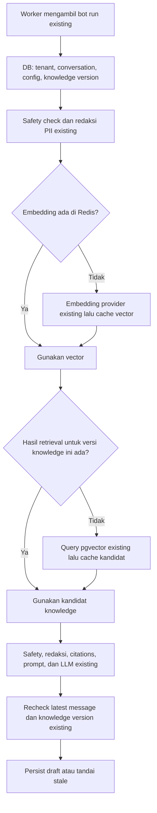

# Rencana upgrade Redis untuk fitur FlowDesk yang sudah ada

Tanggal audit: 10 September 2026. Basis kode: `52744fe`. Status: **audit dan rencana awal**. Kandidat 1 ditindaklanjuti melalui [issue #257](https://github.com/Ryanakml/flowdesk-ai/issues/257); kontrak implementasi aktual ada di [runbook query embedding cache](../runbooks/query-embedding-cache.md). Kandidat lain tetap rencana.

## 1. Keputusan

**Worth it untuk upgrade terbatas pada pipeline AI dan rate limiter yang sudah ada.** Kandidat utama adalah cache embedding pertanyaan, dilanjutkan cache hasil pencarian knowledge dengan invalidasi berbasis versi. Redis rate limiter menjadi perbaikan terpisah untuk konsistensi antar-instance. Service-window cache ditunda karena manfaatnya kecil pada struktur kode sekarang.

Paket AI tersebut memberikan dua bukti yang berbeda: penghematan panggilan embedding provider, dan database cache-aside dengan invalidasi ketika knowledge berubah. Rate limiting adalah distributed coordination; jangan menyebutnya sebagai bukti cache-aside data aplikasi.

Rekomendasi ini berbasis pembacaan kode, bukan benchmark atau audit staging. Belum ada angka hit rate, latency provider, beban pgvector, atau biaya produksi yang terukur pada audit ini. Kesesuaian dengan lowongan mengacu pada kutipan requirement yang diberikan pengguna.

## 2. Fakta kode dan peringkat kandidat

| Kandidat                       | Jalur existing dan temuan                                                                                                                    | Manfaat                                                                               | Kompleksitas relatif                                                  | Keputusan                                                  |
| ------------------------------ | -------------------------------------------------------------------------------------------------------------------------------------------- | ------------------------------------------------------------------------------------- | --------------------------------------------------------------------- | ---------------------------------------------------------- |
| Query embedding cache          | `apps/worker/src/bot-drafts.ts:171`: setiap run yang lolos safety memanggil embedding atas query yang sudah direduksi PII                    | Menghindari panggilan provider untuk input identik dalam tenant yang sama             | Sedang                                                                | Prioritas 1                                                |
| RAG retrieval cache            | `packages/db/src/knowledge.ts:653`: query pgvector dengan tenant, topK, dan threshold; worker sudah membaca versi knowledge                  | Menghindari pencarian vektor berulang; invalidasi memiliki trigger bisnis yang nyata  | Sedang; lebih sensitif terhadap correctness                           | Prioritas 2, melengkapi paket AI                           |
| Distributed auth rate limiter  | `packages/security/src/rate-limit.ts:18` memakai Map; `apps/api/src/app.ts:153` memasangnya pada `/api/v1/auth`                              | Limit bersama antar-proses; restart API tidak mereset state di Redis yang masih hidup | Sedang                                                                | Prioritas 3, dapat didahulukan jika scale-out mendesak     |
| Document chunk embedding cache | `apps/worker/src/knowledge-ingestion.ts:135` melakukan embedding per batch sebelum persist                                                   | Menghemat chunk identik lintas dokumen/retry                                          | Sedang                                                                | Extension setelah query cache terbukti berguna             |
| Analytics metrics cache        | `apps/api/src/analytics.ts:45`, `packages/db/src/analytics.ts:221` membaca aggregate ditambah live conversation counts, dengan fallback scan | Potensial bagus untuk dashboard yang sering dibuka                                    | Sedang untuk TTL; lebih besar untuk invalidasi lengkap                | Cadangan jika hasil ukur menunjukkan analytics lebih mahal |
| Published routing policy cache | `apps/worker/src/normalization.ts:356` membaca policy aktif dan fallback legacy rules                                                        | Mengurangi pembacaan konfigurasi berulang                                             | Sedang–tinggi karena publish, rollback, legacy CRUD, dan efek routing | Tunda sampai beban terbukti                                |
| Service-window cache           | `packages/domain/src/service-window.ts:20` hanya menghitung timestamp; conversation sudah dibaca oleh caller                                 | Hampir tidak menghilangkan kerja DB pada jalur sekarang                               | Implementasi kecil, risiko freshness relatif besar                    | Tidak masuk paket awal                                     |

Redis aktif saat ini berada di `apps/api/src/realtime.ts:87` sebagai Socket.IO pub/sub. Worker belum memiliki dependency Redis langsung. Runtime AI yang dipilih dari konfigurasi ada di `packages/providers/src/ai-runtime.ts:37` dan dipakai worker untuk ingestion serta draft.

Catatan penghematan ingestion: `apps/api/src/knowledge.ts:123` dan `packages/db/src/knowledge.ts:365` sudah mempunyai source/job dedupe. Upload ulang source identik tidak otomatis berarti provider dipanggil ulang. Nilai tambahan cache chunk datang dari input chunk identik yang masih lolos dedupe job, misalnya lintas sumber berbeda atau retry sesudah embedding berhasil tetapi transaksi gagal.

## 3. Alur paket AI yang direkomendasikan



Jawaban LLM tetap dihasilkan dengan konteks percakapan aktual. Yang dipakai ulang adalah vector dan kandidat knowledge. Kita tidak menambahkan semantic-answer cache, layar baru, endpoint bisnis baru, provider baru, atau queue baru.

### Query embedding

Cache helper menerima tenant secara eksplisit. Jangan menaruh mutable `currentOrganizationId` pada singleton provider yang dipakai banyak job.

Usulan key:

```text
fd:<env>:emb:v1:{<orgId>}:<providerConfigFingerprint>:<model>:<dimensions>:<purpose>:<preprocessVersion>:<inputDigest>
```

- Digest berasal dari **input persis yang dikirim ke provider**, setelah safety/redaksi existing. Jangan lowercase atau mengubah tanda baca hanya untuk meningkatkan hit rate.
- Fingerprint membedakan provider/base URL non-secret, model revision/deployment epoch, dimensi, serta opsi yang memengaruhi vector. Jangan memasukkan credential ke key atau log.
- `purpose` membedakan query/document; semua task type, normalization, dan opsi provider aktual harus masuk identitas bila digunakan.
- Tenant key wajib, meskipun teks identik. Redis tidak otomatis mendapatkan RLS PostgreSQL.
- Nilai hanya vector tervalidasi dan metadata minimum. TTL awal 24 jam dengan jitter ±10%; ini parameter percobaan, bukan jaminan optimum.
- Cache hit tidak boleh dicatat sebagai provider request atau token yang benar-benar ditagihkan. Estimasi token konten dibedakan dari usage provider.
- Cache miss/error kembali ke provider existing. Error provider, timeout, dan vector invalid tidak disimpan sebagai hasil sukses.

**Invalidasi embedding:** perubahan input, preprocessing, provider/model, dimensi, atau opsi menghasilkan key berbeda. TTL membersihkan generasi lama. Penambahan knowledge tidak perlu membuang vector pertanyaan karena makna input embedding tidak tergantung isi knowledge base. Pergantian model embedding tetap membutuhkan kompatibilitas/re-embedding document vectors; cache invalidation sendiri tidak menyelesaikannya.

### RAG retrieval

Usulan key:

```text
fd:<env>:rag:v1:{<orgId>}:<knowledgeVersionId>:<embeddingIdentity>:<vectorDigest>:<topK>:<threshold>:<retrievalVersion>
```

`vectorDigest` membedakan vector aktual, termasuk bila provider menghasilkan vector berbeda untuk input sama. Nilai menyimpan kandidat yang diperlukan pipeline beserta source/chunk IDs dan skor; TTL awal 5 menit dengan jitter ±10%. Validasi schema, tenant, versi, ukuran, tanggal, dan angka finite ketika membaca. Tetap jalankan safety/redaksi downstream pada hit maupun miss.

**Invalidasi yang dipilih adalah versioned keys, bukan TTL saja:**

1. Ingestion menulis document/chunks dan `completeKnowledgeSourceIngestion()` menambah `knowledge_versions` dalam transaksi PostgreSQL yang sama.
2. Worker membaca versi aktif dari PostgreSQL seperti sekarang. Pointer versi ini tidak ikut di-cache pada paket awal.
3. Setelah commit knowledge baru, run baru memilih namespace versi baru sehingga key lama tidak lagi dicari.
4. Run versi lama tetap mengikuti recheck versi existing sebelum draft disimpan (`apps/worker/src/bot-drafts.ts:273`); jika knowledge berubah, run ditandai stale.
5. Cache fill yang terlambat hanya boleh menulis key versi yang dipakai saat mulai membaca. Jangan mengganti key ke versi terbaru setelah query selesai.
6. Pada cache miss, cek ulang versi setelah vector search sebelum mengisi cache. Jika versi berubah, jangan mengisi hasil campuran dan ikuti stale-run path. Pengujian harus mencakup race ini.

Ini memberikan invalidasi logis segera untuk pembacaan versi baru; penghapusan fisik key lama mengikuti TTL. Tidak membutuhkan `KEYS`, `FLUSHALL`, atau event pub/sub sebagai satu-satunya jaminan invalidasi. Rencana tidak mengklaim linearizability baru untuk seluruh pipeline; batas transaksi dan recheck existing tetap berlaku.

**Syarat penting:** seluruh writer yang mengubah corpus yang dapat dicari harus memperbarui versi dalam transaksi yang sama. Jalur runtime ingestion yang diaudit sudah mempunyai version bump; helper document/status dan setiap jalur admin/internal harus dipetakan saat implementasi. Status archived/deleted ada pada model, tetapi audit route knowledge saat ini hanya menemukan list/create; jangan mengarang fitur edit/delete baru untuk demo invalidasi. Gunakan ingestion sumber baru yang benar-benar ada.

Query `searchDocumentChunks()` saat ini memfilter tenant dan vector, tanpa join status sumber. Jangan mengklaim ia sudah mengecualikan seluruh archived/deleted source. Cache harus menjaga semantik hasil existing; bila jalur lifecycle lain ternyata aktif dan perlu perbaikan eligibility, selesaikan prasyarat itu sebelum mengaktifkan retrieval cache.

## 4. Rate limiter: perbaikan nyata, bukti berbeda

Implementasi sekarang adalah sliding-window log lokal: batas staging/production 20 request per 60 detik untuk auth. Jika ada dua instance, state limit terpisah; satu identitas berpotensi mendapat dua budget. Redis memperbaiki koordinasi ini, bukan mempercepat pengecekan Map lokal.

Rencana:

1. Pertahankan scope route dan budget existing. Ubah interface `consume()` menjadi async dan inject store agar middleware bisa memakai Redis atau memory untuk local/test.
2. Pakai sorted set dengan operasi prune/count/add/expire dalam satu Lua script. Unique member per request mencegah timestamp sama menimpa hit; waktu server Redis menyamakan acuan antar-instance.
3. Key mencakup environment, policy version, dan digest IP untuk auth. Tenant/actor hanya dipakai bila endpoint memang mempunyai identitas yang sudah diverifikasi. Jangan menambah global API limiter sebagai scope diam-diam.
4. Validasi trusted proxy: kode sekarang langsung membaca `x-forwarded-for`. Pastikan Caddy dan Express menyepakati proxy tepercaya supaya klien tidak bisa mengganti identitas limit dengan header palsu.
5. Pertahankan kontrak 429 dan RateLimit/Retry-After headers ketika budget habis.
6. Untuk auth staging/production, usulan default saat Redis tidak tersedia adalah 503 terkontrol dengan Retry-After singkat. Ini keputusan availability/security yang harus terlihat dalam issue: outage Redis sementara menghalangi request auth. Local/test tetap bisa memory; jangan diam-diam fail-open saat production.
7. Limit bisnis AUTO-send, cost ceiling, dan deduplikasi pengiriman tetap memakai jalur DB existing. Jangan memindahkan guard durable itu ke counter Redis sebagai bagian pekerjaan ini.

Pendekatan shared counters, TTL, dan atomic scripts didukung [dokumentasi rate limiter Redis](https://redis.io/docs/latest/develop/use-cases/rate-limiter/).

## 5. Fondasi operasional dan failure behavior

Usulan package kecil `@flowdesk/cache` untuk koneksi, get/set tervalidasi, key construction, timeout, dan metrics. Hindari framework caching generik yang jauh melebihi dua use case. Adapter limiter dapat memakai koneksi tersebut dengan interface security yang terpisah.

| Kondisi                                   | Cache AI                                                      | Auth limiter yang diusulkan                         |
| ----------------------------------------- | ------------------------------------------------------------- | --------------------------------------------------- |
| Key tidak ada/expired                     | Panggil sumber existing                                       | Budget baru sesuai window                           |
| Redis lambat/down                         | Bypass ke provider/DB setelah deadline pendek                 | 503 terkontrol di staging/production                |
| Payload cache rusak/versi salah           | Anggap miss, buang key yang bisa diidentifikasi, catat metric | Anggap backend unavailable, bukan budget kosong     |
| Memory limit menolak write                | Proses AI tetap berjalan, skip cache fill                     | Jangan izinkan request tanpa pencatatan budget      |
| Banyak cold requests identik              | Single-flight, tunggu terbatas, lalu fallback terbatas        | Operasi script atomik                               |
| Restart API/worker                        | Cache/counter Redis bisa tetap dipakai                        | Budget tidak reset hanya karena API restart         |
| Redis kehilangan data/restart tanpa state | Cold miss; correctness dari DB/provider                       | Budget dapat reset; bukan ledger abuse yang durable |

Deadline operasi cache awal 50–100 ms di jaringan internal; verifikasi dengan pengukuran. Matikan offline command queue untuk request yang sudah timeout agar operasi tertunda tidak dieksekusi belakangan. Circuit breaker Redis terpisah dari circuit breaker LLM.

Stampede protection: satu loader per key dalam proses; distributed lock `SET NX PX` untuk cross-worker, token ownership saat release, lease menyesuaikan deadline loader, bounded wait dan jitter. Bila lease habis, duplikasi komputasi mungkin terjadi; lock ini mengurangi beban, bukan jaminan exactly-once. Batasi fallback concurrency supaya outage Redis tidak menyerbu provider/DB. Pola dasarnya ada pada [contoh cache-aside Redis](https://redis.io/docs/latest/develop/use-cases/cache-aside/go/).

Infra sekarang memakai `noeviction` dan AOF, tanpa `maxmemory` eksplisit di Compose yang diaudit. Tentukan memory budget dari headroom host aktual; jangan langsung mengganti menjadi `allkeys-lru` jika cache dan counter limiter berbagi instance. Eviction counter bisa menghapus budget sebelum waktunya. Namespace atau Redis logical DB tidak memisahkan memory/eviction policy.

Pilihan awal paling kecil: instance existing, `maxmemory` eksplisit, tetap `noeviction`, TTL di semua key, batas ukuran entry/admission cache dan alarm headroom. Ini belum hard isolation: jika pemakaian cache mengancam auth atau realtime, hentikan cache admission dan bypass. Untuk kebutuhan capacity yang lebih kuat, pisahkan Redis cache disposable dengan policy eviction sendiri dari koordinasi/rate limit; tidak perlu menambahkan layanan itu sebelum kapasitas menuntutnya. Detail kebijakan dijelaskan di [dokumentasi eviction Redis](https://redis.io/docs/latest/develop/reference/eviction/).

Gunakan koneksi command sendiri, bukan koneksi subscriber Socket.IO. Tambahkan lifecycle startup/shutdown API dan worker, config flags terpisah, wiring Compose dan image smoke. Redis tetap private. Vector dan snippet tetap diperlakukan sebagai data tenant, termasuk ketika AOF menyimpannya di disk; jangan log raw query, key, vector, snippet, atau credential. Cleanup tenant harus mencakup prefix/index cache yang relevan dalam prosedur penghapusan data existing.

Metrics minimum: hit/miss/bypass/error per cache kind, latency cache/provider/vector-search/end-to-end, upstream calls avoided, fill failure, stampede contention, Redis memory/rejected writes, limiter denial/backend-unavailable. Jangan menggunakan org ID atau query digest sebagai label Prometheus ber-cardinality tinggi.

## 6. Efektivitas dan batas worth it

Caching bernilai ketika kerja yang dihindari mahal dan input berulang. Hit rate untuk query embedding bersifat exact-match setelah preprocessing. “Jam buka?” dan “Bukanya jam berapa?” tidak otomatis saling hit. Ingestion dedupe existing juga mengurangi ruang penghematan tambahan.

Model perkiraan sederhana:

```text
penghematan rata-rata embedding ≈ hitRate × latencyEmbedding − overheadCache
penghematan total draft ≈ penghematanEmbedding + penghematanRetrieval
```

Contoh hipotetis, bukan hasil FlowDesk: embedding 300 ms, retrieval 40 ms, LLM 2.500 ms, overhead dua cache 4 ms. Ketika kedua cache hit, bagian tersebut turun dari 2.840 ms ke 2.504 ms, sekitar 12%. Pada hit rate 30% untuk keduanya, penghematan rata-rata hanya sekitar 98 ms. Biaya LLM generasi jawaban tetap ada.

Vector 1.536 dimensi memerlukan sekitar 6 KiB untuk angka float32 mentah; 10.000 vector sudah sekitar 59 MiB sebelum key/Redis overhead. JSON bisa jauh lebih besar. Ukur serialized size dan `MEMORY USAGE` sebelum menentukan TTL/admission; jangan menyamakan ukuran vector mentah dengan penggunaan Redis nyata.

Sebelum enable penuh, ambil baseline dari traffic yang representatif atau replay fixture yang aman. Pisahkan hasil fixture FAQ berulang dari estimasi traffic pengguna. Bandingkan cold/warm/mixed serta Redis outage dengan konfigurasi cache-off. Kriteria go/no-go: penghematan latency/provider-call terukur, overhead miss/outage terkendali, tidak ada regresi correctness/tenant/safety, dan memory dalam budget. Jika input hampir seluruhnya unik, tunda retrieval/chunk extension; jangan mengejar hit rate dengan semantic answer cache.

## 7. Tahapan, deliverable, dan estimasi

Estimasi berikut adalah engineering judgment untuk satu engineer yang memahami repo, termasuk test dan review normal; belum termasuk antrean CI, akses staging, atau blocker provider. Tahapan bisa dipangkas bila baseline menunjukkan kandidat tidak bernilai.

| Tahap | Deliverable                                                                                               | Estimasi          |
| ----- | --------------------------------------------------------------------------------------------------------- | ----------------- |
| 0     | Issue dengan scope, label/milestone aktual, baseline dan acceptance; peta writer knowledge; memory budget | 0,5–1 hari        |
| 1     | Fondasi Redis/cache, config terpisah, timeout/fallback, metrics, integration harness                      | 1–1,5 hari        |
| 2     | Query embedding cache pada draft existing, isolasi tenant, stampede handling                              | 1–1,5 hari        |
| 3     | Retrieval cache, version invalidation, race tests, safety parity                                          | 1–2 hari          |
| 4     | Failure/load test, CI gate, staging proof dan dokumentasi                                                 | 1–2 hari          |
| 5     | Auth distributed limiter dan proxy/failure tests sebagai PR terpisah                                      | 1–2 hari tambahan |

**Paket AI yang layak ditunjukkan: sekitar 5–8 hari kerja. Dengan auth limiter: sekitar 6–10 hari.** Prototype GET/SET bisa jauh lebih cepat, tetapi belum membuktikan robust caching. Tidak ada rewrite frontend, migrasi queue, atau rencana migrasi database besar pada paket awal; migration kecil hanya bila audit writer menemukan kebutuhan revision invariant yang belum terpenuhi.

Urutan PR: fondasi + embedding → retrieval + invalidation → auth limiter. Setiap implementation PR punya tracking issue dan `Closes #...`; nomor issue/label tidak dikarang dan belum dibuat pada tahap perencanaan ini. Bila ada kebutuhan multi-instance dalam waktu dekat, limiter dapat didahulukan setelah fondasi.

Rollout: flags default off → CI integration Redis nyata → staging cache-on → bukti fungsional dan performa → merge/deploy lewat CI/CD existing. Rollback cache dilakukan dengan flag off ke jalur provider/DB lama; rollback limiter harus eksplisit terhadap perubahan availability dan semantik multi-instance. Startup staging yang mengaktifkan limiter harus memiliki config Redis valid. Cache-only Redis outage tidak boleh menjadikan seluruh API tidak ready; tampilkan degraded dependency terpisah dari liveness.

## 8. Acceptance dan demo yang bisa dipertanggungjawabkan

- [ ] Cold miss → provider/DB dipanggil; warm hit identik → panggilan tersebut berkurang. Hasil retrieval dan safety setara dengan cache-off.
- [ ] Dua worker memproses input identik bersamaan: stampede dibatasi; hasil benar; lease expiry/loader crash tidak menyebabkan hang permanen.
- [ ] Tenant A/B memakai teks identik: key dan hasil terisolasi. Forged/mismatched cache payload ditolak.
- [ ] Model, dimensi, preprocessing, topK, threshold, atau versi query berubah: hasil cache lama tidak dipakai pada identitas baru.
- [ ] Tambah source melalui UI/API existing sampai ingestion commit dan versi bertambah; pertanyaan sama pada run baru memakai retrieval versi baru. Embedding boleh tetap hit.
- [ ] Knowledge berubah ketika cache fill atau LLM sedang berjalan: key lama tidak mencemari versi baru, dan recheck existing menandai draft lama stale.
- [ ] Redis dimatikan, diperlambat, key expired/corrupt, dan memory penuh pada environment isolasi: draft tetap mengikuti fallback; metric/log membuktikan mode yang terjadi.
- [ ] Cache tidak melewati safety check, PII redaction, auth/RLS, human takeover, service-window gate, killswitch, atau final send guard existing.
- [ ] Dua API instance berbagi satu budget auth; restart API tidak mereset budget; header IP palsu tidak membypass limiter; Redis-down mengikuti 503 yang direncanakan.
- [ ] Integration job CI benar-benar menjalankan Redis 7.4-compatible dan PostgreSQL; tidak silently skip bila Redis belum disiapkan. Build dependency workspace sebelum consumer tests bila diperlukan.
- [ ] Staging menjalankan exact build SHA yang diuji; lakukan real inbound → worker → real configured provider → cited draft. Pengiriman pesan uji eksternal dikoordinasikan saat eksekusi acceptance.
- [ ] Simpan tabel cache-off/on, cold/warm/mixed, upstream calls, stage p50/p95, total latency, memory, dan bukti invalidasi. Benchmark sintetis diberi label sintetis.

Demo lowongan: pertanyaan pertama miss → pertanyaan sama dari run berbeda hit → ingestion knowledge baru → versi berubah dan retrieval miss → Redis outage dan fallback terukur. Rate limiter multi-instance menjadi bukti tambahan. Klaim akhirnya sesuai hasil yang benar-benar dibuktikan, bukan sekadar Redis berhasil tersambung.
